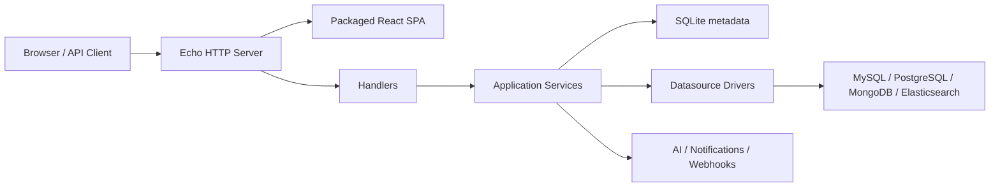

# SQLFlow

SQLFlow 是面向开发团队和 DBA 的数据访问治理平台。它把低风险查询交给开发者自助完成，把高风险变更纳入评审、审批、执行和审计闭环。

> 当前发布标签：`v1.0.0`。主分包含 MySQL、PostgreSQL、MongoDB 和 Elasticsearch 适配，平台元数据默认存储在 SQLite。2026-07-26 跨角色评审发现发布阻断问题，2026-07-31 复核确认其中多项仍未修复（含定时工单执行完全不可用）。当前仅建议用于隔离开发验证；生产采用前请完成[阶段 0 整改](docs/ROADMAP.md#阶段-0安全止血与主流程恢复p0)。

## 为什么需要 SQLFlow

数据库操作通常在效率与治理之间拉扯：开发者需要快速查询和变更，DBA 需要控制风险，管理者需要留下可验证的审计证据。SQLFlow 将这些诉求放进同一条工作流：

- 查询前完成身份、权限、语句类型和风险校验；查询结果默认脱敏。
- AI 提供风险和优化建议；AI 不可用时回退到确定性规则。
- DDL、DML 和受控的 NoSQL 写操作通过工单审批后执行。
- 查询、审批、执行、导出、权限和配置动作形成审计记录。
- Casbin 策略、临时权限、敏感表和脱敏规则共同约束数据访问。

详细产品边界和验收规则见[需求文档](docs/REQUIREMENTS.md)。

## 核心能力

| 领域 | 能力 |
|------|------|
| 数据源 | MySQL、PostgreSQL、MongoDB、Elasticsearch；通过能力声明表达差异 |
| 查询 | 在线编辑、语法分析、EXPLAIN、历史、慢查询、导出和结果分享 |
| 风险评审 | OpenAI、智谱 GLM、Azure OpenAI、兼容 API；支持 SSE 和规则降级 |
| 变更治理 | 工单、条件审批策略、多级审批、SLA、定时执行、修订和评论 |
| 权限与安全 | JWT、Refresh Token、API Token、OIDC、Casbin RBAC、临时权限 |
| 数据保护 | 字段脱敏、敏感表、脱敏豁免审计、数据源凭据加密 |
| 审计与运维 | 全量审计、报表、SQLite 备份、健康探针、Prometheus、Web Vitals |
| 集成 | 钉钉、飞书、通用 Webhook、Git 关联 |

## 快速开始

### Docker Compose

准备 Docker 20.10+ 和 Docker Compose V2：

```bash
git clone https://github.com/whg517/sqlflow.git
cd sqlflow
cp .env.example .env

# 编辑 .env，至少填写以下三项：
# SQLFLOW_JWT_SECRET
# SQLFLOW_ADMIN_PASSWORD
# SQLFLOW_ENCRYPTION_KEY

docker compose up -d --build
curl http://localhost:8080/readyz
```

浏览器访问 `http://localhost:8080`，使用 `.env` 中配置的管理员账号登录。

### 本地开发

需要 Go 1.25+、Node.js 22+ 和 npm：

```bash
cp config/config.example.yaml config/config.yaml

# 终端 1：后端，默认监听 8080
go run ./cmd/server/

# 终端 2：前端，默认监听 5173 并代理 API
cd web
npm install
npm run dev
```

示例配置只用于本地开发；生产环境必须通过环境变量覆盖密钥和初始管理员密码。

## 开发与验证

```bash
make build       # Go + React 生产构建
make test        # Go race test + 前端单元测试
make lint        # golangci-lint + ESLint
make verify      # lint + build + test
make docs        # 从 handler 注解生成 OpenAPI 包
```

Swagger UI 在服务启动后通过 `/swagger/index.html` 访问。API 契约以 handler 注解生成的 OpenAPI 为准，README 不维护重复端点清单。

## 架构概览

SQLFlow 采用单体仓库、模块化单体和单一部署单元：React SPA 构建后随镜像打包并由 Go 服务托管，Echo 将 API 请求交给 Handler 和 Service，Service 再访问平台 SQLite、目标数据源 Driver 或外部集成。



系统结构与依赖规则见[架构文档](docs/ARCHITECTURE.md)，关键取舍及其原因见[ADR](docs/adr/README.md)。

## 仓库结构

```text
cmd/server/              进程入口
config/                  配置加载与示例
internal/app/            应用依赖装配和生命周期（组合根）
internal/api/            Echo 路由、中间件、跨域聚合端点和 OpenAPI 生成包
internal/{audit,datasource,iam,security,query,ticket,notify,ops}/
                         八个领域包，各自含 service + HTTP handler + 测试
internal/platform/       领域无关能力：auditlog、httpx、crypto、mask、sqlparser 等
internal/arch/           分包依赖方向的可执行约束（仅测试）
internal/db/             SQLite、Ent 和迁移
internal/driver/         数据源接口、能力声明、注册表和连接池
web/src/                 React 前端
docs/                    需求、架构、ADR、设计和运维文档
```

## 文档

- [文档入口与治理规则](docs/README.md)
- [需求文档](docs/REQUIREMENTS.md)
- [架构文档](docs/ARCHITECTURE.md)
- [架构决策记录](docs/adr/README.md)
- [User Stories](docs/user-stories/README.md)
- [跨角色评审记录](docs/reviews/2026-07-26-cross-functional-review.md)
- [整改进度复核（2026-07-31）](docs/reviews/2026-07-31-implementation-verification.md)
- [整改与交付路线图](docs/ROADMAP.md)

## License

当前仓库未提供开源许可证。除非获得版权所有者授权，不应将代码视为可自由复制、修改或分发的软件。
