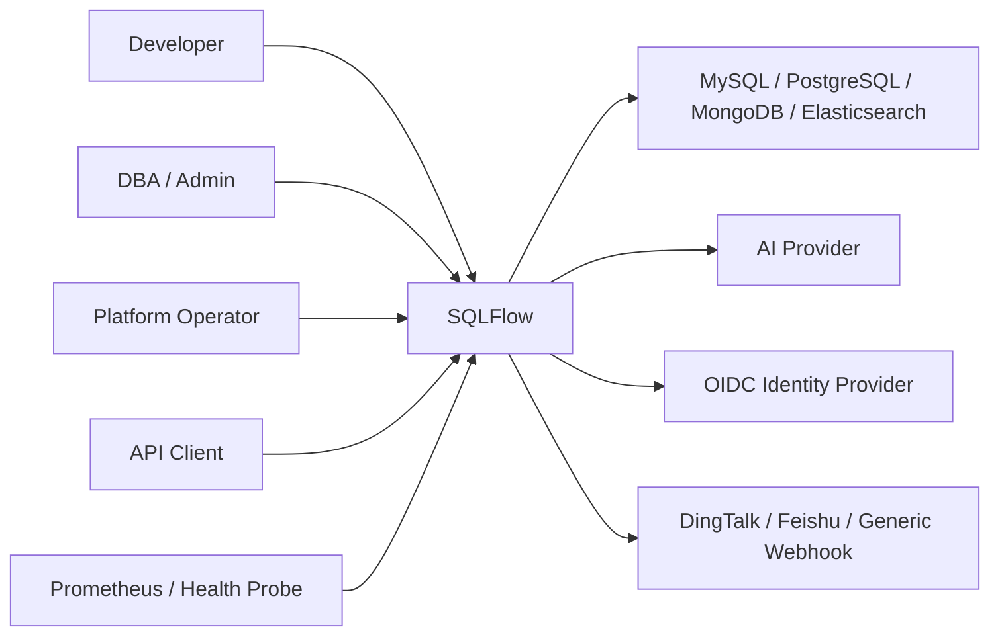
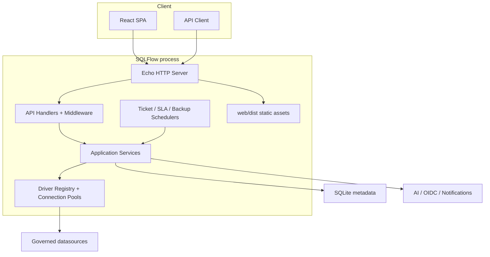
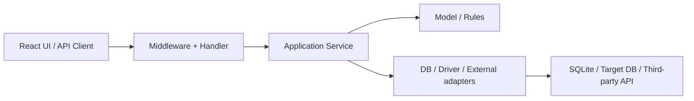
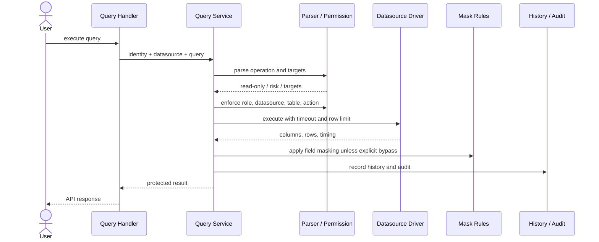
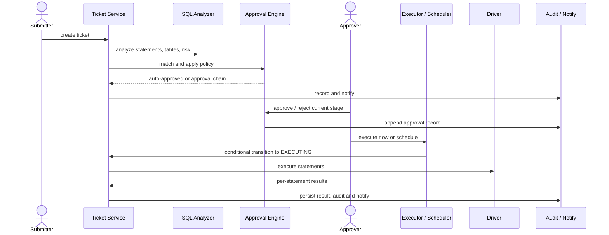

# SQLFlow 架构文档

| 属性 | 值 |
|---|---|
| 架构风格 | 模块化单体、分层架构、单一部署单元 |
| 基线日期 | 2026-07-14 |
| 状态 | Reviewed as-is baseline with known blockers |
| 对应需求 | [REQUIREMENTS.md](REQUIREMENTS.md) |
| 决策记录 | [adr/README.md](adr/README.md) |
| 实现评审 | [2026-07-26 跨角色评审](reviews/2026-07-26-cross-functional-review.md) |

> 本文描述目标架构约束和当前组件形态，不表示所有约束已被实现。已确认的授权、状态机、分享、恢复和运行偏差见[评审报告](reviews/2026-07-26-cross-functional-review.md)，整改顺序见[路线图](ROADMAP.md)。

## 1. 架构目标

SQLFlow 的架构优先保证数据库操作的安全门禁和可审计性，同时让小团队能够以一个服务完成部署和运维。关键质量属性按优先级为：

1. **安全与正确性**：权限、状态机、脱敏和凭据保护不能依赖前端或 AI。
2. **可审计性**：查询、审批、执行和关键管理行为可以关联用户、目标和结果。
3. **可维护性**：业务规则集中在 Service，数据源差异由 Driver 能力抽象隔离。
4. **可用性**：AI 和通知等外围集成失败时，核心治理流程仍能运行。
5. **部署简洁性**：Go API、React SPA、调度器和 SQLite 元数据组成单一部署单元。

## 2. 系统上下文

### 2.1 信任边界

- 浏览器和 API Client 均不可信，必须经过服务端认证、授权和输入校验。
- 目标数据源属于外部资源边界；连接只通过受管凭据和驱动建立。
- AI、OIDC 与通知端点属于第三方边界；超时、失败和不可信响应必须被隔离。
- 平台 SQLite 和备份包含敏感治理元数据，应由宿主机/Volume 权限保护。

## 3. 容器与部署视图

生产镜像使用多阶段构建：Node 构建 SPA，Go 构建后端，Alpine 运行时以 `sqlflow` 非 root 用户启动。React 构建产物位于 `web/dist`，由同一个 Echo 进程提供静态资源和 SPA fallback。

## 4. 代码模块与依赖规则

| 模块 | 职责 | 允许依赖 |
|---|---|---|
| `cmd/server` | 读取配置、打开数据库、迁移、装配容器、启动/关闭 HTTP 服务 | `config`、`internal/app`、`internal/api`、`internal/db` |
| `config` | YAML/环境变量绑定、默认值和启动期校验 | 通用安全工具 |
| `internal/app` | 构造 Service、连接池、调度器及其生命周期 | Service、DB、Driver、Config |
| `internal/api` | Echo 路由、中间件、请求/响应适配、OpenAPI 注解、SPA 托管 | `internal/app`、Handler、Service 接口 |
| `internal/service` | 用例编排、授权、状态机、审计、事务边界和外部集成 | DB/Ent、Driver、领域模型、pkg |
| `internal/driver` | 数据源统一接口、能力声明、注册表和驱动连接池 | 数据库客户端库，不依赖 API |
| `internal/db` | SQLite 打开、migration、Ent Client 与 Schema | SQLite、Ent、golang-migrate |
| `internal/model` | 跨层使用的领域数据结构与状态枚举 | 标准库 |
| `internal/pkg` | SQL parser、加密、脱敏、Casbin、指标等可复用能力 | 尽量不依赖业务层 |
| `web/src` | SPA 页面、状态、API Client 和 UI 组件 | `/api` HTTP 契约 |

目标依赖方向：

关键约束：

- Handler 只做协议适配、身份上下文提取和响应映射，不承载核心授权与状态迁移。
- Service 是业务规则和事务边界的所有者；前端角色可见性只是体验优化。
- Driver 不依赖 API 或具体页面模型；新增数据源通过实现接口并注册完成。
- `app.Container` 负责依赖装配和启动/关闭副作用，避免在路由中构造服务。
- 新代码不应扩大 `internal/connpool` 兼容层；优先收敛至 `internal/driver.PoolManager`。

## 5. 后端运行时架构

### 5.1 请求入口

全局中间件按 Recovery、Logger、CORS 和可选 Metrics 的顺序安装。路由分为：

- 公共路由：登录/刷新、OIDC、健康检查、分享链接和 Web Vitals 采集。
- 已认证路由：同时接受 JWT 与 API Token，覆盖查询、工单、个人 Token 和个人权限申请。
- 平台管理路由：在认证后继续执行 `system` 域的 Casbin 权限校验；用户、RBAC、数据源、安全、审计和设置能力可独立委派。

API 契约由 Handler 注解生成至 `internal/api/openapi`，运行时通过 `/swagger/` 提供 Swagger UI。

### 5.2 查询链路

不变量：

- 在线查询入口不得执行被解析为写操作或被阻断的操作。
- 默认查询超时为 30 秒，默认返回上限为 1000 行。
- 权限与脱敏必须在结果返回之前执行；导出不能绕过同一规则。
- AI 评审与确定性解析并列提供信息，但不替代权限门禁。

### 5.3 工单链路

状态机定义于 `internal/model`，合法迁移定义于 `internal/service/ticket.go`。状态更新应使用前置状态条件，防止并发审批或重复执行。数据库执行语义按驱动区分：PostgreSQL 批量语句支持事务回滚；MySQL 尤其 DDL 可能逐条提交；MongoDB/Elasticsearch 以声明能力为准。

### 5.4 后台任务

- Ticket Scheduler：扫描到期的 `SCHEDULED` 工单并尝试执行。
- SLA Scheduler：处理审批提醒、升级和可选自动拒绝。
- Backup Scheduler：按配置备份平台 SQLite 并执行保留策略。
- Export Async Service：生成大结果导出文件并维护任务状态。

这些组件运行在应用进程内，由 `app.Container` 启动并在 `Close()` 中停止。因此当前架构不适合多个副本无协调地同时调度。

## 6. 数据源驱动架构

`internal/driver.Driver` 为所有目标数据源提供统一端口：连接、健康检查、元数据、只读查询、单条/批量变更和解析。每个驱动通过位集合声明能力：

- `CapQuery`
- `CapTicketExec`
- `CapMetadata`
- `CapTableLevelPermission`
- `CapFieldMasking`
- `CapSQLParse`
- `CapExport`

启动入口通过空导入加载 MySQL、PostgreSQL、MongoDB 和 Elasticsearch 驱动的 `init()` 注册。`PoolManager` 以数据源 ID 缓存已连接驱动；数据源更新或应用关闭时应移除并关闭连接。

能力声明是产品行为的一部分：Service 和 UI 应根据能力选择路径或返回明确的不支持错误，不应假定所有数据库都具有 SQL 事务、表字段或 EXPLAIN。

## 7. 数据架构

### 7.1 平台元数据

平台使用 SQLite，启动参数包括 WAL、外键约束和 5 秒 busy timeout，并将最大打开连接数限制为 1 以减少锁冲突。`golang-migrate` 负责执行嵌入二进制的 SQL migration；Ent Client 与原始 `database/sql` 共享连接。

主要数据域：

| 数据域 | 核心实体 |
|---|---|
| 身份 | User、Role、RefreshToken、APIToken、OIDCProvider |
| 数据源与安全 | Datasource、MaskRule、SensitiveTable、TempPolicy、PermissionRequest |
| 查询 | QueryHistory、SharedResult、SQLTemplate、ExportTask |
| 工单 | Ticket、TicketRevision、ApprovalPolicy、ApprovalRecord、ExecutionResult、Comment、GitLink |
| SLA 与通知 | SLAConfig、SLAActionLog、通知偏好、Webhook 配置/订阅 |
| 审计与观测 | AuditLog、WebVital |

### 7.2 数据访问迁移状态

当前处于双轨状态：

- SQL migration 是 DDL 的唯一运行时事实来源。
- Ent Schema 提供类型化模型，但 Ent 自动迁移未启用。
- Service 中原始 SQL 和 Ent 查询并存。

在完成迁移前，任何表结构变更必须同时评估 SQL migration、Ent Schema、原始 SQL 和测试 fixture 的一致性。详见 [ADR-0002](adr/0002-sqlite-metadata-and-migrations.md)。

### 7.3 数据保留与备份

- 平台支持 SQLite 文件备份、可选 gzip 和按份数保留。
- Query History 按用户受 `query_history_max` 配置约束。
- Share 和 Token 由到期时间与撤销状态控制逻辑有效性。
- 导出文件和审计日志的长期保留策略目前不是统一可配置能力，应由部署环境补充磁盘和合规策略。

## 8. 安全架构

### 8.1 认证

- Web 会话使用 JWT Access Token 与服务端持久化的 Refresh Token。
- API Token 只在创建时返回明文，服务端存储哈希、前缀、Scope、有效期和使用统计。
- OIDC 是可选身份入口，最终映射为本地用户和内置角色。

### 8.2 授权

授权由三层组成：

1. 路由级：公开、认证、Admin 管理边界。
2. Service 级：资源所有权、DBA/Admin 操作权、工单当前阶段和状态校验。
3. 数据级：Casbin 的角色/域/对象/动作策略与临时权限。

Casbin 使用 [ADR-0006](adr/0006-canonical-casbin-tuples.md) 定义的唯一元组格式：角色或 `user:<id>`、`ds_<id>`、表/集合/索引和受控动作。策略侧的 `*` 可匹配任意域、对象或动作；运行路径通过 `internal/authz` 构造和规范化元组。

授权决策遵循 [ADR-0007](adr/0007-unified-authorization-and-data-visibility.md)：

- 主体同时包含用户 ID、当前角色和可选 API Token Scope；角色授权与个人授权取并集，再与 Token Scope 取交集。
- `metadata:view` 控制表/集合/索引及字段元数据发现；`select` 隐含对象可发现性，但 `metadata:view` 不授予数据读取。
- 临时个人策略在每次决策时校验到期时间，后台清理仅用于回收数据，不承担安全正确性。
- 工单、权限申请、模板、导出任务等平台资源由服务端所有权策略裁决。

### 8.3 数据保护

- 数据源密码/API Key 使用 AES 密钥加密存储。
- 密码使用不可逆哈希；JWT Secret、管理员初始密码和加密密钥由部署环境注入。
- 查询结果按数据源、库、表和字段匹配脱敏规则；字段命中规则时默认脱敏，显式 `unmask` 权限才允许返回明文。
- SQL/JSON 输入通过解析、操作类型限制和驱动参数边界降低注入与越权风险。
- SQL 模板只把占位符渲染为驱动参数标记；参数值通过 Query/EXPLAIN/Export API 单独传输，并由 MySQL/PostgreSQL 驱动绑定，不在浏览器或服务端拼接进 SQL。
- TLS 可在进程内启用，也可由上游反向代理终止；生产环境必须使用受保护传输。

## 9. 前端架构

前端基于 React、TypeScript、Vite、React Router、TanStack Query/Table、CodeMirror 和 Tailwind CSS。页面按路由懒加载，并由 `AuthGuard` 保护主布局。

主要页面域：概览、查询、工单、权限、审计、性能、报表、临时权限、用户、API Token、SQL 模板、设置以及公开分享结果。

前端约束：

- `web/src/api/client.ts` 统一处理 API 前缀、Token 和刷新流程。
- 服务端返回是授权事实来源；菜单显示和按钮禁用不代替 API 鉴权。
- 从 SQL 模板进入查询工作台时，标签状态同时保存模板来源、有序参数和数据库类型；用户编辑 SQL 后必须清除旧参数绑定。
- 页面级异步状态应显式处理 loading、empty、error 和 retry。
- 覆盖度页面当前不代表后端已启用，必须由独立后端接入后才进入正式导航能力基线。

## 10. 可观测性与故障处理

| 能力 | 位置 | 用途 |
|---|---|---|
| `/healthz` | 公共路由 | 进程存活，不检查依赖 |
| `/readyz` | 公共路由 | 检查平台 DB 和连接依赖是否可服务 |
| `/health`、`/api/health` | 公共路由 | 综合健康信息 |
| `/metrics` | 配置启用后 | Prometheus 指标 |
| Request Logger / Recovery | 全局中间件 | 请求追踪、异常恢复 |
| Web Vitals | 前端采集 + 公共受限入口 | LCP/INP/CLS 等体验信号 |
| Audit Log | Service | 业务操作证据，不替代运行日志 |

故障隔离原则：外部 AI 和通知调用应有超时；失败可记录但不得回滚已完成的核心数据库事务。目标数据源错误应转换为受控领域错误，并保留足够的审计上下文，避免泄露凭据。

## 11. 测试与交付架构

- Go 测试覆盖 Service、Handler、Driver、DB、权限、解析和性能辅助包。
- Vitest 覆盖页面、组件、状态和 API 行为。
- Playwright 使用 Docker 测试栈验证真实登录、查询、工单、审批、审计和管理流程。
- CI 将 Lint、Test/Build 和 E2E 分开；发布 Tag 触发多架构镜像、Trivy 扫描和 GitHub Release。
- OpenAPI 由 `make docs` 从 Handler 注解生成，禁止手工维护重复端点表。

## 12. 架构风险与演进方向

| 风险/债务 | 影响 | 建议演进 |
|---|---|---|
| SQLite 单写者与进程内任务 | 限制写吞吐、多副本和故障接管 | 当出现明确容量需求时评估外部元数据库和分布式任务租约 |
| 原始 SQL / Ent 双轨 | 模型漂移和迁移成本 | 分域迁移 Service，保持 SQL migration 为唯一 DDL 来源直到正式切换 |
| 两套连接池并存 | 生命周期和行为不一致 | 新路径统一使用 Driver/PoolManager，逐步移除 `connpool` |
| 路由层 Admin 分组覆盖 DBA 可见性 | 角色语义与注释可能不完全一致 | 为审计/报表定义明确的策略中间件，而不是复用 Admin 中间件 |
| 外部集成在进程内调用 | 慢调用和失败可能影响延迟 | 强化超时、重试、幂等与 outbox/队列边界 |
| 覆盖度 UI 与禁用后端并存 | 用户预期不一致 | 未启用时隐藏导航，或完成独立 PostgreSQL 依赖注入和部署方案 |

### 12.1 已确认的实现偏差

2026-07-26 评审确认以下架构不变量当前未成立：

| 不变量 | 当前偏差 | 必要动作 |
|---|---|---|
| 授权输入在所有路径保持一致 | Casbin 元组已统一；API Token Scope 与角色/个人授权的组合规则仍未完成 | 阶段 1 建立统一授权决策入口并执行 Token Scope |
| 被分析对象等于被执行对象 | SQL parser 可能只分析首条语句，Driver 接收原始完整输入 | 拒绝多语句或对规范化语句集合逐条门禁 |
| 状态迁移只有一个事务化写入口 | Scheduler 与工单执行函数对 `EXECUTING` 前置状态理解冲突 | 统一 CAS 状态机并设计租约/恢复 |
| 资源所有权由服务端裁决 | 私有模板读取/渲染已按所有者或公开状态门禁；工单和部分结果资源仍有仅要求认证的路径 | 继续为工单和结果建立统一资源授权策略和负向测试 |
| 备份必须可验证恢复 | 当前主要是文件复制，缺少完整性、异地副本和恢复演练 | 建立备份—校验—恢复—演练闭环 |

这些偏差是现有实现需要在模块化单体内部修复的问题，不构成立即拆分微服务的理由。

任何改变部署拓扑、元数据库、消息可靠性或授权模型的演进，应先新增 ADR，再修改本文件。
