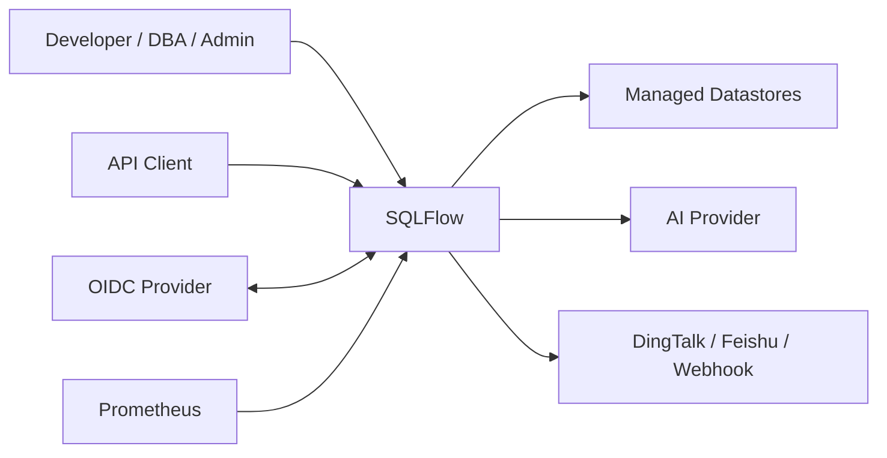
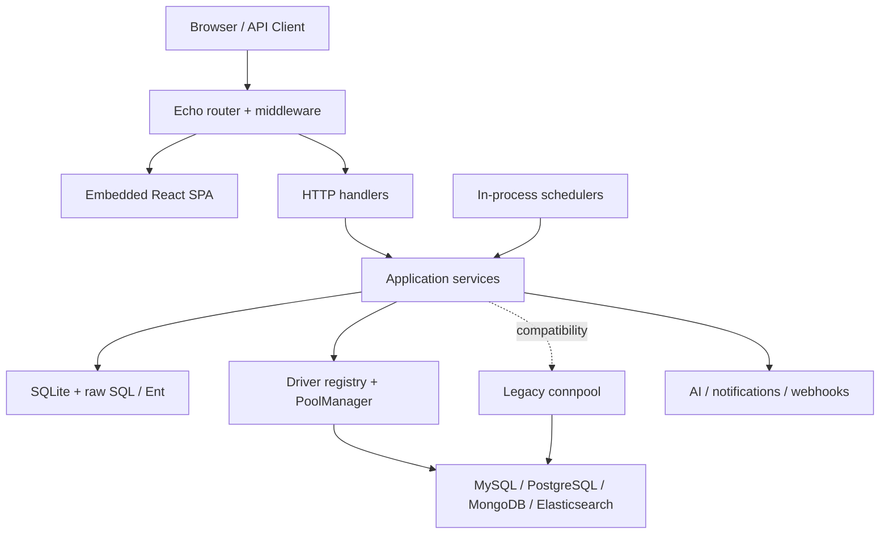
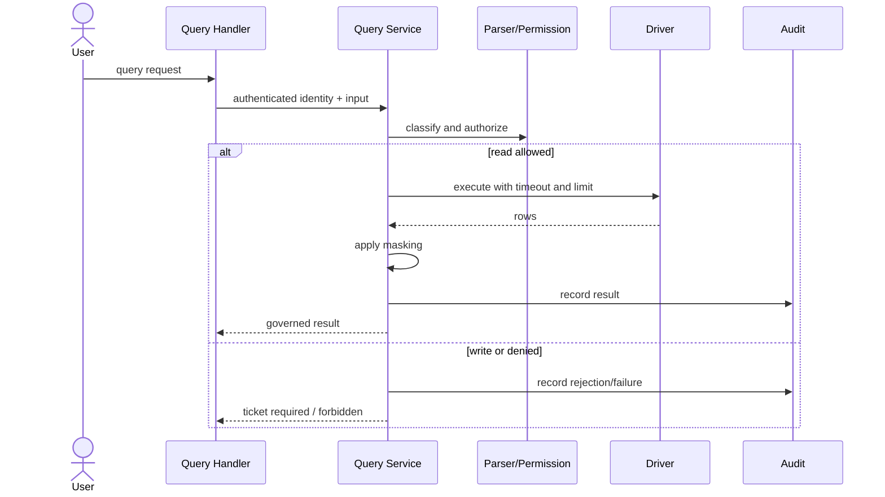

# SQLFlow 系统架构

状态：Active

维护者：engineering

最后评审：2026-07-10

事实源：当前系统结构与工程约束

相关代码：`cmd/server`、`internal`、`config`、`web/src`

本文描述 SQLFlow 当前如何实现[产品需求](REQUIREMENTS.md)。架构选择的背景和取舍以 [ADR](adr/README.md) 为准；本文不重复记录决策历史。

## 1. 架构驱动力

- **治理优先**：权限、风险、审批、执行和审计在服务端形成闭环。
- **简单交付**：一个 Go 进程、一个容器和一个持久化数据卷即可运行核心平台。
- **明确差异**：跨数据源复用接口，但不掩盖语法、事务和权限差异。
- **故障隔离**：AI、通知和 Webhook 失败不能绕过或破坏核心治理。
- **可演进边界**：HTTP、业务规则、平台数据、目标数据源和前端分别演进。

默认部署是模块化单体，见 [ADR-0001](adr/0001-modular-monolith.md)。

## 2. 系统上下文与运行时

进程启动顺序：加载配置 → 打开 SQLite → 执行迁移 → 创建应用容器 → 初始化默认数据和外部配置 → 启动调度器 → 注册路由 → 启动 HTTP/TLS。进程退出时，容器停止调度器、异步任务和连接池，再关闭数据库。

## 3. 模块与依赖方向

| 层 | 位置 | 职责 | 禁止事项 |
|----|------|------|----------|
| 启动 | `cmd/server` | 配置、数据库、容器、服务器生命周期 | 不承载业务规则 |
| 装配 | `internal/app` | 构造 Service、处理依赖、启动和关闭后台组件 | 不处理 HTTP 请求 |
| HTTP | `internal/api` | 路由、中间件、参数、认证上下文、响应和 OpenAPI 注解 | Handler 不直接查询数据库 |
| 应用 | `internal/service` | 查询、工单、审批、权限、审计、导出和通知规则 | 不依赖 Echo Context |
| 平台数据 | `internal/db`、`internal/model` | SQLite、迁移、Ent、持久化模型 | 不连接用户目标数据库 |
| 数据源 | `internal/driver` | 统一接口、Capability、注册表和池 | 不假设所有数据库语义一致 |
| 兼容连接 | `internal/connpool` | 迁移期旧连接路径 | 不新增长期能力 |
| 共享基础 | `internal/pkg`、`internal/resp` | 加密、脱敏、解析、指标和响应 | 不形成新的领域服务 |
| 前端 | `web/src` | 页面、组件、客户端状态与 API 适配 | 不承担最终权限判断 |

允许的主依赖方向是 `cmd/api → app/service → db/driver/pkg`。跨 Service 依赖统一在 `app.Container` 装配，避免 Handler 自行创建下游实例。

## 4. 请求与后台任务

### 同步请求

1. Echo 中间件处理恢复、日志、CORS、认证和角色限制。
2. Handler 绑定并校验输入，从 Context 获取已认证身份。
3. Service 执行业务权限、状态机、事务和审计规则。
4. 平台数据写入 SQLite；目标查询通过 Driver/Pool 执行。
5. Handler 使用统一响应格式返回，内部错误在生产响应中脱敏。

### 后台工作

应用容器内启动：

- 工单调度器：每分钟检查到期的 `SCHEDULED` 工单。
- SLA 调度器：每 10 分钟检查审批截止时间和配置动作。
- 备份服务：按配置周期创建 SQLite 备份。
- 异步导出：处理导出任务并清理过期文件。

后台任务必须支持停止，状态变化要么使用原子条件更新，要么设计为重复执行安全。

## 5. 数据架构

### 平台数据

SQLite 是控制面事实存储，包含身份、数据源配置、权限、工单、审批、审计、导出、分享、模板、通知和运行记录。连接启用：

- WAL journal mode；
- foreign keys；
- 5 秒 busy timeout；
- 最多一个打开连接，避免多个写连接竞争。

选择与扩展限制见 [ADR-0002](adr/0002-sqlite-platform-metadata.md)。部署必须持久化 SQLite 文件和导出/备份目录。

### 数据访问迁移

`db.DB` 同时包装 `*sql.DB` 与 Ent Client；`golang-migrate` 继续管理 DDL，部分 Service 已使用 Ent，其他路径仍使用 raw SQL。该双轨仅是过渡状态，新增代码应避免在同一业务事务中无边界混用，具体退出条件见 [ADR-0006](adr/0006-ent-migration-transition.md)。

### 一致性边界

- SQLite 事务只能保证平台元数据内部一致性。
- 目标数据库执行与 SQLite 审计写入不存在分布式事务。
- 执行流程先通过状态条件阻止重复执行，再记录目标数据库结果和最终状态。
- 通知与 Webhook 是事务后的副作用，失败进入重试/死信或日志，不回滚核心业务。

## 6. 数据源架构

`internal/driver.Driver` 定义连接、探活、元数据、查询、语句执行、批量执行和解析接口；每个实现通过注册表注册，并用 Capability 声明可用能力。`PoolManager` 按数据源 ID 复用连接。

关键差异：

| 数据源 | 查询输入 | 工单执行 | 批量事务语义 |
|--------|----------|----------|--------------|
| MySQL | SQL | DDL/DML | 逐条 auto-commit，收集每条结果 |
| PostgreSQL | SQL | DDL/DML | 单事务，首个失败后回滚 |
| MongoDB | 受控 JSON 操作/聚合 | 支持的写操作 | 不提供 SQL 事务等价保证 |
| Elasticsearch | 受控 JSON 查询 | 不支持 | 不适用 |

新增数据源或能力必须：实现/扩展 Driver、声明 Capability、定义权限对象和解析策略、覆盖连接生命周期与失败测试，并同步需求能力矩阵。设计原因见 [ADR-0003](adr/0003-capability-based-datasource-drivers.md)。

## 7. 核心业务架构

### 查询链路

### 工单链路

工单负责高风险变更的生命周期。AI 和静态规则生成风险信息，Approval Engine 选择审批策略，审批完成后由用户或调度器触发执行。工单状态、审批记录、每条语句结果和审计证据分别持久化。AI 不形成授权，见 [ADR-0004](adr/0004-governed-change-workflow.md)。

### 权限链路

Casbin 策略以角色、数据源 domain、对象和动作表达长期权限。临时权限申请批准后写入带有效期的策略，到期或撤销时清理。敏感表和 `desensitize:bypass` 在业务 Service 中叠加校验，不能只靠前端菜单控制。

## 8. HTTP 与身份安全

路由分为公开、已认证和 Admin 三个边界：

- 公开：健康探针、登录/刷新、OIDC、固化结果分享、Web Vitals、Swagger。
- 已认证：查询、个人历史/导出/分享、工单、模板、Token 和权限申请。
- Admin：用户、数据源、全局策略、脱敏、系统设置、备份和管理型集成。

JWT 和 API Token 共用认证上下文。认证中间件会解析 API Token scope，代码也提供 `RequireScope`，但当前 Router 尚未把 scope 中间件绑定到具体路由；因此 scope 完整强制执行仍是待补齐的需求缺口。`Admin()` 中间件当前只接受 `admin` 角色，DBA 能力应在具体业务授权中显式实现，不能通过路由注释假定。

HTTP 契约由 Handler 注解生成，见 [ADR-0005](adr/0005-generated-openapi-contract.md)。`internal/api/router.go` 是实际暴露路由的代码事实源。

安全约束：

- JWT Secret、管理员初始密码和加密密钥在启动时验证。
- 数据源密码、Webhook Secret 等敏感数据加密存储或不回传。
- Refresh Token 和 API Token 保存不可逆表示。
- 目标查询必须设置 Context 超时并限制结果。
- 审计接口不提供普通删除能力。

## 9. 前端架构

React SPA 使用 TypeScript、React Router、TanStack Query/Table、Zustand、CodeMirror 和 Tailwind。路由页面通过 `lazy()` 拆分，生产构建嵌入 Go 二进制。

目录约束：

- `web/src/api`：HTTP 客户端和传输类型。
- `web/src/pages`：页面级编排，不沉淀通用请求逻辑。
- `web/src/components`：可复用业务和 UI 组件。
- `web/src/hooks`、`web/src/store`：跨组件状态和副作用。
- `web/src/lib`：无领域所有权的前端工具。

前端负责体验层权限提示，后端 401/403 才是安全边界。每个页面应覆盖加载、空态、筛选无结果、失败和无权限状态。

## 10. 配置、可观测性与部署

- Viper 从 `config.yaml` 读取配置，显式绑定的 `SQLFLOW_*` 环境变量覆盖文件值。
- HTTP 默认监听 8080，可选择应用内 TLS 和独立 HTTP→HTTPS 重定向监听器。
- `/healthz` 用于 liveness，`/readyz` 检查依赖，`/health` 和 `/api/health` 提供综合健康信息。
- 启用指标后 `/metrics` 暴露 Prometheus 数据；前端通过公开入口上报 Web Vitals。
- 默认生产交付为 Docker 多阶段构建和 Compose。

## 11. 已知演进边界

- raw SQL/Ent 与 `connpool`/Driver 都处于迁移双轨，不能把兼容路径当作新扩展点。
- SQLite 和进程内调度器限定默认部署为单实例；水平扩展需要新的存储、选主和任务协调决策。
- Coverage 审计模块依赖独立 PostgreSQL；默认路由传入 `nil`，属于设计性禁用。
- API 路由分组与角色职责仍需持续对齐，新增 DBA 能力必须有显式后端授权测试。
- API Token 已保存和解析 scope，但路由尚未绑定 `RequireScope`，不能把 scope 配置当作已经形成的安全边界。
- 临时权限提供手动过期清理入口，但应用容器尚未启动对应周期调度器；自动过期要求仍需实现闭环。

## 12. 架构变更检查

变更提交前确认：

1. 是否遵循模块依赖方向，生命周期是否由容器管理？
2. 是否改变一致性、事务、权限、状态机或审计边界？
3. 是否对不同数据源定义了能力和失败语义？
4. 是否改变存储、部署或外部集成，并需要 ADR？
5. 是否同步 Handler 注解、生成 OpenAPI、测试和派生文档？
