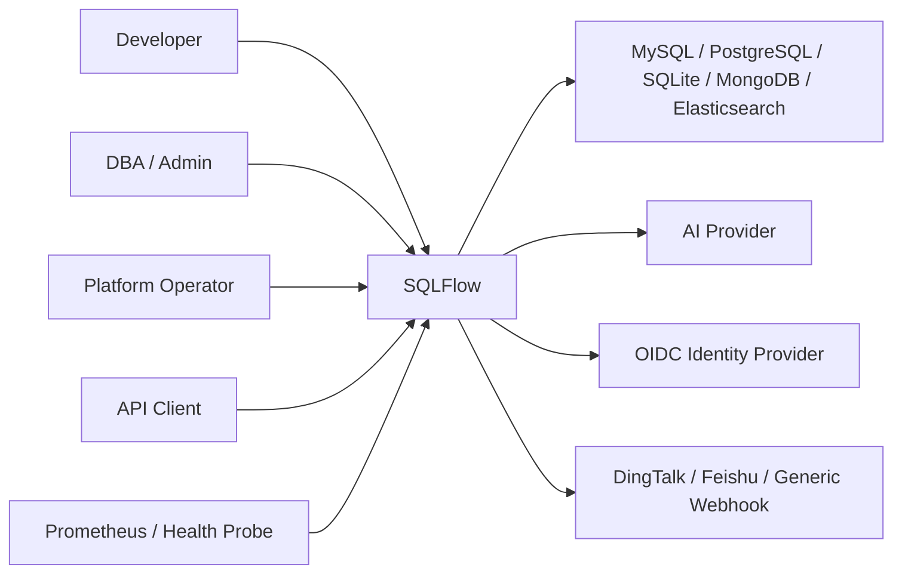
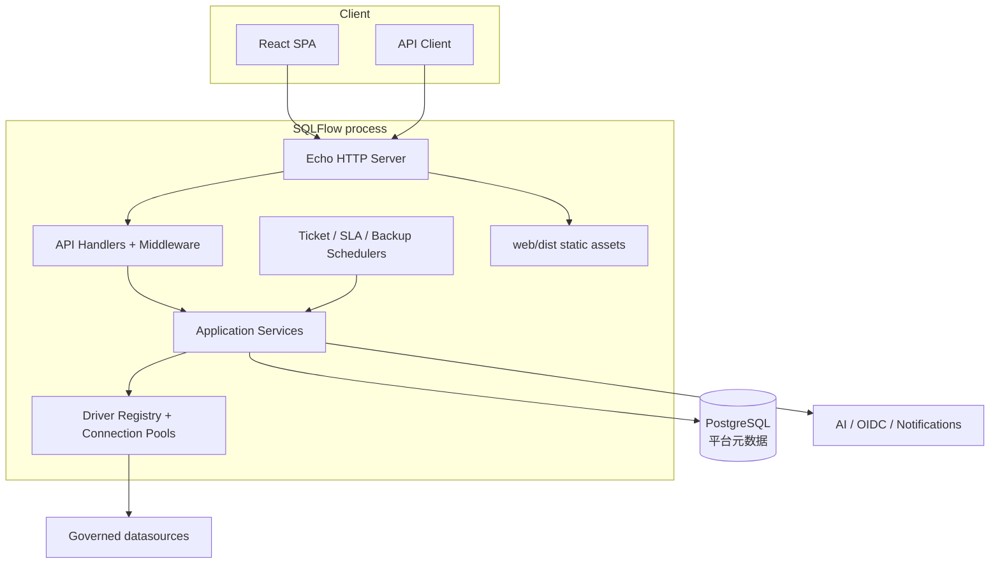
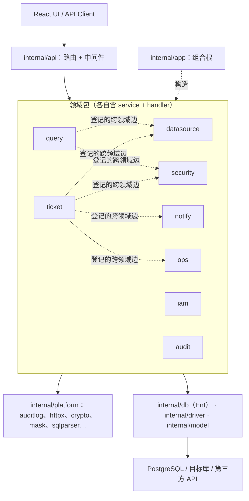
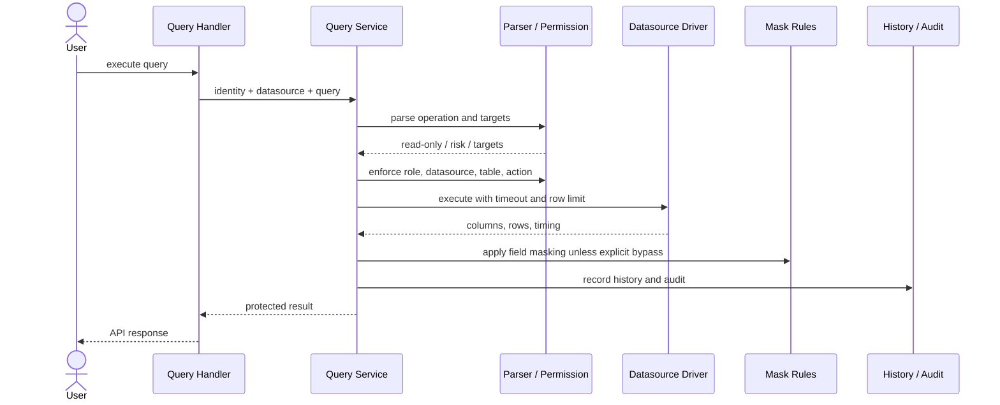
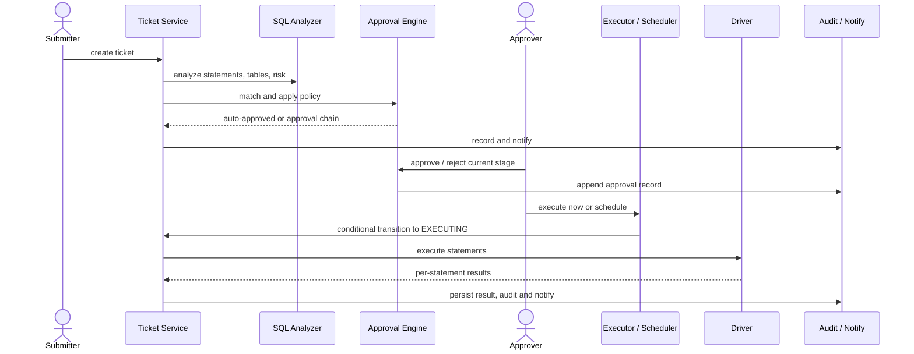

# SQLFlow 架构文档

| 属性 | 值 |
|---|---|
| 架构风格 | 模块化单体、按 feature 垂直切分、单一部署单元 |
| 基线日期 | 2026-08-06 |
| 状态 | 发布等级 L0，存在未关闭的发布阻断项 |
| 对应需求 | [REQUIREMENTS.md](REQUIREMENTS.md) |
| 决策记录 | [adr/README.md](adr/README.md) |
| 实现评审 | [2026-07-26 跨角色评审](reviews/2026-07-26-cross-functional-review.md)、[2026-07-31 复核](reviews/2026-07-31-implementation-verification.md) |

> 本文描述目标架构约束和当前组件形态，**不表示所有约束已被实现**。已确认的偏差集中在
> [§12.1](#121-已确认的实现偏差)，整改顺序见[路线图](ROADMAP.md)。
>
> 规模参考：后端 Go 生产代码 4.1 万行、测试 4.5 万行（不含 `internal/db/ent` 的
> 14 万行生成代码）；前端 TS/TSX 4.4 万行。

## 1. 架构目标

SQLFlow 的架构优先保证数据库操作的安全门禁和可审计性，同时让小团队能够以一个服务完成部署和运维。关键质量属性按优先级为：

1. **安全与正确性**：权限、状态机、脱敏和凭据保护不能依赖前端或 AI。
2. **可审计性**：查询、审批、执行和关键管理行为可以关联用户、目标和结果。
3. **可维护性**：业务规则集中在 Service，数据源差异由 Driver 能力抽象隔离。
4. **可用性**：AI 和通知等外围集成失败时，核心治理流程仍能运行。
5. **部署简洁性**：Go API、React SPA 与调度器组成单一进程，外加一个 PostgreSQL 实例。

## 2. 系统上下文



### 2.1 信任边界

- 浏览器和 API Client 均不可信，必须经过服务端认证、授权和输入校验。
- 目标数据源属于外部资源边界；连接只通过受管凭据和驱动建立。
- AI、OIDC 与通知端点属于第三方边界；超时、失败和不可信响应必须被隔离。
- 平台 PostgreSQL 和 `pg_dump` 备份包含敏感治理元数据（含加密后的数据源凭据），
  应由网络隔离、数据库账号权限和卷权限共同保护。

## 3. 容器与部署视图



生产镜像使用多阶段构建：Node 构建 SPA，Go 构建后端，Alpine 运行时以 `sqlflow` 非 root 用户启动。React 构建产物位于 `web/dist`，由同一个 Echo 进程提供静态资源和 SPA fallback。

部署单元是「一个进程 + 一个 PostgreSQL」。进程内含调度器且**没有分布式租约**，因此
当前只支持单副本；这是部署拓扑上的硬约束，不是调优项（见 [§12](#12-架构风险与演进方向)）。

## 4. 代码模块与依赖规则

| 模块 | 职责 | 允许依赖 |
|---|---|---|
| `cmd/server` | 读取配置、打开数据库、迁移、装配容器、启动/关闭 HTTP 服务 | `config`、`internal/app`、`internal/api`、`internal/db` |
| `config` | YAML/环境变量绑定、默认值和启动期校验 | 通用安全工具 |
| `internal/app` | 构造 Service、连接池、调度器及其生命周期；唯一认识全部具体实现的地方 | Service、DB、Driver、Config |
| `internal/api` | Echo 路由与分组、SPA 托管 | `internal/app`、各领域包 |
| `internal/api/middleware` | Recovery、Logger、CORS、Auth、RequireScope、Admin、SystemPermission | `iam`、`security`、`platform/httpx` |
| `internal/api/handler` | 跨领域聚合端点（health、settings） | 多个领域包 |
| `internal/api/openapi` | 由 `make docs` 从 Handler 注解生成，不手工维护 | — |
| 领域包（`audit`/`datasource`/`iam`/`security`/`query`/`ticket`/`notify`/`ops`） | 各自的用例编排、授权、状态机、审计与 HTTP handler | Ent、Driver、`internal/model`、`internal/platform`，以及 `allowedDomainEdges` 中登记的跨领域依赖 |
| `internal/arch` | 分包依赖方向与数据访问路径的可执行约束（无代码，只有测试） | 标准库 |
| `internal/driver` | 数据源统一端口、能力声明、注册表和驱动连接池 | 数据库客户端库，不依赖 API |
| `internal/db` | PostgreSQL 连接、golang-migrate、Ent Client 与 Schema | pgx、Ent、golang-migrate |
| `internal/model` | 跨领域的持久化模型与状态枚举 | 标准库 |
| `internal/authz` | Casbin 元组的唯一构造点 | 标准库 |
| `internal/platform/*` | 领域无关能力：`auditlog`、`crypto`、`httpx`、`mask`、`metrics`、`perf`、`sqlparser`、`sqlutil` | 不依赖任何领域包 |
| `internal/resp` | 统一响应信封（`SuccessResponse` / `ErrorResponse`） | Echo |
| `internal/connpool` | **仅存 ES 索引/字段浏览一处用途**，不得扩大 | ES 原生客户端 |
| `internal/testutil` | 跨包共享的测试夹具与驱动注册 | DB、driver（仅测试期）|
| `web/src` | SPA 页面、状态、API Client 和 UI 组件 | `/api` HTTP 契约 |

目标依赖方向：

代码按 feature 垂直切分：每个领域包自带 service、HTTP handler 和测试，
而不是按技术分层横切成 handler/service/repository 三个大包。



**当前登记在册的跨领域边只有 6 条**，全部集中在两个领域：

| 从 | 到 | 理由 |
|---|---|---|
| `query` | `datasource` | 查询要解析数据源配置并取连接 |
| `query` | `security` | 查询前检查表级权限并应用脱敏规则 |
| `ticket` | `datasource` | 工单执行变更需要目标数据源 |
| `ticket` | `notify` | 工单状态流转发送通知 |
| `ticket` | `ops` | 工单关联 Git 提交 |
| `ticket` | `security` | MongoDB 工单做集合级权限检查 |

另有 3 条**仅测试**的边（`query`/`ticket`/`security` → `audit`），用于断言审计行确实落库。
它们与生产边分开登记：测试边一旦出现在生产代码里，`internal/arch` 会指出耦合已经溜进来。

关键约束（前五条由 `internal/arch` 的测试强制，违反即 CI 失败）：

- `internal/platform/*` 不得依赖任何领域包——它是基础设施，不能认识业务。
- 领域包不得依赖 `internal/api`：领域自带 handler，但不反向依赖传输层。
- 跨领域依赖必须在 `allowedDomainEdges` 显式登记并写明理由；条目失效同样报错，
  避免过期条目成为默许耦合的许可。
- 只有 `internal/app` 认识全部领域实现；其余包最多依赖两个领域。
- 领域包不得直接用 `database/sql` 查询平台库（ADR-0010，见 [§7.2](#72-数据访问路径)）。
- 只用到对方一两个方法时，**在消费侧声明接口**而不是新增一条边。已有三例：
  `datasource.ObjectViewChecker`、`iam.PlatformPermissionLister`、`auditlog.Writer`。
- Handler 只做协议适配、身份上下文提取和响应映射，不承载核心授权与状态迁移。
- Service 是业务规则和事务边界的所有者；前端角色可见性只是体验优化。
- Driver 不依赖 API 或具体页面模型；新增数据源通过实现接口并注册完成。
- `app.Container` 负责依赖装配和启动/关闭副作用，避免在路由中构造服务；
  各 service 构造完成后即不可变（无 Set* 注入方法）。
- 不得扩大 `internal/connpool`：它只保留 Elasticsearch 元数据浏览一处用途，所有连接均由 `internal/driver.PoolManager` 管理。

### 4.1 复杂度分布

各领域包的生产代码与测试代码行数（用于判断复杂度集中在哪里，不是质量指标）：

| 领域 | 生产 | 测试 | 测试比 | 备注 |
|---|---:|---:|---:|---|
| `ticket` | 6378 | 9779 | 1.53 | 状态机 + 审批引擎 + SLA + AI 评审 + 调度，最重 |
| `query` | 5317 | 6597 | 1.24 | 执行 + 历史 + 导出 + 分享 + 模板 |
| `notify` | 2976 | 2349 | 0.79 | 测试比最低 |
| `security` | 2808 | 4305 | 1.53 | |
| `iam` | 2422 | 3073 | 1.27 | |
| `datasource` | 2081 | 3413 | 1.64 | |
| `audit` | 1824 | 2371 | 1.30 | |
| `ops` | 1650 | 2024 | 1.23 | |

`ticket` 与 `query` 合计占领域代码的 45%，与它们承担的治理职责相称。**但包内仍有
大文件**（`datasource.go` 1122 行、`ticket.go` 1062 行、`notify.go` 1001 行），
按职责继续切分的收益高于跨包重组——包边界本身是健康的，边只有 6 条。

## 5. 后端运行时架构

### 5.1 请求入口

全局中间件按 Recovery、Logger、CORS 和可选 Metrics 的顺序安装。路由分为：

| 分组 | 中间件链 | 覆盖 |
|---|---|---|
| 公共 | — | 登录/刷新、OIDC、健康检查、分享链接、Web Vitals 采集 |
| 已认证 | `Auth` | 查询、工单、个人 Token、个人权限申请 |
| 平台管理 | `Auth` → `RequireScope("admin")` → `Admin()` 或 `SystemPermission(域, 动作)` | 用户、RBAC、数据源、安全、审计、设置 |

平台管理能力按域**独立委派**，而不是一个 admin 开关：`users:manage`、`rbac:manage`、
`datasources:manage`、`security:manage`、`audit:view`、`settings:manage` 各自成组。

`RequireScope` 只对 API Token 生效，JWT 会话直接放行——**会话的权限边界由角色和
Casbin 裁决，Scope 是 Token 特有的收缩机制**，二者语义不同不应混用。

API 契约由 Handler 注解生成至 `internal/api/openapi`，运行时通过 `/swagger/` 提供 Swagger UI。

### 5.2 查询链路



不变量：

- 在线查询入口不得执行被解析为写操作或被阻断的操作。
- 默认查询超时为 30 秒，默认返回上限为 1000 行。
- 权限与脱敏必须在结果返回之前执行；导出不能绕过同一规则。
- AI 评审与确定性解析并列提供信息，但不替代权限门禁。

### 5.3 工单链路



状态机定义于 `internal/model`，合法迁移定义于 `internal/ticket/ticket.go`。状态更新应使用前置状态条件，防止并发审批或重复执行。数据库执行语义按驱动区分：PostgreSQL 批量语句支持事务回滚；MySQL 尤其 DDL 可能逐条提交；MongoDB/Elasticsearch 以声明能力为准。

### 5.4 后台任务

| 组件 | 周期 | 幂等机制 |
|---|---|---|
| Ticket Scheduler | 1 分钟 | 先读尽到期工单 ID 再执行；`SCHEDULED → EXECUTING` 由 CAS 单点持有 |
| SLA Scheduler | 10 分钟 | `sla_action_logs.dedup_key` 唯一约束 |
| Backup Scheduler | 按配置 | 按份数保留，`pg_dump` 全量 |
| Export Async Service | 事件驱动 | 任务状态机 |

这些组件运行在应用进程内，由 `app.Container` 启动并在 `Close()` 中停止。

幂等由**数据库约束**承担而非调度器自律——这是刻意的：调度器重启、时钟漂移和并发
副本都不会改变唯一约束的语义。但幂等不等于互斥，进程在 `EXECUTING` 期间崩溃会让
工单卡住，因为**没有执行租约**。多副本部署在此之前是不成立的。

## 6. 数据源驱动架构

`internal/driver.Driver` 为所有目标数据源提供统一端口：连接、健康检查、元数据、只读查询、单条/批量变更和解析。每个驱动通过位集合声明能力：

- `CapTicketExec` —— 能否通过工单执行 DML/DDL。SQLite 与 Elasticsearch 声明否，且属实：
  它们的 `ExecuteStatement` 返回不支持错误。
- `CapMetadata` —— 能否列出库/表/字段。当前五个驱动全部声明为真，读它的那处检查因此
  永不触发；它是结构性的（`ListTables`/`GetColumns` 是方法），应随 `ExecuteStatement`
  一起收进可选接口。

**一个能力位只有在「某个驱动的回答与其他不同」且「某个调用方会依据回答行事」时才成立。**
曾经有七个位，五个两条都不满足，已删除：

| 已删除 | 原因 |
|---|---|
| `CapQuery`、`CapFieldMasking` | 五个驱动全声明为真，没有任何东西能因缺少它被拒绝 |
| `CapSQLParse`、`CapExport` | 被 Mongo/ES 声明为假，但两者的 `Parse()` 都成功，导出链路也与驱动无关——照它执行反而会拒掉可用的 MongoDB 导出 |
| `CapTableLevelPermission` | 被 ES 声明为假，而 ES 的索引实际正被 Casbin 当作普通目标校验——照它执行会**删掉**一处访问检查。它还问错了对象：权限由 Casbin 对 `Parse` 的 targets 施加，脱敏由 `platform/mask` 对结果施加，而「结果能否脱敏」是 `ResultShape` 回答的问题 |

驱动注册由 `internal/driver/all` 的空导入完成，`internal/app.Container` 引入它。注册发生在各驱动的 `init()` 中，遗漏空导入只会在运行时查表失败，因此注册集合必须只有这一个来源。`PoolManager` 以数据源 ID 缓存已连接驱动；数据源更新或应用关闭时应移除并关闭连接。

### 6.1 三个正交的差异轴

数据源之间的差异由三组独立声明表达，Service 与 UI 只读这些声明，不按类型名分支：

| 轴 | 载体 | 回答的问题 |
|---|---|---|
| 能力位 | `Capabilities() CapabilitySet` | 能不能做（查询/工单执行/元数据/表级权限/脱敏/解析/导出） |
| 查询形态 | `QueryForm() QueryForm` | 查询怎么写（`sql` / `document` / `dsl`） |
| 结果形态 | `QueryResult.Shape` | 结果怎么读（`table` / `documents` / `aggregation`） |

能力位与查询形态是正交的：Elasticsearch 与 MySQL 都可查询，但前者是 `dsl` 形态，编辑器、请求载荷和结果渲染全不相同——「能不能查」从来不是有用的区分，「怎么查」才是。

结构性能力用**可选接口**而非能力位表达，由类型系统检查而非运行时查表：
`ParameterizedQueryExecutor`（参数化执行）、`ParameterBinder`（占位符方言）、
`QueryExplainer`（查询计划）、`ConfigValidator`（配置校验）。`driver.Describe` 把三者合成 `Descriptor`。

**每个驱动必须写编译期断言**：

```go
var (
	_ driver.Driver         = (*MySQLDriver)(nil)
	_ driver.QueryExplainer = (*MySQLDriver)(nil)
)
```

可选接口是结构化满足的——曾经有一次重构把两个 `ExplainQuery` 方法整个漏掉，
`go build` 照样通过，症状只是所有数据源静默上报 `explain=false`。断言把这类问题
变成编译失败。当前 5 个驱动的断言分布：

| 驱动 | Driver | ParameterizedQueryExecutor | ParameterBinder | QueryExplainer | ConfigValidator |
|---|:-:|:-:|:-:|:-:|:-:|
| MySQL | ✓ | ✓ | ✓ | ✓ | |
| PostgreSQL | ✓ | ✓ | ✓ | ✓ | |
| SQLite | ✓ | ✓ | ✓ | | ✓ |
| MongoDB | ✓ | | | | |
| Elasticsearch | ✓ | | | | ✓ |

### 6.2 契约

- `GET /api/datasources/:id/capabilities` 返回 `Descriptor`，是前端决定编辑器、可用操作和结果渲染的唯一依据。它只描述驱动能做什么，从不表示调用方被允许做什么——每个操作仍各自鉴权。
- 查询解析走 `driver.ParseFor(type, query)`，operation/risk/target 语义归驱动所有；Service 与 Handler 不再向解析器传数据源类型。
- SQL 模板的参数占位符方言由驱动的可选接口 `ParameterBinder` 声明（`?` / `$N`），不绑定参数的驱动不实现它，渲染器改为转义内联。模板可用的数据源类型以注册表为准，不维护白名单。
- 配置校验由驱动的可选接口 `ConfigValidator` 承担：字段含义归驱动所有，Service 不为任何类型代写校验。它不建立连接——保存数据源时目标可能尚不可达，因此只检查形态与传输约束（如 ES 的 HTTPS 要求），运行时事实（如 SQLite 文件是否存在）留给 `Connect`。
- 元数据浏览按 `CapMetadata` 路由；不声明该能力的驱动返回明确的不支持错误。数据库/索引作用域原样传给驱动，Service 不代填默认值——空作用域的含义由驱动定义。
- 连接失效按数据源 ID 统一处理（`PoolManager.Remove`），与类型无关，因此数据源改类型也无需特殊处理。
- 新增数据源类型的改动面应当是：实现 `Driver`、在 `driver/all` 注册。查询、导出、AI 评审、元数据、连接测试与前端工作台都不需要改。

### 6.3 结果形态

关系型结果是 `Columns`/`Rows` 的表格。文档型（ES hits、Mongo 文档）保留嵌套结构，前端以 JSON 呈现单元格而非 `String()`。聚合型结果没有固定列集，`Aggregations` 原样透传驱动负载。

聚合结果不经过按行脱敏器：其结构由驱动定义且任意嵌套，行掩码无法进入。因此当目标存在生效的脱敏规则时，服务端拒绝聚合查询而不是返回未经检查的结果。

## 7. 数据架构

### 7.1 平台元数据

平台元数据库是 PostgreSQL（[ADR-0009](adr/0009-postgresql-platform-metadata.md)），
**不保留 SQLite 兼容路径**。`golang-migrate` 执行嵌入二进制的 SQL migration，
Ent Client 在同一连接池上工作。当前有 2 个 migration、32 个 Ent Schema。

测试用真实 PostgreSQL：每个用例独占一个 schema，跑完即删。没有它，DB 相关测试
直接 fail 而不是跳过——一个静默跳过的数据库测试套件比没有测试更危险。

主要数据域：

| 数据域 | 核心实体 |
|---|---|
| 身份 | User、Role、RefreshToken、APIToken、OIDCProvider |
| 数据源与安全 | Datasource、MaskRule、SensitiveTable、TempPolicy、PermissionRequest |
| 查询 | QueryHistory、SharedResult、SQLTemplate、ExportTask |
| 工单 | Ticket、TicketRevision、ApprovalPolicy、ApprovalRecord、ExecutionResult、Comment、GitLink |
| SLA 与通知 | SLAConfig、SLAActionLog、通知偏好、Webhook 配置/订阅 |
| 审计与观测 | AuditLog、WebVital |

### 7.2 数据访问路径

**Ent 是领域包访问平台库的唯一方式**（[ADR-0010](adr/0010-ent-as-the-single-data-access-path.md)，
已于 2026-08-04 关闭），由 `internal/arch` 的 `TestDomainsDoNotQueryThroughDatabaseSQL`
强制：它 AST 扫描 8 个领域包，发现 `QueryContext` / `QueryRowContext` / `ExecContext`
即失败。

- SQL migration 是 DDL 的唯一运行时事实来源；Ent 自动迁移**未启用**。
- `internal/db/ent/` 是生成代码，改 `internal/db/ent/schema/` 后跑 `go generate`。
- 表结构变更要同时评估 migration、Ent Schema 和测试夹具三处。

这条规则不是口味问题。双轨期的 141 处改写暴露了 8 个缺陷，其中 5 个是静默的：
占位符复用让私有模板的归属校验失效、`INSERT OR IGNORE` 让通知去重从未生效、
布尔写成 0/1 让 webhook 无法禁用。每一个都是合法的 Go 程序，类型化查询让它们**写不出来**。

**逃生口**：Ent 表达不了的 SQL 用 `Modify(func(*entsql.Selector))`，并在注释里写明
为什么。全文检索的 `@@`、聚合上的 `ORDER BY`、`GROUP BY` 后取 top-N 都属于这一类。
用逃生口本身不违反 ADR-0010，**无理由地用**才违反。

### 7.3 数据保留与备份

- 平台备份走 `pg_dump`（`--serializable-deferrable`、指定 `--schema`），可选 gzip、按份数保留。
  密码经 `PGPASSWORD` 环境变量传递而非 argv，避免出现在进程列表里。
- 恢复能力由 `TestBackupRestoreRoundTrip` 在每次 CI 验证：把备份还原进独立库并核对
  行数、内置角色、检索函数与序列。**备份不等于可恢复，只有演练过的备份才算数。**
- Query History 按用户受 `query_history_max` 约束；Share 与 Token 由到期时间和撤销状态控制。
- 导出文件与审计日志的长期保留仍不是统一可配置能力，需由部署环境补充磁盘与合规策略。

## 8. 安全架构

### 8.1 认证

- Web 会话使用 JWT Access Token 与服务端持久化的 Refresh Token。
- API Token 只在创建时返回明文，服务端存储哈希、前缀、Scope、有效期和使用统计。
- OIDC 是可选身份入口，最终映射为本地用户和内置角色。

### 8.2 授权

授权由三层组成：

1. 路由级：公开、认证、Admin 管理边界。
2. Service 级：资源所有权、DBA/Admin 操作权、工单当前阶段和状态校验。
3. 数据级：Casbin 的角色/域/对象/动作策略与临时权限。

Casbin 使用 [ADR-0006](adr/0006-canonical-casbin-tuples.md) 定义的唯一元组格式：角色或 `user:<id>`、`ds_<id>`、表/集合/索引和受控动作。策略侧的 `*` 可匹配任意域、对象或动作；运行路径通过 `internal/authz` 构造和规范化元组。

授权决策遵循 [ADR-0007](adr/0007-unified-authorization-and-data-visibility.md)：

- 主体同时包含用户 ID、当前角色和可选 API Token Scope；角色授权与个人授权取并集，再与 Token Scope 取交集。
- `metadata:view` 控制表/集合/索引及字段元数据发现；`select` 隐含对象可发现性，但 `metadata:view` 不授予数据读取。
- 临时个人策略在每次决策时校验到期时间，后台清理仅用于回收数据，不承担安全正确性。
- 工单、权限申请、模板、导出任务等平台资源由服务端所有权策略裁决。

### 8.3 数据保护

- 数据源密码/API Key 使用 AES 密钥加密存储。
- 密码使用不可逆哈希；JWT Secret、管理员初始密码和加密密钥由部署环境注入。
- 查询结果按数据源、库、表和字段匹配脱敏规则；字段命中规则时默认脱敏，显式 `unmask` 权限才允许返回明文。
- SQL/JSON 输入通过解析、操作类型限制和驱动参数边界降低注入与越权风险。
- SQL 模板只把占位符渲染为驱动参数标记；参数值通过 Query/EXPLAIN/Export API 单独传输，并由 MySQL/PostgreSQL 驱动绑定，不在浏览器或服务端拼接进 SQL。
- TLS 可在进程内启用，也可由上游反向代理终止；生产环境必须使用受保护传输。

## 9. 前端架构

前端基于 React、TypeScript、Vite、React Router、TanStack Query/Table、CodeMirror 和 Tailwind CSS。页面按路由懒加载，并由 `AuthGuard` 保护主布局。

主要页面域：概览、查询、工单、权限、审计、性能、报表、临时权限、用户、API Token、SQL 模板、设置以及公开分享结果。

前端约束：

- `web/src/shared/api/client.ts` 统一处理 API 前缀、Token 和刷新流程。
- 查询工作台按 `query_form` 选择查询模式（`web/src/features/query/pages/Query/queryModes.ts`），由模式对象负责校验与请求载荷构造；不得在页面里按数据源类型名分支。
- 结果区按 `QueryResult.shape` 分发渲染器；表格视图对嵌套值使用 JSON 呈现，筛选与显示保持同一套格式化。
- 能力相关的按钮（EXPLAIN、变更工单等）读 `useDatasourceCapabilities`，禁用或隐藏只是体验优化，服务端仍独立裁决。
- 服务端返回是授权事实来源；菜单显示和按钮禁用不代替 API 鉴权。
- 从 SQL 模板进入查询工作台时，标签状态同时保存模板来源、有序参数和数据库类型；用户编辑 SQL 后必须清除旧参数绑定。
- 页面级异步状态应显式处理 loading、empty、error 和 retry。

## 10. 可观测性与故障处理

| 能力 | 位置 | 用途 |
|---|---|---|
| `/healthz` | 公共路由 | 进程存活，不检查依赖 |
| `/readyz` | 公共路由 | 检查平台 DB 和连接依赖是否可服务 |
| `/health`、`/api/health` | 公共路由 | 综合健康信息 |
| `/metrics` | 配置启用后 | Prometheus 指标 |
| Request Logger / Recovery | 全局中间件 | 请求追踪、异常恢复 |
| Web Vitals | 前端采集 + 公共受限入口 | LCP/INP/CLS 等体验信号 |
| Audit Log | Service | 业务操作证据，不替代运行日志 |

故障隔离原则：外部 AI 和通知调用应有超时；失败可记录但不得回滚已完成的核心数据库事务。目标数据源错误应转换为受控领域错误，并保留足够的审计上下文，避免泄露凭据。

## 11. 测试与交付架构

- Go 测试覆盖 Service、Handler、Driver、DB、权限、解析和性能辅助包；测试代码略多于
  生产代码（4.5 万行 : 4.1 万行）。
- **DB 测试需要真实 PostgreSQL**，每个用例独占一个 schema。`make dev-db` 起测试库。
- `internal/arch` 是可执行的架构约束（无生产代码，只有测试），`make arch` 秒级反馈。
- Vitest 覆盖页面、组件、状态和 API 行为。
- CI 分为 Lint 与 Test/Build；发布 Tag 触发多架构镜像、Trivy 扫描和 GitHub Release。
- 浏览器级端到端验证当前缺失：Playwright 套件已于 2026-07-31 移除，尚无替代方案。
- OpenAPI 由 `make docs` 从 Handler 注解生成，禁止手工维护重复端点表。

反馈回路的成本是有形的：`go test ./internal/...` 全量各包合计约 13 分钟，`internal/query`
单包 3.5 分钟、`internal/ticket` 2 分钟。**改动集中时只跑相关包**，不要把全量当默认回路。

测试质量标准：「调用不 panic」不算覆盖。修 bug 先写会失败的用例，并撤销修复确认它
真的会失败——曾经有个只在空库上跑的调度器测试，让三个致命缺陷长期不被发现。

## 12. 架构风险与演进方向

| 风险/债务 | 影响 | 建议演进 | 状态 |
|---|---|---|---|
| **同一段 SQL 有三套互不相同的理解**（见 [§12.2](#122-三套-sql-理解)） | 工单风险与审批路径由只看首关键字的正则分析器决定，而执行由裸分号切分驱动：`SELECT 1; DROP TABLE users` 被判为 low/score 0，却会执行 DROP | 收敛为单一分词器 + 单一分析器；拒绝多语句或逐条门禁 | **未开始**（REV-P0-004） |
| **工单执行缺租约** | 进程在 `EXECUTING` 期间崩溃会使工单永久卡住；多副本会重复执行 | 引入执行租约与崩溃恢复；这是解除单副本限制的前置条件 | 未开始（阶段 1.2） |
| 查询超时/行数上限硬编码 | `queryTimeout = 30s`、`ExportMaxRows = 10000` 等常量散落在 `query` 包，运维无法按环境调整 | 提为配置并在 Service 层统一施加 | 未开始（DEBT-06） |
| `connpool` 残留于 ES 元数据浏览 | 该路径的连接生命周期不受 `PoolManager` 管理 | 为 `Driver` 增加索引/字段浏览能力后移除 | 仅剩 1 处用途 |
| 外部集成在进程内调用 | AI、通知的慢调用和失败会影响请求延迟 | 强化超时、重试、幂等与 outbox/队列边界 | 部分完成 |
| 浏览器级端到端验证缺失 | Playwright 套件已于 2026-07-31 移除，无替代方案 | 确定替代验证方式 | 未开始 |
| 原始 SQL / Ent 双轨 | 模型漂移和换库成本 | — | **已关闭**（2026-08-04，由 `internal/arch` 守卫） |

### 12.1 已确认的实现偏差

以下架构不变量的当前成立状态。「已成立」的项有对应的回归测试，撤销修复即可复现缺陷。

| 不变量 | 当前状态 | 剩余动作 |
|---|---|---|
| 客户端不得影响风险等级或审批路径 | **已成立** — `risk_level` / `ai_review_result` 已从创建请求移除，风险由服务端 `RiskEvaluator` 无条件派生 | — |
| 状态迁移只能用 CAS | **已成立** — 审批/驳回/重提/多阶段全部走谓词式 `Update()` 并检查影响行数 | 审批记录与状态迁移纳入同一事务（1.4b） |
| 备份必须可验证恢复 | **已成立** — `pg_dump` + 每次 CI 的还原演练 | 加密、异地副本、季度演练（阶段 2） |
| 资源所有权由服务端裁决 | **基本成立** — 临时权限、私有模板、工单可见性已统一 | 结果类资源的负向越权测试 |
| 授权输入在所有路径保持一致 | **部分成立** — Casbin 元组已由 `internal/authz` 单点构造；`RequireScope` 已覆盖 35 处路由 | 补齐剩余路由的 Token Scope；工单创建的数据源级门禁 |
| **被分析对象等于被执行对象** | **未成立** — 见上表第一行 | 统一语句分词器 |
| **执行有且仅有一个持有者** | **未成立** — 无租约，崩溃即卡住 | 租约 + 崩溃恢复 |

这些偏差是现有实现需要在模块化单体内部修复的问题，不构成拆分微服务的理由。

### 12.2 三套 SQL 理解

同一段 SQL 文本在系统里被**三处独立实现**分别解读，彼此不共享代码也不互相校验：

| 实现 | 位置 | 方式 | 服务于 |
|---|---|---|---|
| AST 解析器 | `internal/platform/sqlparser` | TiDB parser / pg_query_go，**在第一个 `;` 字节处截断** | 查询路径的操作/风险/目标判定 |
| 正则分析器 | `internal/ticket/sql_analyzer.go` | `^\s*(SELECT\|INSERT\|...)` 只取首关键字 | 工单的 `sql_type`、`affected_tables`、**风险等级** |
| 分号切分 | `internal/ticket/ticket_executor.go` | `strings.Split(sql, ";")` | 工单**实际执行**的语句序列 |

三者的分歧是可复现的：

```
DROP TABLE users              → type=DROP   risk=critical(95)  执行 1 条
SELECT 1; DROP TABLE users    → type=SELECT risk=low(0)        执行 2 条（含 DROP）
```

风险等级和 `sql_type` 都是审批策略的匹配条件（`PolicyCondition.RiskLevels` /
`SQLTypes`），策略还可以开启自动审批。因此**客户端通过在 SQL 前加一句 `SELECT 1;`
就能改变自己工单的审批路径**——这正是「客户端不得影响风险等级或审批路径」要禁止的事。
即使按默认策略仍需 DBA 审批，审批人看到的也是「低风险 SELECT，不影响任何表」。

同一根因还有两个次生表现：

- `WHERE name = 'a;b'` 这类合法查询在 MySQL 路径被解析器拒绝（截断后语法错误）。
- PG 路径解析失败会降级为关键词检测，静态高危规则随之失效：
  `DELETE FROM logs` 是 high/blocked，`DELETE FROM logs /* a;b */` 变成 medium/未阻断。

修复方向不是给三处各打补丁，而是**收敛为一个语句分词器 + 一个分析器**，让「被分析的
对象」和「被执行的对象」在类型上就是同一个值。

任何改变部署拓扑、元数据库、消息可靠性或授权模型的演进，应先新增 ADR，再修改本文件。
