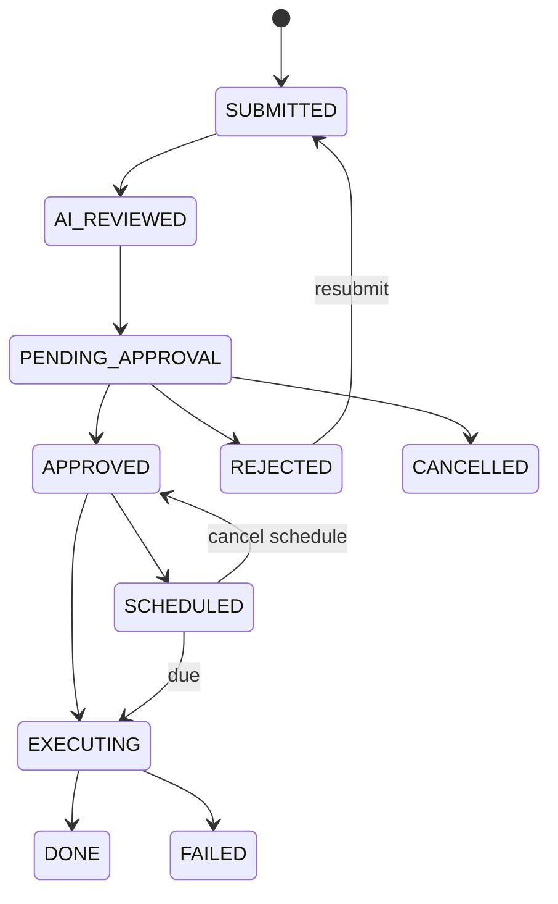
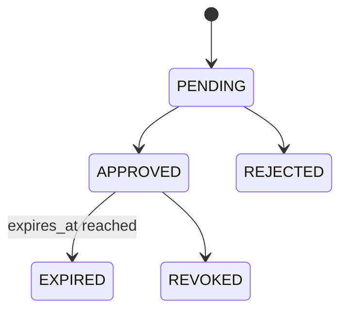
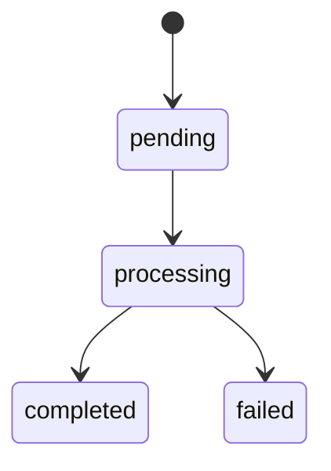

# SQLFlow 产品需求

状态：Active

维护者：product

最后评审：2026-07-10

事实源：产品行为与验收

相关代码：`internal/service`、`internal/api/handler`、`web/src/pages`、`e2e/tests`

本文定义 SQLFlow 必须提供的产品行为，不规定具体代码结构。实现方式见[架构文档](ARCHITECTURE.md)，关键设计原因见[ADR](adr/README.md)。

## 1. 产品目标

SQLFlow 帮助团队在数据库操作效率、安全和审计合规之间取得平衡：

1. 让经过权限和风险校验的读取操作可以自助完成。
2. 让写入、结构变更和其他高风险操作进入可追溯审批流程。
3. 统一治理数据源、敏感数据、导出、权限和操作证据。
4. 在 AI、通知等外部依赖不可用时，仍保持核心治理链路可用。

### 非目标

- 不托管或代理运维目标数据库实例。
- 不替代专业数据库防火墙、审计网关或备份系统。
- 不承诺所有数据源具备相同语法、事务、元数据或导出能力。
- 不允许匿名执行查询；公开分享只读取创建时固化且受限的结果。
- 当前不以多实例水平扩展为默认部署目标，参见 [ADR-0002](adr/0002-sqlite-platform-metadata.md)。

## 2. 角色与职责

| 主体 | 主要目标 | 允许的职责 |
|------|----------|------------|
| Developer | 安全地获取数据并提交变更 | 查询、个人导出和分享、模板、提交和查看自己的工单、申请临时权限 |
| DBA | 评估和处理数据库风险 | 审批与执行工单、处理权限申请、查看授权范围内的治理信息 |
| Admin | 管理平台和全局策略 | 用户、数据源、角色策略、脱敏、审批策略、SLA、通知、备份和系统配置 |
| System | 执行受控自动化 | 定时工单、SLA 巡检、备份、导出任务和过期资源清理 |
| API Client | 通过 Token 自动化调用 | 仅能使用 Token scope 和所属用户权限共同允许的操作 |

角色只描述业务职责。每次授权都必须由后端验证，前端隐藏入口不能替代权限控制。

## 3. 功能需求

### 3.1 身份与会话

- **AUTH-01** 用户可以使用本地账号和密码登录。
- **AUTH-02** 登录会话使用短期 Access Token 和可轮换 Refresh Token。
- **AUTH-03** 平台可以配置一个或多个 OIDC Provider，并处理登录和回调。
- **AUTH-04** 用户可以创建、查看和吊销自己的 API Token；Token 具有 scope、有效期和使用记录。
- **AUTH-05** Admin 可以管理用户并重置密码；密码变更必须使旧凭据风险可控。
- **AUTH-06** 认证失败返回 401，身份有效但权限不足返回 403，且不得泄露敏感内部错误。

### 3.2 数据源

- **DS-01** Admin 可以创建、更新、禁用、查看和测试数据源。
- **DS-02** 数据源凭据必须使用平台加密密钥加密保存，API 不返回明文。
- **DS-03** 平台支持 MySQL、PostgreSQL、MongoDB 和 Elasticsearch。
- **DS-04** 数据源必须声明真实能力，调用方不得假设跨数据库语义一致。
- **DS-05** 登录用户在获得数据源权限后可以浏览相应库、表、字段、集合或索引元数据。

当前能力基线：

| 能力 | MySQL | PostgreSQL | MongoDB | Elasticsearch |
|------|:-----:|:----------:|:-------:|:-------------:|
| 读取查询 | ✓ | ✓ | ✓ | ✓ |
| 工单执行 | ✓ | ✓ | ✓ | — |
| 元数据 | ✓ | ✓ | ✓ | ✓ |
| 表级权限 | ✓ | ✓ | ✓ | — |
| 结果脱敏 | ✓ | ✓ | ✓ | ✓ |
| SQL 解析 | ✓ | ✓ | — | — |
| 导出 | ✓ | ✓ | — | ✓ |

`EXPLAIN` 当前只保证 MySQL SELECT。能力差异的设计依据见 [ADR-0003](adr/0003-capability-based-datasource-drivers.md)。

### 3.3 查询、导出与分享

- **QUERY-01** 登录用户只能在后端权限允许的数据源和对象上执行读取操作。
- **QUERY-02** 执行前必须识别操作类型、目标对象、风险和禁止条件；写操作不能通过查询接口绕过工单。
- **QUERY-03** 查询必须有超时和结果行数上限，超时后取消下游操作并记录结果。
- **QUERY-04** 查询结果默认应用字段脱敏，并明确返回脱敏状态和字段。
- **QUERY-05** 用户可以查看和清理自己的查询历史，并使用频繁查询辅助复用。
- **QUERY-06** 支持同步导出；大结果集使用异步任务，并提供任务状态、下载和过期清理。
- **QUERY-07** 用户可以创建有过期时间、可选密码且可撤销的结果分享；分享内容是固化结果，不执行原查询。
- **QUERY-08** 查询成功和失败、导出及脱敏豁免都必须写入审计。

### 3.4 风险评审

- **REVIEW-01** 评审输出至少包含风险等级、决策、建议和影响说明。
- **REVIEW-02** 平台支持 OpenAI、智谱 GLM、Azure OpenAI 和 OpenAI 兼容 Provider。
- **REVIEW-03** 支持通过 SSE 返回流式评审结果。
- **REVIEW-04** AI 未配置、失败、返回无效内容或超时时，必须使用确定性静态规则降级。
- **REVIEW-05** AI 输出只提供辅助信息，不授予权限、不替代审批，也不能降低后端安全规则。

### 3.5 工单与审批

- **TICKET-01** DDL、DML 和受支持的 NoSQL 写操作必须通过工单执行。
- **TICKET-02** 提交工单时记录数据源、目标库、语句、原因、提交人、风险和评审结果。
- **TICKET-03** 审批策略可以按数据源、操作类型、风险等条件匹配，并生成可查看的审批链。
- **TICKET-04** 授权审批人可以通过或驳回；提交人可以在允许状态取消，被驳回工单可以修改后重提并保留修订历史。
- **TICKET-05** 审批和执行是独立动作；已审批工单可手动执行或安排定时执行。
- **TICKET-06** 执行结果记录每条语句的状态、耗时、影响行数和错误。
- **TICKET-07** PostgreSQL 批量语句使用单事务并在任一失败时回滚；MySQL DDL/DML 按语句 auto-commit，失败不伪装成整批回滚。
- **TICKET-08** SLA 可以提醒、升级或自动驳回超时工单，所有自动动作可审计。
- **TICKET-09** 工单支持评论和 Git 链接，协作信息不能改变审批授权。

该治理边界由 [ADR-0004](adr/0004-governed-change-workflow.md) 确立。

### 3.6 权限与数据保护

- **ACCESS-01** 平台内置 admin、dba、developer 角色，并使用 Casbin domain 策略约束数据源、对象和动作。
- **ACCESS-02** Admin 可以管理持久权限策略；策略变更必须审计。
- **ACCESS-03** 用户可以申请有明确对象、动作、理由和过期时间的临时权限。
- **ACCESS-04** 授权审批人可以批准、驳回或撤销申请；批准权限在到期后自动失效。
- **PROTECT-01** Admin 可以配置字段脱敏规则并标记敏感表。
- **PROTECT-02** 敏感表默认拒绝访问，直到存在明确授权。
- **PROTECT-03** 脱敏豁免必须由 `desensitize:bypass` 权限授予，每次使用都写审计。

### 3.7 审计、报表与通知

- **AUDIT-01** 查询、变更、审批、执行、导出、权限和关键配置动作必须记录操作者、时间、对象、结果和错误。
- **AUDIT-02** 审计日志支持按时间、用户、数据源、动作和关键词筛选与全文检索。
- **AUDIT-03** 普通 API 不提供删除审计日志的能力。
- **AUDIT-04** 报表提供使用、错误、性能和工单聚合，但不能替代审计明细。
- **NOTIFY-01** 平台支持钉钉、飞书和通用 Webhook，并允许用户设置通知偏好。
- **NOTIFY-02** 中高风险、审批结果和 SLA 事件可以通知相关人员。
- **NOTIFY-03** Webhook 失败应保留重试或死信证据，通知失败不能回滚已经完成的核心业务事务。

### 3.8 运维与可观测性

- **OPS-01** 提供 liveness、readiness 和依赖健康检查。
- **OPS-02** 可选暴露 Prometheus 指标，并接收前端 Web Vitals。
- **OPS-03** SQLite 支持手动和定时备份、压缩、保留数量和下载。
- **OPS-04** 后台调度器和连接池在进程退出时必须停止或释放资源。
- **OPS-05** 生产配置必须允许通过环境变量注入，密钥不得依赖镜像内默认值。
- **OPS-06** AI、通知等非核心外部依赖失败时，查询权限和工单治理仍然可工作。

## 4. 状态机

### 工单

`DONE`、`FAILED` 和 `CANCELLED` 为终态。重提从 `REJECTED` 创建新修订并回到 `SUBMITTED`。

### 临时权限申请

`APPROVED` 表示权限已生效；系统不使用单独的 `ACTIVE` 状态。

### 异步导出

已完成文件在保留期后由清理任务删除；清理不是对外暴露的业务状态。

## 5. 质量属性

| 属性 | 必须满足的约束 |
|------|----------------|
| 安全 | 后端强制认证授权；敏感配置不记录、不回传；写操作不能绕过工单 |
| 可审计 | 关键状态变化和治理动作具有操作者、对象、时间与结果证据 |
| 可靠性 | 超时可取消；后台任务幂等或可恢复；非核心集成失败不破坏主流程 |
| 性能 | 查询有超时和行数上限；大导出异步；连接按数据源复用 |
| 可维护 | 层级和依赖方向明确；接口契约从代码生成；重大决定进入 ADR |
| 可测试 | 核心 Service、Handler、状态机和关键业务流程具有自动化测试 |
| 可运维 | 单容器可部署；数据可持久化和恢复；健康状态与关键指标可观察 |

## 6. 交付验收

每个功能变更必须回答以下问题：

1. 影响哪些需求编号、角色和数据源能力？
2. 是否改变权限、状态机、审计事件、敏感数据或失败语义？
3. 是否需要新增或替代 ADR？
4. Handler 注解与生成 OpenAPI 是否同步？
5. 是否覆盖成功、加载、空数据、校验失败、403、下游失败和重试路径？
6. 部署配置、迁移、备份或可观测性是否需要更新？

验收证据至少包括相关单元/集成测试；跨角色核心流程还应包含 Playwright E2E。产品行为变化同步更新本文，架构变化同步更新[架构文档](ARCHITECTURE.md)和相关 ADR。
