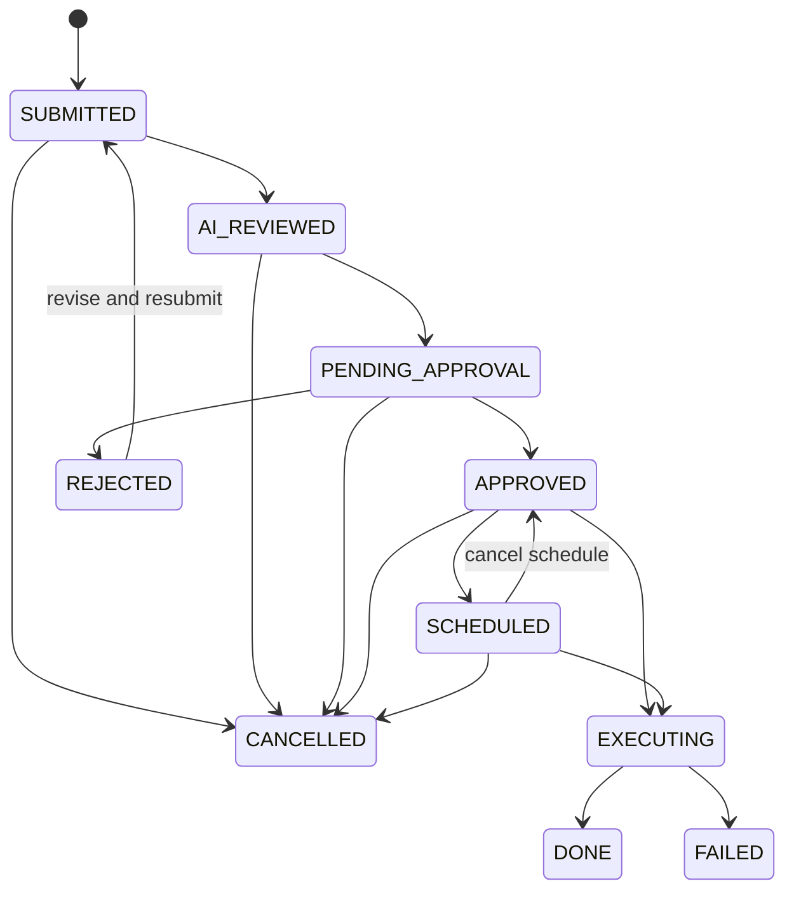

# SQLFlow 产品需求文档

| 属性 | 值 |
|---|---|
| 文档类型 | 现状需求基线（as-is PRD） |
| 基线日期 | 2026-07-14 |
| 产品版本 | v1.0.0 / main 分支 |
| 状态 | Baseline |
| 事实来源 | README、HTTP 路由、Service、数据模型、迁移、自动化测试 |

## 1. 产品定义

SQLFlow 是面向开发团队和 DBA 的数据访问治理平台。它将日常只读查询、敏感数据保护、数据库变更审批、受控执行和审计证据整合为一个闭环，在不直接暴露生产数据库凭据的前提下提高数据访问效率。

### 1.1 问题陈述

传统数据库访问通常存在以下矛盾：

- 开发者需要快速排障和取数，DBA 需要限制高风险语句与越权访问。
- 数据变更散落在聊天、脚本和人工操作中，审批、执行结果和责任人难以串联。
- 敏感字段、临时授权、数据导出和共享链接容易脱离统一审计。
- 多种数据库能力不同，若直接暴露底层差异，会增加治理规则和操作体验的不一致。

### 1.2 产品目标

- 为合规的只读查询提供自助入口，并默认执行身份、权限、语句和脱敏检查。
- 将 DDL、DML 及受控 NoSQL 写操作纳入可配置的工单审批与执行流程。
- 形成查询、审批、执行、导出、权限和管理操作的可检索审计记录。
- 通过统一驱动能力模型支持 MySQL、PostgreSQL、MongoDB 和 Elasticsearch。
- 在 AI 服务不可用时保持核心风险判断可用，AI 只提供辅助判断。

### 1.3 非目标

- 不作为通用 BI、数据仓库或 ETL/ELT 编排平台。
- 不替代目标数据库自身的备份、复制、容灾和账号体系。
- 不保证跨异构数据源的分布式事务。
- 不允许在线查询入口绕过工单执行任意写操作。
- 不把 AI 结论作为唯一授权或执行依据。
- 当前不交付独立 PostgreSQL 支撑的覆盖度审计后端。

## 2. 角色与利益相关者

| 角色 | 主要目标 | 默认权限边界 |
|---|---|---|
| Developer | 自助查询、提交和跟踪变更、申请临时权限 | 默认只读查询；变更通过工单 |
| DBA | 审核风险、审批/拒绝/执行变更、查看审计 | 具备查询和数据库变更治理权限 |
| Admin | 管理用户、数据源、策略、脱敏、集成和运维 | 平台管理权限 |
| Auditor / Manager | 检索记录、查看统计和报表 | 当前由 Admin 能力承载，不是独立内置角色 |
| Platform Operator | 部署、配置、备份、监控和恢复服务 | 通过运行环境操作，不等同于业务角色 |

系统内置业务角色为 `admin`、`dba`、`developer`。细粒度数据访问由 Casbin 策略和临时策略共同决定。

## 3. 范围与核心概念

### 3.1 范围内

- 本地账号、JWT/Refresh Token、个人 API Token、可选 OIDC 登录。
- 数据源登记、连接测试、元数据浏览和驱动能力差异处理。
- 在线只读查询、解析、EXPLAIN、历史、慢查询、导出和结果分享。
- AI 风险建议与确定性规则降级。
- 工单创建、策略匹配、多级审批、SLA、定时执行、修订、评论和 Git 关联。
- RBAC、表级权限、临时授权、敏感表和字段脱敏。
- 审计检索、报表、通知/Webhook、平台 SQLite 备份、健康检查和指标。

### 3.2 术语

| 术语 | 定义 |
|---|---|
| 平台元数据 | SQLFlow 自身的用户、策略、工单、审计等数据，存储于 SQLite |
| 目标数据源 | 被 SQLFlow 查询或执行变更的外部数据库/搜索引擎 |
| 工单 | 对一组受控变更的申请、评审、审批和执行载体 |
| 审批策略 | 由条件、优先级、审批链和自动审批配置组成的规则 |
| 临时权限 | 带过期时间、可撤销的 Casbin 动态授权 |
| 脱敏 | 根据字段规则对返回值进行掩码变换 |
| 能力声明 | 驱动对查询、变更、元数据、权限、脱敏、解析和导出的支持声明 |

## 4. 功能需求

下列需求均为当前实现基线；`partial` 表示 UI 或基础设施存在但端到端能力未完整启用。

### 4.1 身份与账号（IAM）

| ID | 需求 | 验收摘要 | 状态 |
|---|---|---|---|
| FR-IAM-001 | 用户可通过用户名和密码登录，服务签发短期 JWT 和可轮换 Refresh Token。 | 无效凭据被拒绝；刷新后旧 Refresh Token 不再作为正常会话继续使用。 | implemented |
| FR-IAM-002 | 用户可查看本人信息并修改本人密码。 | 受认证保护；密码不会以明文或哈希出现在响应中。 | implemented |
| FR-IAM-003 | Admin 可创建、查看、修改角色、重置密码和删除用户。 | 角色限制为内置角色；系统防止删除唯一管理员。 | implemented |
| FR-IAM-004 | 用户可创建、查看和撤销带 Scope 与有效期的个人 API Token。 | Token 明文只在创建时返回；服务端仅存哈希；Admin 可审计和撤销任意 Token。 | implemented |
| FR-IAM-005 | 系统可配置多个 OIDC Provider 作为可选登录方式。 | Provider 列表公开可发现；首次登录按默认 Developer 身份建档。 | implemented |

对应 User Stories：[身份与访问](user-stories/US-IAM.md)。

### 4.2 数据源治理（DS）

| ID | 需求 | 验收摘要 | 状态 |
|---|---|---|---|
| FR-DS-001 | Admin 可登记、查看、修改、禁用和测试目标数据源。 | 支持 MySQL、PostgreSQL、MongoDB、Elasticsearch；不在列表中的驱动类型被拒绝。 | implemented |
| FR-DS-002 | 数据源密码和 API Key 必须加密持久化，普通响应不得回传密文或明文。 | 加密密钥由部署配置提供；更新时空密码可保留原凭据。 | implemented |
| FR-DS-003 | 已认证用户可按驱动能力浏览表、列、ES 索引和字段元数据。 | 对不具备相应能力的驱动返回可解释错误，不伪造支持。 | implemented |
| FR-DS-004 | 连接应按数据源复用，并在数据源变更、禁用或应用关闭时释放。 | 连接配置包含最大连接、空闲连接和生命周期参数。 | implemented |

对应 User Stories：[数据源管理](user-stories/US-DATASOURCE.md)。

### 4.3 查询与结果（QRY）

| ID | 需求 | 验收摘要 | 状态 |
|---|---|---|---|
| FR-QRY-001 | 已认证且获授权的用户可执行只读查询。 | 查询前校验数据源、语法/操作类型、Casbin 权限和敏感表规则；写操作被引导至工单。 | implemented |
| FR-QRY-002 | 查询必须受超时和默认行数限制保护。 | 默认超时 30 秒、默认最大 1000 行；错误以受控响应返回。 | implemented |
| FR-QRY-003 | 系统应根据字段脱敏规则处理结果，除非用户拥有显式脱敏豁免。 | 响应和审计均能标识已脱敏字段；豁免本身可审计。 | implemented |
| FR-QRY-004 | 用户可执行 EXPLAIN/查询分析，并获取 AI 流式评审或规则降级结果。 | AI 超时、未配置或失败不阻断确定性分析；AI 不能直接授权执行。 | implemented |
| FR-QRY-005 | 用户可查看、搜索高频项、删除或清空自己的查询历史。 | 用户之间历史隔离；历史记录包含耗时、行数和 SQL 摘要。 | implemented |
| FR-QRY-006 | 用户可导出允许的数据，并可查看异步导出任务。 | 导出再次执行权限和脱敏检查；支持 CSV/XLSX 的既有导出路径。 | implemented |
| FR-QRY-007 | 用户可创建有有效期、可选密码且可撤销的结果分享链接。 | 未过期且未撤销的链接才可访问；密码保护链接须先验证。 | implemented |
| FR-QRY-008 | 用户可管理私有/公开 SQL 模板并使用参数渲染。 | 非所有者不能修改私有模板；渲染参数必须按模板定义处理。 | implemented |
| FR-QRY-009 | 用户可查看慢查询列表和聚合性能统计。 | 统计来自平台查询历史，不宣称替代数据库原生 APM。 | implemented |

对应 User Stories：[查询与结果](user-stories/US-QUERY.md)。

### 4.4 工单与审批（TKT）

| ID | 需求 | 验收摘要 | 状态 |
|---|---|---|---|
| FR-TKT-001 | 用户可为 DDL/DML 或受控 NoSQL 写操作创建变更工单。 | 工单记录提交人、数据源、目标库、语句摘要、风险、原因和 AI 结果。 | implemented |
| FR-TKT-002 | 创建工单时应执行语句分析并匹配启用的审批策略。 | 按优先级选择匹配策略；无匹配时存在默认审批策略。 | implemented |
| FR-TKT-003 | 系统支持多级审批、自动跳过同一提交人和有条件自动批准。 | 仅当前阶段合法角色可审批；每一步形成审批记录。 | implemented |
| FR-TKT-004 | DBA/Admin 可批准或拒绝工单；支持批量处理。 | 非授权角色被拒绝；拒绝原因和审批意见被保存。 | implemented |
| FR-TKT-005 | 经批准的工单可立即或定时执行，并保存逐语句结果。 | 执行前再次检查状态和操作者权限；状态变更具备条件更新保护。 | implemented |
| FR-TKT-006 | 被拒绝的工单可由提交人修订并重新提交，历史版本不可丢失。 | Revision 单调递增；旧 SQL、风险和审核意见可追溯。 | implemented |
| FR-TKT-007 | 工单支持评论、取消、SLA 提醒/升级/自动拒绝及 Git Commit/PR 关联。 | 评论删除受作者或管理角色约束；SLA 动作和 Git 关联可追溯。 | implemented |

工单状态机：

对应 User Stories：[工单与审批](user-stories/US-TICKET.md)。

### 4.5 权限与数据保护（SEC）

| ID | 需求 | 验收摘要 | 状态 |
|---|---|---|---|
| FR-SEC-001 | 系统使用 Casbin 按角色、数据源/域、对象和动作执行授权。 | 默认 Developer 只读；DBA 具备治理动作；Admin 具备平台管理能力。 | implemented |
| FR-SEC-002 | Admin 可查看、增加、删除并同步权限策略。 | 策略变化在运行时生效；管理接口仅 Admin 可用。 | implemented |
| FR-SEC-003 | 用户可申请指定数据源、表、动作和有效期的临时权限。 | Admin 可批准、拒绝、撤销；过期授权停止生效。 | implemented |
| FR-SEC-004 | Admin 可配置敏感表和字段脱敏规则。 | 查询、导出和共享结果不得绕过既有保护规则。 | implemented |
| FR-SEC-005 | 鉴权、权限、资源所有权和管理角色须在服务端校验。 | 仅隐藏前端菜单不构成授权；API 直接调用同样受保护。 | implemented |

对应 User Stories：[权限与数据保护](user-stories/US-SECURITY.md)。

### 4.6 审计、集成与运维（OPS）

| ID | 需求 | 验收摘要 | 状态 |
|---|---|---|---|
| FR-OPS-001 | 查询、工单执行和关键管理动作形成审计记录，并支持筛选和全文检索。 | 审计包含用户、动作、目标、摘要、结果、耗时和错误等上下文。 | implemented |
| FR-OPS-002 | Admin 可查看使用、错误、性能、工单和用户行为报表。 | 报表来自平台记录，筛选边界与角色权限保持一致。 | implemented |
| FR-OPS-003 | 系统支持钉钉、飞书和通用 Webhook 通知及个人通知偏好。 | 外部通知失败不能破坏核心事务；失败可被记录或进入死信视图。 | implemented |
| FR-OPS-004 | Admin 可触发、列出、下载和删除平台 SQLite 备份，并可启用定时备份与保留策略。 | 备份仅覆盖平台元数据，不覆盖目标数据源。 | implemented |
| FR-OPS-005 | 服务提供存活、就绪、健康和可选 Prometheus 指标端点。 | `/healthz` 不依赖外部依赖；`/readyz` 检查就绪依赖。 | implemented |
| FR-OPS-006 | 服务记录前端 Core Web Vitals 用于体验分析。 | 采集入口公开但受限流；数据不作为身份认证依据。 | implemented |
| FR-OPS-007 | 覆盖度审计页面和独立 PostgreSQL 数据模型可作为后续能力。 | 当前默认容器未注入 PostgreSQL，相关后端路由不注册。 | partial |

对应 User Stories：[审计与运维](user-stories/US-OPERATIONS.md)。

## 5. 业务规则

1. 在线查询只允许只读操作；被判定为写操作或高风险操作时必须转入工单。
2. 权限检查在服务端执行，并组合内置角色策略、细粒度策略和未过期临时策略。
3. 数据源密钥不进入 API 响应、日志或审计正文；平台使用配置的 AES 密钥加密持久化。
4. 脱敏是查询、导出和分享链路的共同约束，不应由某个 UI 入口单独实现。
5. AI 评审是建议系统；确定性解析、权限和状态机才是执行门禁。
6. 工单只有在合法状态迁移下才能变化；并发审批/执行必须避免重复动作。
7. PostgreSQL 工单批量语句可在单事务中失败回滚；MySQL DDL 的引擎限制意味着逐条执行可能不可回滚；NoSQL 执行语义由驱动能力显式表达。
8. 公开分享链接只暴露创建时保存的结果快照，不暴露数据源凭据；有效期、撤销和可选密码共同控制访问。

## 6. 非功能需求

| ID | 需求 | 可验证标准 | 状态 |
|---|---|---|---|
| NFR-SEC-001 | 传输与密钥安全 | 支持 TLS；生产环境通过环境变量注入 JWT、管理员密码和加密密钥；镜像以非 root 用户运行。 | implemented |
| NFR-SEC-002 | 最小暴露 | 密码、Token 哈希、数据源密钥和本地文件路径不得进入普通响应。 | implemented |
| NFR-REL-001 | 可恢复性 | 服务优雅关闭调度器和连接；SQLite 使用 WAL、外键和 busy timeout；支持定时备份。 | implemented |
| NFR-PERF-001 | 查询保护 | 查询默认 30 秒超时和 1000 行上限；连接参数可配置；大文件导出可异步。 | implemented |
| NFR-OBS-001 | 可观测性 | 提供结构化请求日志、健康探针、可选 Prometheus 指标和 Web Vitals。 | implemented |
| NFR-MNT-001 | 可维护性 | 后端遵循 Handler → Service → DB/Driver 依赖方向；数据源差异通过 Driver/Capability 隔离。 | implemented |
| NFR-TST-001 | 可测试性 | 变更应通过 Go 单元/集成测试、Vitest 和关键 Playwright 场景验证；CI 执行 lint、test、build。 | implemented |
| NFR-DEP-001 | 可部署性 | 提供多阶段 Docker 镜像和 Docker Compose；Go 服务统一托管 API 与 React SPA。 | implemented |
| NFR-SCL-001 | 扩展边界 | 当前目标是单实例/小团队部署；SQLite 单写者和进程内调度器不承诺水平扩展。 | implemented |

## 7. 约束、假设与风险

- Go 版本基线为 1.25，前端为 React + TypeScript + Vite。
- 平台是模块化单体和单一部署单元；调度任务、连接池和异步服务均在进程内。
- SQLite 连接池限制为单连接以降低锁竞争，这限制高写入吞吐和多副本部署。
- 当前原始 SQL 与 Ent 访问并存，迁移期间必须保持两套模型和 migration 一致。
- 多数据库驱动的事务、语法、元数据和导出能力并不完全相同，产品不得把能力缺失表现为成功。
- 外部 AI、OIDC、通知和 Webhook 均可能不可用，核心查询治理和工单状态不能依赖它们才能正确运行。

## 8. 需求追踪

| 需求域 | User Story | 主要实现位置 | 主要验证位置 |
|---|---|---|---|
| IAM | [US-IAM](user-stories/US-IAM.md) | `internal/service/auth.go`、`token.go`、`oidc.go` | `internal/service/*_test.go`、`e2e/tests/auth*.spec.ts` |
| 数据源 | [US-DATASOURCE](user-stories/US-DATASOURCE.md) | `internal/service/datasource.go`、`internal/driver/` | `datasource*_test.go`、`e2e/tests/datasource*.spec.ts` |
| 查询 | [US-QUERY](user-stories/US-QUERY.md) | `internal/service/query.go`、`sql_analyzer.go` | `query*_test.go`、`e2e/tests/query*.spec.ts` |
| 工单 | [US-TICKET](user-stories/US-TICKET.md) | `ticket*.go`、`approval_engine.go`、`scheduler.go` | `ticket*_test.go`、`e2e/tests/ticket*.spec.ts` |
| 安全 | [US-SECURITY](user-stories/US-SECURITY.md) | `permission*.go`、`mask_rule.go`、鉴权中间件 | `permission*_test.go`、`e2e/tests/rbac*.spec.ts` |
| 运维 | [US-OPERATIONS](user-stories/US-OPERATIONS.md) | `audit*.go`、`backup.go`、通知/Webhook 服务 | 对应 Go 测试、`e2e/tests/audit*.spec.ts` |

## 9. 变更与验收原则

- 每个新增功能需求必须有稳定 ID、用户故事、明确的成功/失败验收条件和对应测试。
- 需求状态从 `planned` 变为 `implemented` 前，必须具备服务端授权、错误处理和审计方案。
- 跨模块或不可逆设计变化必须先记录 ADR，再更新本需求基线和架构文档。
- API 细节以生成的 OpenAPI 为准；本文件只维护产品行为和边界。
