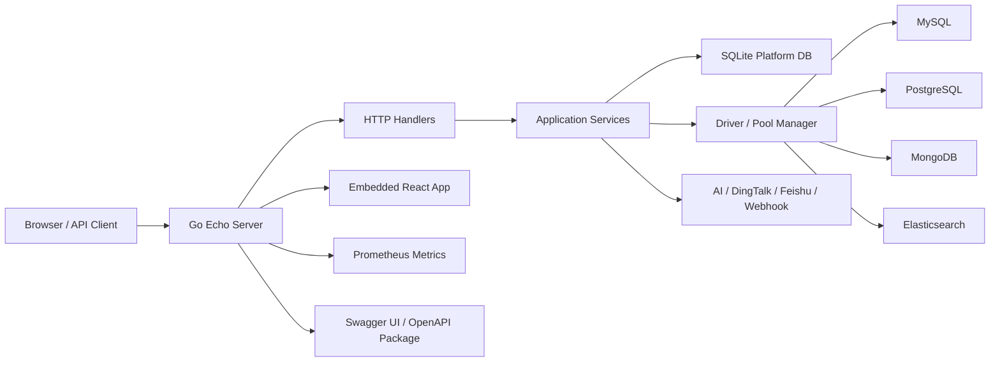

# SQLFlow 架构文档

Status: Active
Owner: engineering
Last reviewed: 2026-07-07
Source of truth: yes
Related code: `cmd/server`, `internal`, `config`, `web/src`

## 1. 架构目标

SQLFlow 是面向开发团队和 DBA 的 SQL 审批管理平台。系统架构优先满足四类目标：

- **治理优先**：查询、变更、审批、导出、权限和审计都必须可追溯。
- **部署简单**：默认以单个 Go 服务承载后端 API 和前端静态资源，平台元数据使用 SQLite。
- **数据源可扩展**：MySQL、PostgreSQL、MongoDB、Elasticsearch 通过统一 driver 抽象接入。
- **边界清晰**：HTTP、业务服务、数据访问、外部数据源连接、前端 UI 各自独立演进。

## 2. 运行时拓扑

## 3. 后端分层

| 层 | 目录 | 职责 | 约束 |
|----|------|------|------|
| 启动层 | `cmd/server` | 加载配置、打开数据库、执行迁移、装配容器、启动 Echo | 不承载业务逻辑 |
| 路由层 | `internal/api/router.go` | 注册公开、登录、Admin 路由和前端静态资源 | 路由是 HTTP 暴露面的事实源 |
| Handler 层 | `internal/api/handler` | 参数绑定、鉴权上下文读取、响应封装、OpenAPI 注解 | 不直接访问数据库 |
| Service 层 | `internal/service` | 查询、工单、审批、权限、审计、通知、导出等业务规则 | 业务一致性在此收敛 |
| 数据访问层 | `internal/db`, `internal/model` | 平台数据库、模型和迁移 | 默认 SQLite，迁移必须可重复执行 |
| 数据源层 | `internal/driver`, `internal/connpool` | 目标数据库连接、能力声明、查询执行 | 新能力优先进入 `driver` 抽象 |
| 基础设施 | `internal/pkg`, `internal/resp` | 加密、脱敏、指标、SQL 解析、统一响应 | 仅放跨模块通用能力 |

`internal/connpool` 是历史连接层，仍有兼容职责；新增数据源能力应优先基于 `internal/driver` 设计，避免扩大双轨连接模型。

## 4. 依赖装配

`internal/app.Container` 是运行时依赖容器，负责创建 service、连接池、调度器和跨服务依赖。容器是唯一允许集中处理依赖关系的地方；handler 和 service 不应自行 new 下游依赖。

生命周期规则：

- 数据库连接由 `cmd/server` 打开并交给容器。
- 调度器、异步任务和连接池由容器关闭。
- 后台任务必须支持进程退出时停止或自然释放资源。

## 5. API 架构

HTTP 框架使用 Echo v4。路由分为：

- 公开路由：登录、OIDC、分享访问、Web Vitals、健康检查、Swagger UI。
- 登录路由：查询、工单、模板、Token、权限申请、个人通知设置等。
- Admin 路由：用户、数据源、策略、脱敏、审计、报表、备份、系统设置和集成配置。

API 文档实践：

- handler 注解是 API 契约的事实源。
- `make docs` 生成 `internal/api/openapi/docs.go`。
- `internal/api/router.go` 通过 blank import 注册生成包，并用 `echoSwagger.WrapHandler` 暴露 `/swagger/*`。
- 不在 `docs/` 中维护手写 API 端点清单，也不提交 `swagger.json`、`swagger.yaml` 静态副本。

## 6. 数据模型与存储

平台元数据默认存放在 SQLite，覆盖用户、数据源、权限策略、查询历史、工单、审批记录、审计日志、通知配置、备份记录等。

数据原则：

- 审计日志不可作为普通业务数据删除。
- 数据源密码必须加密存储，密钥通过配置或环境变量提供。
- Refresh Token、API Token 等敏感令牌只保存 hash 或不可逆表示。
- 业务状态机变更必须写审计或历史记录。

## 7. 数据源抽象

目标数据库通过 driver 注册表接入。每个数据源实现应声明能力边界，例如：

- 是否支持事务执行。
- 是否支持 EXPLAIN。
- 是否支持 schema/table/column 元数据。
- 是否支持导出和分页。
- 查询语法、参数占位符和安全校验差异。

跨数据源功能不能假设 SQL 方言一致。前端、权限、AI 评审和工单执行都应读取能力声明或显式分支。

## 8. 核心业务流

### 查询流

1. 用户选择数据源并提交查询。
2. 后端验证身份、数据源权限和语句风险。
3. AI 评审可用时返回风险和建议；不可用时降级为静态规则。
4. 低风险查询直接执行，高风险变更进入工单流。
5. 查询结果默认经过脱敏和审计记录。

### 工单流

1. 用户提交 DDL/DML 或高风险操作。
2. 系统执行 AI/规则评审并生成风险等级。
3. 审批引擎按策略匹配审批链。
4. DBA/Admin 审批、驳回、取消或调度执行。
5. 执行结果、影响行数、错误和审计记录落库。

### 权限流

1. 用户提交临时权限申请。
2. DBA/Admin 审批后写入 Casbin 策略。
3. 权限带有效期，到期应由清理任务撤销。
4. 所有策略变更写审计。

## 9. 权限与安全

- 认证支持本地账号、JWT、Refresh Token、API Token 和 OIDC。
- 授权基于角色和 Casbin domain 策略。
- Admin 是唯一拥有系统配置和用户管理能力的角色。
- DBA 负责审批、执行、审计和部分治理动作。
- Developer 负责查询、提交工单、申请权限和管理个人资源。
- 所有后端接口必须以后端权限为准，前端隐藏只作为体验优化。

## 10. 前端架构

前端位于 `web/src`，使用 React、Vite、TypeScript、TanStack Query/Table、Zustand、CodeMirror 和 shadcn/ui 风格组件。

分层规则：

- `web/src/api` 只封装请求和类型适配。
- `web/src/pages` 承载页面级组合。
- `web/src/components` 承载复用组件。
- `web/src/hooks` 和 `web/src/store` 承载可复用状态逻辑。
- 页面权限必须同时依赖后端 403 兜底。

生产构建时，前端静态产物由 Go 服务嵌入并在 API 路由之后兜底服务。

## 11. 可观测性和运维

- 健康检查：`/health`、`/healthz`、`/readyz`。
- 指标：启用后暴露 `/metrics`。
- 前端性能：Web Vitals 上报到公开接口。
- 日志：Echo middleware 记录请求日志，业务异常应保留可排查上下文。
- 备份：SQLite 备份支持定时和手动触发。

## 12. 架构治理规则

- 新模块必须先明确所属层级和依赖方向。
- Handler 不写业务规则，Service 不依赖 Echo context。
- 新路由必须补充 OpenAPI 注解，并通过 `make docs` 更新生成包。
- 新数据源必须声明能力差异，不得只复制 SQL 数据源路径。
- 涉及状态机、权限、审计、脱敏、执行安全的变更必须更新需求或用户旅程文档。
