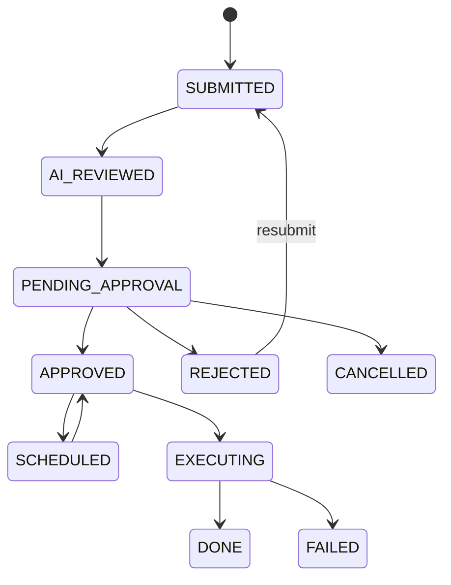
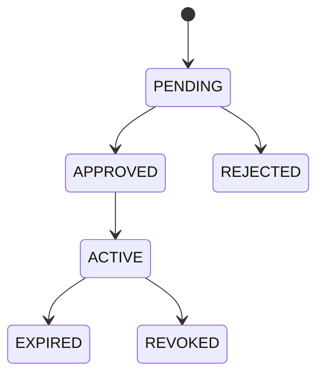
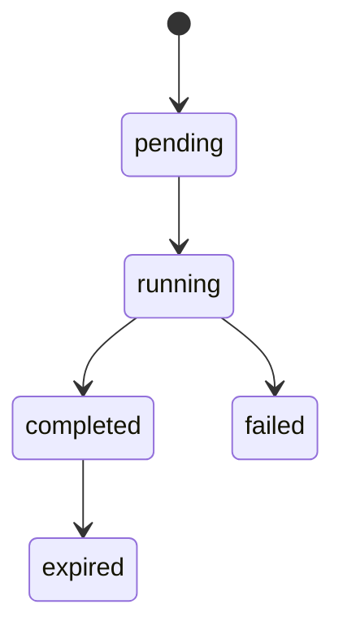

# SQLFlow 需求文档

Status: Active
Owner: product
Last reviewed: 2026-07-07
Source of truth: yes
Related code: `internal/service`, `internal/api/handler`, `web/src/pages`, `e2e/tests`

## 1. 产品定位

SQLFlow 是 SQL 查询、变更审批和数据访问治理平台。它服务于需要在开发效率、数据库安全和审计合规之间取得平衡的团队。

核心价值：

- 让低风险查询自助化。
- 让高风险变更进入审批和审计流程。
- 让数据源访问、敏感数据、导出、权限和操作记录可治理。

## 2. 用户角色

| 角色 | 目标 | 核心能力 |
|------|------|----------|
| Developer | 快速、安全地查询和提交变更 | 查询、导出、分享、模板、提交工单、申请权限 |
| DBA | 审核和执行高风险操作 | 工单审批、执行、审计、权限审批、治理建议 |
| Admin | 管理平台和组织策略 | 用户、数据源、权限、脱敏、AI、SLA、通知、备份、集成配置 |
| API Token | 支持自动化调用 | 以 scope 限定查询、工单、数据源、审计和管理能力 |
| System | 执行后台自动化 | SLA 巡检、定时执行、备份、导出清理、过期清理 |

## 3. 范围

### 范围内

- 多数据源查询和元数据浏览。
- SQL/Mongo 查询风险识别和 AI 前置评审。
- DDL/DML 变更工单审批。
- RBAC、数据源权限、临时权限申请。
- 字段级脱敏、敏感表标记和脱敏豁免审计。
- 查询历史、导出、分享、SQL 模板。
- 审计日志、报表、性能分析和 Web Vitals。
- 通知集成、备份、健康检查和 Prometheus 指标。

### 范围外

- 替代专业数据库审计网关。
- 托管目标数据库实例。
- 对所有数据库方言提供完全一致能力。
- 对外开放匿名查询能力。

## 4. 核心功能需求

### 4.1 认证与会话

- 用户可以通过本地账号登录。
- 系统支持 Access Token 和 Refresh Token。
- 系统支持 OIDC provider 配置和登录回调。
- API Token 支持独立 scope、过期时间、吊销和使用统计。
- 修改密码或重置密码后，应使后续认证风险可控。

### 4.2 数据源管理

- Admin 可以创建、更新、禁用和测试数据源。
- 数据源密码必须加密保存。
- 支持 MySQL、PostgreSQL、MongoDB、Elasticsearch。
- 数据源应暴露能力差异，供查询、工单、前端提示和测试使用。

### 4.3 查询

- 登录用户可以在有权限的数据源上执行查询。
- 查询前应完成权限校验、语句类型识别和风险判断。
- 查询结果默认脱敏。
- 支持分页、导出、查询历史、频繁查询、EXPLAIN 和慢查询统计。
- 大导出应使用异步任务，提供状态查询和下载。

### 4.4 AI 评审

- 系统支持 OpenAI、智谱 GLM、Azure OpenAI 和 OpenAI 兼容 provider。
- AI 评审返回风险等级、决策、建议和影响分析。
- AI 不可用或超时时，必须降级到静态规则评审。
- AI 评审不可绕过后端权限和工单规则。

### 4.5 工单与审批

- 高风险 DDL/DML 或 NoSQL 写操作必须进入工单。
- 工单支持提交、审批、驳回、取消、定时执行、执行、重提和查看修订。
- 审批策略按数据源、SQL 类型、风险等级等条件匹配。
- 审批链和审批历史必须可查看。
- 执行结果必须记录成功、失败、耗时、影响行数和错误原因。

### 4.6 权限治理

- 系统内置 admin、dba、developer 三类角色。
- 数据源、表、操作类型通过 Casbin 策略控制。
- 用户可以申请临时权限。
- Admin/DBA 可以审批、驳回和撤销权限申请。
- 权限过期后应自动失效。

### 4.7 脱敏与敏感数据

- Admin 可以配置字段脱敏规则。
- Admin 可以标记敏感表。
- 查询结果默认应用脱敏。
- 脱敏豁免必须基于权限，并写入审计。

### 4.8 审计与报表

- 查询、变更、导出、权限、配置和审批动作必须写审计。
- 审计日志支持筛选和全文检索。
- 报表覆盖使用、错误、性能和工单统计。
- 审计日志不提供普通删除能力。

### 4.9 通知与集成

- 支持钉钉、飞书和通用 Webhook。
- 支持用户通知偏好。
- 中高风险事件、审批结果和 SLA 事件应可通知。
- Webhook 应具备失败记录和重试或死信能力。

### 4.10 运维

- 系统提供健康检查和就绪检查。
- 可选启用 Prometheus 指标。
- SQLite 数据支持手动和定时备份。
- 部署文档必须覆盖 Docker Compose、本地开发和生产注意事项。

## 5. 非功能需求

| 类别 | 要求 |
|------|------|
| 安全 | 生产环境必须修改默认密钥和管理员密码；敏感配置优先使用环境变量 |
| 可用性 | AI、通知等外部依赖失败不能阻断核心审批和查询治理 |
| 性能 | 普通查询应有超时控制；大导出必须异步化 |
| 可审计 | 关键动作必须记录操作者、时间、对象、结果和错误 |
| 可维护 | API 契约由代码注解生成，文档不维护重复端点清单 |
| 可测试 | 核心 service、handler 和 E2E 旅程应有测试覆盖 |

## 6. 状态机

### 工单

### 权限申请

### 导出任务

## 7. 验收规则

- 新功能必须说明影响的角色、权限、状态机和审计事件。
- 新后端接口必须有 OpenAPI 注解和 handler/service 测试。
- 新前端页面必须覆盖加载、空态、错误、无权限和成功状态。
- 涉及生产部署的变更必须更新 `docs/deployment.md`。
- 涉及用户旅程的变更必须更新 `docs/user-journeys.md`。
