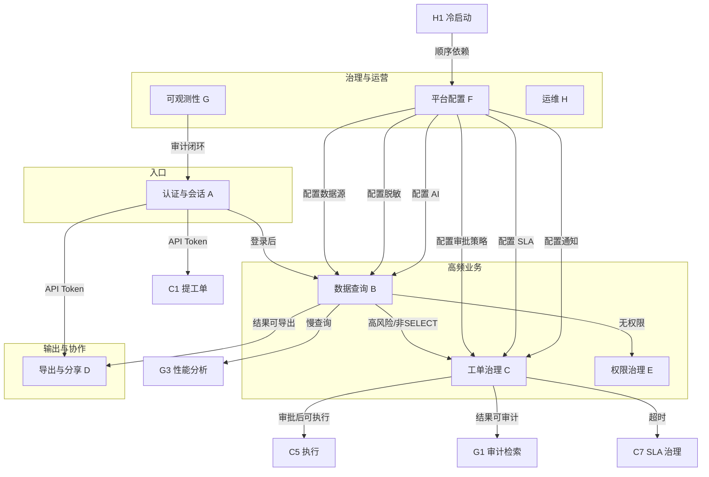

# SQLFlow 用户旅程地图

> 创建日期：2026-07-04
> 状态：已评审
> 分析方法：10 维度独立探索（需求 / 实现 / 数据 / 运维 / 交互 / 集成 / **微观交互** / **多数据源差异** / **实体生命周期** / **真实场景**）+ 交叉验证（对照代码逐条核实）+ 评审
> 事实源：以代码为唯一事实源（`internal/service/`、`internal/model/model.go`、`web/src/`、`e2e/tests/`）；需求、架构和 UI 文档用于说明当前治理口径
> 关联文档：[需求文档](./spec/REQUIREMENTS.md)、[UI 设计文档](./spec/UI-DESIGN.md)、[架构文档](./spec/ARCHITECTURE.md)

---

## 如何阅读本文档

本文档按**三个正交维度**组织用户旅程，可从不同视角切入：

| 维度 | 章节 | 适合谁读 | 视角 |
|------|------|----------|------|
| **功能维度** | §4 详细旅程（A–H 类） | 开发、产品 | "系统能做什么"——按功能模块拆解 |
| **场景维度** | §11 场景旅程（S01–S50） | 产品、测试、设计 | "用户在什么情境下走完整条路"——端到端真实场景 |
| **差异维度** | §12–§14 | 开发、测试 | "不同数据源/角色/状态下行为有何不同"——边界与差异 |

**快速入口**：
- 想看"系统能力清单" → [§2 旅程全景矩阵](#2-旅程全景矩阵)
- 想看"用户真实故事" → §11 场景旅程（S01–S50）
- 想看"四种数据库有何不同" → [§12 多数据源差异矩阵](#12-多数据源差异矩阵)
- 想看"页面内细粒度交互" → [§13 微观交互状态机](#13-微观交互状态机)
- 想看"一个实体从生到死" → [§14 实体生命周期](#14-实体生命周期)
- 想看"出了问题怎么办" → [§6 异常与降级](#6-异常与降级路径汇总)
- 想看"哪里有坑" → [§9 缺口与风险](#9-评审发现的缺口与风险)

---

## 1. 角色画像

| 角色 | 标识 | 核心职责 | 能力边界 | 会话失效条件 |
|------|------|----------|---------|-------------|
| 🌐 **访客** | 未认证 | 访问公开链接 | 仅 `/login`、`/s/:token`（分享）、`/api/metrics/web-vitals` | — |
| 👨‍💻 **developer** | role=developer | 查询、提工单、申请权限、自管 Token/模板/分享 | 不可审批工单；仅能取消/重提/执行**本人**工单 | access(15m) 过期 → 自动 refresh；改密 → refresh 全失效 |
| 🛡️ **dba** | role=dba | 审批工单、执行工单、审批权限申请、审计导出、管理评论 | 不可管理用户；可审批任意工单 | 同 developer |
| 👑 **admin** | role=admin | 用户管理、数据源/脱敏/AI/SLA/审批策略/集成配置、全量审计、Token 全局管理、备份 | 唯一可管理用户；**唯一不可被改角色/删除** | 同 developer |
| 🔌 **api_token** | token=`sqlflow_*`，role 标记 `api_token` | CI/CD 自动化调用 API | 按 scope 最小必要：`read:query` / `execute:query` / `read:ticket` / `write:ticket` / `read:datasource` / `read:audit` / `admin`（admin scope 自动通过全部） | token 过期 / 吊销 / 用户禁用 |
| 🤖 **system** | operatorID=0（调度器/巡检器） | SLA 巡检、定时执行、过期清理、备份、导出清理 | 系统自动化操作，跳过权限校验 | 进程重启 |
| 🔧 **DevOps** | 平台外 | Prometheus 抓取、备份下载恢复、健康探针、容器编排 | — | — |

**权限判定规则**（代码反推）：
- 工单审批/执行：`role ∈ {admin, dba}` 或**提交人本人**
- 工单重提：**仅原提交人**
- 用户管理（CRUD/重置密码）：**仅 admin**；admin 账户不可被改角色/删除
- 审计/报表导出：`role ∈ {admin, dba}`（审计检索 admin 独占）
- 前端导航过滤：仅 `/users`（用户管理）按 `role === 'admin'` 前端隐藏，其他页面依赖后端 403 兜底

---

## 2. 旅程全景矩阵

> 共 9 大类、42 条旅程。✅=可执行，—=不可执行，自动=系统后台触发

| # | 旅程 | 访客 | developer | dba | admin | api_token | system | 触发方式 |
|---|------|:---:|:---:|:---:|:---:|:---:|:---:|---------|
| **A 认证与会话** ||||||||
| A1 | 本地账密登录 | ✅ | — | — | — | — | — | 手动 |
| A2 | OIDC SSO 登录 | ✅ | — | — | — | — | — | 手动 |
| A3 | Token 自动续期 | — | ✅ | ✅ | ✅ | — | — | 自动 |
| A4 | 修改密码 → 会话失效 | — | ✅ | ✅ | ✅ | — | — | 手动 |
| A5 | 401/403 错误处理 | ✅ | ✅ | ✅ | ✅ | ✅ | — | 自动 |
| A6 | API Token 鉴权 | — | — | — | — | ✅ | — | 自动 |
| **B 数据查询** ||||||||
| B1 | 在线查询（AI 前置评审分流） | — | ✅ | ✅ | ✅ | ✅ | — | 手动 |
| B2 | AI 评审 + 三级降级 | — | ✅ | ✅ | ✅ | — | — | 自动 |
| B3 | SQL 自动补全 | — | ✅ | ✅ | ✅ | — | — | 自动 |
| B4 | EXPLAIN 执行计划 | — | ✅ | ✅ | ✅ | — | — | 手动 |
| B5 | 多 Tab 查询隔离 | — | ✅ | ✅ | ✅ | — | — | 手动 |
| B6 | 全局搜索 Cmd+K | — | ✅ | ✅ | ✅ | — | — | 手动 |
| B7 | 查询历史管理 | — | ✅ | ✅ | ✅ | — | — | 手动 |
| **C 工单治理** ||||||||
| C1 | 工单提交（含自动 AI 评审） | — | ✅ | ✅ | ✅ | ✅ | — | 手动 |
| C2 | 工单审批（单/多级链） | — | — | ✅ | ✅ | — | — | 手动 |
| C3 | 批量审批 | — | — | ✅ | ✅ | — | — | 手动 |
| C4 | 工单定时执行 | — | ✅ | ✅ | ✅ | — | ✅ | 手动+自动 |
| C5 | 工单执行（PG 事务 / MySQL auto-commit） | — | ✅* | ✅ | ✅ | — | — | 手动 |
| C6 | 工单改后重提 | — | ✅* | — | — | — | — | 手动 |
| C7 | SLA 治理（提醒/升级/自动驳回） | — | — | ✅ | ✅ | — | ✅ | 自动 |
| C8 | 工单评论 + Git 关联 | — | ✅ | ✅ | ✅ | — | — | 手动 |
| **D 数据导出与分享** ||||||||
| D1 | 同步导出（≤10000 行） | — | ✅ | ✅ | ✅ | ✅ | — | 手动 |
| D2 | 异步导出（>5000 行任务化） | — | — | ✅ | ✅ | — | — | 手动 |
| D3 | 查询结果分享（公开链接） | — | ✅ | ✅ | ✅ | — | — | 手动 |
| D4 | 访客访问分享 | ✅ | — | — | — | — | — | 手动 |
| **E 权限治理** ||||||||
| E1 | 临时权限申请 | — | ✅ | ✅ | ✅ | — | — | 手动 |
| E2 | 临时权限审批 + 自动下发/回收 | — | — | ✅ | ✅ | — | ✅ | 手动+自动 |
| E3 | 脱敏 bypass 与审计 | — | ✅ | ✅ | ✅ | — | — | 自动 |
| **F 平台配置（admin）** ||||||||
| F1 | 数据源接入 + 连接测试 | — | — | — | ✅ | — | — | 手动 |
| F2 | 脱敏规则 + 敏感表登记 | — | — | — | ✅ | — | — | 手动 |
| F3 | AI 配置 + 热更新 | — | — | — | ✅ | — | — | 手动 |
| F4 | 审批策略配置（多级链） | — | — | — | ✅ | — | — | 手动 |
| F5 | SLA 配置 | — | — | — | ✅ | — | — | 手动 |
| F6 | 通知集成（钉钉/飞书/Webhook） | — | — | — | ✅ | — | — | 手动 |
| F7 | 用户管理 | — | — | — | ✅ | — | — | 手动 |
| **G 可观测性与合规** ||||||||
| G1 | 审计日志检索 + 行展开 | — | — | ✅ | ✅ | — | — | 手动 |
| G2 | 报表（使用/错误/性能/工单） | — | — | — | ✅ | — | — | 手动 |
| G3 | 性能分析（慢查询） | — | ✅ | ✅ | ✅ | — | — | 手动 |
| G4 | Dashboard 概览 | — | ✅ | ✅ | ✅ | — | — | 手动 |
| G5 | 监控（Prometheus + Web Vitals） | — | — | — | — | — | ✅ | 自动 |
| **H 运维** ||||||||
| H1 | 冷启动初始化 | — | — | — | ✅ | — | — | 手动 |
| H2 | 数据库备份与恢复 | — | — | — | ✅ | — | ✅ | 手动+自动 |
| H3 | 健康检查（health/healthz/readyz） | — | — | — | — | — | ✅ | 自动 |

`*` = 仅本人提交的工单

---

## 3. 旅程间关系图



**6 个关键交汇点**（系统设计精髓）：

1. **AI 评审是"中枢"**：贯穿 B1（查询前评审）、C1（工单创建时评审）、B2（三级降级链）
2. **SLA 是"时间轴"**：贯穿 C2（进待审设 deadline）→ C7（巡检提醒/升级/驳回）
3. **审计是"闭环"**：A/B/C/D/E/F 几乎所有操作落入 G1 审计日志（独立 ctx 写入，即使操作超时审计仍落库）
4. **脱敏是"底线"**：B1 查询结果、D4 分享**默认强制脱敏**，仅 E3 bypass 权限可豁免（且记审计）
5. **状态机是"骨架"**：C 类工单 10 态状态机 + CAS 保护，支撑"审批-执行-回滚"全链路
6. **降级是"韧性"**：B2 三级降级 + 通知重试/死信/熔断 + 导出崩溃恢复，保证"AI 挂了系统仍可用"

---

## 4. 详细旅程

每条旅程按以下结构描述：

- **目标**：用户想达成什么
- **角色**：谁参与
- **触发**：手动 / 自动 / 异常
- **步骤**：时序化操作
- **API**：调用的后端端点
- **状态转换**：涉及的状态机（如有）
- **异常分支 / 降级**：非 happy path
- **成功标准**：验收点

---

### A 类：认证与会话

---

#### A1 · 本地账密登录

| 项 | 内容 |
|---|---|
| **目标** | 获取凭证进入工作区 |
| **角色** | 访客 |
| **触发** | 访问受保护路由 → `AuthGuard` 重定向 `/login` |
| **步骤** | ① 输入用户名（3–32 字符）<br>② 输入密码（8–128 字符）<br>③ onBlur 字段级校验<br>④ 点击"登录" |
| **API** | `POST /api/auth/login` → `{access_token(15m), refresh_token(7d), user{id,username,role}}` |
| **落地** | 写 localStorage → `navigate('/query')` |
| **异常** | 账密错误 → 服务端错误文案（红色提示条）<br>用户被禁用 → 拒绝登录 |
| **安全短板** | ⚠️ 登录接口缺暴力破解防护（CHANGELOG 已知问题 #5） |
| **成功标准** | 进入查询页，`/auth/me` 返回角色信息 |

---

#### A2 · OIDC SSO 登录

| 项 | 内容 |
|---|---|
| **目标** | 通过企业 IdP 单点登录（Keycloak / Auth0 / Google / Azure AD 等） |
| **角色** | 访客 |
| **触发** | 用户点击 IdP 登录入口 |
| **步骤** | ① `GET /api/auth/providers` 列出已启用 IdP<br>② `GET /api/auth/oidc/:provider` → 生成 `state` + PKCE（S256 verifier/challenge）→ 跳转 IdP<br>③ 用户在 IdP 完成登录<br>④ IdP 回调 `GET /api/auth/oidc/:provider/callback?code=&state=`<br>⑤ `exchangeCode` 换 token → `getUserInfo` → **findOrCreateUser**<br>⑥ 签发 JWT → 前端落地 |
| **用户映射** | 首次登录自动建用户（默认 `developer` 角色）：<br>- 优先按 `oidc_subject + provider` 查<br>- 其次按 email 关联已有账号（绑定 OIDC 身份）<br>- 都没有则创建（username 取 preferred_username/email/降级 `oidc_<provider>_<sub>`，随机密码，`ensureUniqueUsername` 防重名，最多 `_100` 后缀） |
| **缓存** | IdP 发现端点 `<issuer>/.well-known/openid-configuration` 缓存 |
| **超时** | HttpClient 15s |
| **⚠️ 安全隐患** | `state` 仅客户端校验，代码注释明确"production 应用 session/Redis"——当前实现存在 CSRF 风险 |
| **成功标准** | 回调后直接拿到 JWT 进入工作区 |

---

#### A3 · Token 自动续期

| 项 | 内容 |
|---|---|
| **目标** | access_token 过期不打断用户 |
| **角色** | developer / dba / admin |
| **触发** | 任意 API 返回 401（排除 `/auth/refresh`、`/auth/login` 自身） |
| **机制** | 前端 `api/client.ts`：<br>- `isRefreshing` 单例锁 + `refreshSubscribers` 队列<br>- 并发请求命中 401 时，仅第一个发起 refresh，其余排队等待<br>- refresh 成功 → 通知所有订阅者 + 重试原请求<br>- refresh 失败 → 清 token + toast `登录已过期` + 跳 `/login` |
| **API** | `POST /api/auth/refresh`（10s 超时，AbortController） |
| **后端 Rotation** | 事务内：校验旧 token → 标记 `revoked=true` → 签发新 token（`refresh_token.go:69-135`） |
| **⚠️ 例外** | SSE（`streamAIReview`）和 `getBlob` **不走 refresh**，401 直接跳登录 |
| **成功标准** | 用户无感知，请求自动重试成功 |

---

#### A4 · 修改密码 → 会话全局失效

| 项 | 内容 |
|---|---|
| **目标** | 改密后所有会话失效（安全要求） |
| **角色** | developer / dba / admin |
| **触发** | 头像下拉"修改密码" |
| **API** | `PUT /api/auth/password`（old_password / new_password） |
| **副作用** | 后端 `RevokeAllTokens` 撤销该用户**所有** refresh token（`auth.go`、`refresh_token.go:138-150`） |
| **用户体验** | 其他设备/Tab 下一次 access 过期时 refresh 失败 → 强制重登 |
| **成功标准** | 改密成功；其他会话失效 |

---

#### A5 · 401/403 错误处理

| 项 | 内容 |
|---|---|
| **目标** | 鉴权失败时正确引导 |
| **角色** | 全部 |
| **401 处理** | 走 A3 自动续期；续期失败 → 清 token + 跳 `/login` |
| **403 处理** | 直接 `window.location.href = "/403"`（跳整页 ErrorPage） |
| **5xx 处理** | toast `服务器错误，请稍后重试` |
| **网络错误** | `AbortError`（30s 超时）→ toast `请求超时`<br>`TypeError` → toast `网络连接失败` |
| **其他 4xx** | `STATUS_MESSAGES` 映射：400 `请求参数有误` / 404 `资源不存在` / 409 `操作冲突` / 429 `操作过于频繁` |

---

#### A6 · API Token 鉴权

| 项 | 内容 |
|---|---|
| **目标** | CI/CD 等外部系统集成 |
| **角色** | api_token |
| **触发** | 请求携带 `Authorization: Bearer sqlflow_*` |
| **机制** | `middleware.Auth` 检测 `sqlflow_` 前缀 → 走 Token 路径 → role 标记 `api_token` |
| **scope 校验** | `RequireScope` 中间件——JWT 用户绕过，API Token 必须有对应 scope，否则 403 |
| **存储安全** | SHA-256 哈希存储（`token_hash`），明文永不落库；显示前缀 `sqlflow_` + 前 8 hex |
| **校验** | 哈希后查库 → 检查 `is_active`、`expires_at` → 原子自增 `use_count` / 更新 `last_used_at` |
| **scope 清单** | `read:query` / `execute:query` / `read:ticket` / `write:ticket` / `read:datasource` / `read:audit` / `admin`（admin scope 自动通过全部） |
| **成功标准** | Token 有效且 scope 匹配则放行 |

---

### B 类：数据查询

---

#### B1 · 在线查询（AI 前置评审分流）

```
选数据源 ──▶ 写 SQL ──▶ 点执行 ──▶ AI 评审(SSE) ──▶ 风险分流
   │            │           │              │
   ▼            ▼           ▼              ├─ low ────────▶ 自动执行
 自动补全     多编辑器    流式渲染         ├─ medium+SELECT─▶ 确认执行
 (表/字段)   MySQL/Mongo  评审卡片         ├─ med/high+非SELECT ─▶ 引导提工单
             /ES/PG                        └─ blocked ────▶ 展示建议
```

| 项 | 内容 |
|---|---|
| **目标** | 安全地在线查询数据 |
| **角色** | developer / dba / admin（api_token 需 `execute:query` scope） |
| **API 链** | ① `GET /api/datasources`（过滤 active）<br>② `GET /api/datasources/:id/tables`、`/tables/:name/columns`（自动补全，5min 缓存）<br>③ `POST /api/query/review`（**SSE 流式**，先于执行）<br>④ `POST /api/query/execute`（按 decision 分流后） |
| **结果特性** | 默认脱敏、最多 1000 行、返回 `desensitized_fields` 列表 |
| **超时** | 30s 自动中断 → 统一映射 `ErrSQLTimeout` |
| **成功标准** | 按风险等级正确分流；低风险自动执行；高风险引导工单 |

---

#### B2 · AI 评审 + 三级降级

> 系统最精妙的设计，对用户透明的降级链。

```
                ┌─ 静态规则(始终先跑) ─→ 命中 IsBlocked? ─是─→ blocked(不调AI)
                │                                      否
                ▼
            AI 已配置? ─否─→ fallback(static)
                │是
                ▼
            callLLM ─成功─→ ReviewSource=ai
                │失败
                ├ DeadlineExceeded ─→ degradeResult: ReviewSource=degraded
                │                     非 SELECT 的 low 升级为 medium
                │                     summary 前缀 [AI超时降级]
                └ 网络错误 ─→ fallback(static)
```

| 项 | 内容 |
|---|---|
| **目标** | 给出风险分级 + 优化建议 + 变更影响分析 |
| **角色** | developer / dba / admin |
| **触发** | 查询执行前（B1）/ 工单创建时（C1，后端自动） |
| **Provider** | OpenAI / 智谱 GLM / Azure / 自定义（统一走 OpenAI Chat Completions 协议，差异仅 BaseURL/Model） |
| **SSE 事件** | `thinking` / `content`（流式文本）/ `result`（最终结构）/ `error` / `done` |
| **输出 JSON** | `{risk_level, risk_score, summary, suggestions, impact_analysis, rollback_sql, warnings, review_source}` |
| **静态规则** | `applyStaticRules`（始终先跑，不依赖 AI）：<br>- SQL 不可解析 → medium + confirm<br>- DROP/TRUNCATE/无 WHERE → blocked + high<br>- 敏感表 → 升级风险<br>- SELECT 无 LIMIT → warning |
| **决策映射** | `RiskToDecision`：<br>- `low` → execute<br>- `medium`/`high` + SELECT → confirm<br>- `medium`/`high` + 非 SELECT → ticket<br>- 静态 blocked → blocked |
| **缓存** | 结果 30s 有效（`ExpiresAt`） |
| **热更新** | `UpdateConfig` 用 RWMutex 保护，可动态切 provider/model/key/timeout |
| **超时** | 默认 10s（可配 `SQLFLOW_AI_TIMEOUT`）；HttpClient 超时 = timeout + 2s |
| **降级（详见 [§6](#6-异常与降级路径汇总)）** | AI 超时 → `degradeResult`（非 SELECT 升级 medium）<br>AI 网络错误/未配置 → `fallbackResult`（纯静态）<br>**降级对用户透明**——只看 badge |
| **风险评分双轨** | AI Prompt 内三档（low/medium/high）<br>静态评分（`risk_evaluator.go`）：SELECT 5 / INSERT 20 / UPDATE 35 / DELETE 45 / CREATE 30 / ALTER 60 / DROP 80 / TRUNCATE 70；≤15 low / ≤40 medium / ≤65 high / >65 critical |
| **成功标准** | 3–10s 出结果；AI 不可用时降级为静态规则且用户无感知 |

---

#### B3 · SQL 自动补全

| 项 | 内容 |
|---|---|
| **目标** | 减少拼写错误，提高编写效率 |
| **触发** | 输入 ≥2 字符 / `Ctrl+Space` / 输入 `.`（触发字段补全） |
| **缓存** | 表/字段 5min TTL；切换数据源/库时清空 |
| **降级** | 网络失败 → **静默降级**为仅关键字补全，不阻塞编辑器 |
| **类型标签** | T(table) / C(column) / K(keyword) / O(operator) |
| **成功标准** | 弹出框 < 200ms 出现；网络失败不阻塞编辑 |

---

#### B4 · EXPLAIN 执行计划

| 项 | 内容 |
|---|---|
| **目标** | 查看执行计划优化 SQL |
| **API** | `POST /api/query/explain` |
| **展示** | 右侧 Sheet 弹出 `ExplainPanel`（树形/格式化） |

---

#### B5 · 多 Tab 查询隔离

| 项 | 内容 |
|---|---|
| **目标** | 同时进行多个查询 |
| **状态管理** | Zustand `queryStore`，每个 Tab 独立隔离（sql / datasourceId / database / result / executing / aiReview / mongo / es） |
| **关闭** | 禁止关闭最后一个 Tab；关闭后自动选中相邻 Tab |
| **⚠️ 注意** | 关闭**无脏数据确认**（dirty 字段仅 UI 状态，不拦截关闭） |
| **持久化** | 分屏比例 `splitRatio` 持久化到 localStorage |

---

#### B6 · 全局搜索 Cmd+K

| 项 | 内容 |
|---|---|
| **目标** | 快速定位历史查询、工单、审计日志 |
| **触发** | `Cmd+K` / `Ctrl+K`（或顶栏搜索按钮） |
| **搜索范围** | 4 分组：页面 / 查询历史 / 工单 / 审计日志；空输入时显示最近 5 条查询历史 |
| **性能** | debounce 300ms；`Promise.allSettled` 容错；每组硬限 5 条 |
| **降级** | 部分失败 → 黄色提示各组错误；全部失败 → `搜索失败，请稍后重试` |
| **跳转行为** | 页面 → navigate<br>查询历史/最近 → `openQueryInNewTab`（开新 Tab 填 SQL）<br>工单 → `navigate('/tickets?id=N')`（打开详情抽屉）<br>审计日志 → `navigate('/audit?highlight=kw')` |
| **成功标准** | < 500ms 响应；空输入有推荐；跳转准确 |

---

#### B7 · 查询历史管理

| 项 | 内容 |
|---|---|
| **目标** | 复用历史 SQL |
| **API** | `GET /api/query/history`、`/history/frequent`、`DELETE /history/:id`、`DELETE /history`（清空） |
| **限制** | 每用户最大 200 条 |
| **操作** | 关键词搜索、单条删除、清空、点击"恢复为新 Tab"重新加载 SQL+数据源+库 |

---

### C 类：工单治理（核心价值）

---

#### C1 · 工单提交（含自动 AI 评审）

| 项 | 内容 |
|---|---|
| **目标** | 发起 DDL/DML/MongoDB update 变更 |
| **角色** | developer / dba / admin（api_token 需 `write:ticket` scope） |
| **步骤** | ① 选数据源<br>② 填数据库名（可选）<br>③ 粘贴 SQL<br>④ 填变更原因（必填，≥10 字符）<br>⑤ 提交 |
| **API** | `POST /api/tickets`（参数：datasource_id / database / sql / db_type / change_reason） |
| **后端自动** | ① SQL 分析器判定 sql_type / affected_tables<br>② AI 评审（风险分级）<br>③ 审批策略匹配 |
| **状态转换** | `SUBMITTED → AI_REVIEWED → PENDING_APPROVAL`（或命中自动审批条件 → 直接 `APPROVED`） |
| **前端** | 提交成功后 toast 提示 + `navigate('/tickets')`（**前端不主动触发 AI**，AI 在后端创建时自动跑） |
| **成功标准** | 工单创建成功，进入审批流 |

---

#### C2 · 工单审批（单/多级链）

| 项 | 内容 |
|---|---|
| **目标** | 审批变更工单 |
| **角色** | dba / admin |
| **多级审批链** | `approval_chain` JSON 结构：`[{role, auto_skip_same_submitter}]` |
| **阶段推进** | 当前阶段 `expectedStage.Role` 必须等于审批人角色，**或审批人是 admin**（admin 可越权审批任意阶段） |
| **API** | `POST /api/tickets/:id/approve`（单级）<br>`POST /api/tickets/:id/engine-approve`（走引擎多级）<br>`POST /api/tickets/:id/reject`（驳回，必填理由）<br>`POST /api/tickets/:id/cancel`（取消，必填理由）<br>`GET /api/tickets/:id/approval-chain`、`/approval-history` |
| **状态转换** | `PENDING_APPROVAL → APPROVED`（通过）/ `→ REJECTED`（驳回）/ `→ CANCELLED`（取消） |
| **SLA 副作用** | 通过/驳回均 `ClearTicketSLA` |
| **⚠️ 实现缺口** | `auto_skip_same_submitter` 字段存在但 `ProcessApproval` **未实现跳过逻辑**——多级链中"提交人自审"会卡住（见 [§9](#9-评审发现的缺口与风险)） |

---

#### C3 · 批量审批

| 项 | 内容 |
|---|---|
| **目标** | 高效处理多个待审批工单 |
| **角色** | dba / admin（`isApprover`） |
| **限制** | 仅 `PENDING_APPROVAL` 状态工单可勾选；**单次 ≤50** |
| **API** | `POST /api/tickets/batch-approve`、`/batch-reject` |
| **执行方式** | **串行循环**调用单条 Approve/Reject（无 goroutine 并发） |
| **⚠️ 部分**失败不回滚 | 返回 `{Total, Succeeded, Failed, Results}`，每条带 `{TicketID, Success, Error}` |
| **反馈** | `N 成功，M 失败` 用 `toast.warning`；全成功用 `toast.success` |

---

#### C4 · 工单定时执行

| 项 | 内容 |
|---|---|
| **目标** | 在指定时间执行变更（DBA 选择合适时机） |
| **触发** | APPROVED 后设 `scheduled_at`（手动），到期由调度器执行（自动） |
| **API** | `POST /api/tickets/:id/schedule`、`POST /api/tickets/:id/cancel-schedule` |
| **调度器** | `Scheduler.loop`（间隔可配，每轮 ctx 30s 超时）→ 查 `SCHEDULED AND scheduled_at<=now` → **原子 CAS** `WHERE id=? AND status='SCHEDULED'` 防重复 → `executeTicket(operatorID=0)` |
| **状态转换** | `APPROVED → SCHEDULED → EXECUTING → DONE` |
| **⚠️ 注意** | 服务器重启后 `SCHEDULED` 工单在**下个 tick 自动恢复执行**（不像导出任务标失败） |
| **成功标准** | 到点自动执行；并发安全；重启可恢复 |

---

#### C5 · 工单执行（PG 事务 vs MySQL auto-commit）

> 关键技术差异旅程，PG 与 MySQL 行为截然不同。

| 项 | 内容 |
|---|---|
| **目标** | 在目标库执行审批通过的 SQL |
| **角色** | 提交人本人 或 admin/dba |
| **并发保护** | 裸 SQL CAS：`UPDATE tickets SET status='EXECUTING' WHERE id=? AND status IN ('APPROVED','SCHEDULED')`，`RowsAffected=0` → `ErrTicketNotExecutable` |
| **SQL hash 防篡改** | 执行前 `sha256(sql)` 比对 `sql_hash`（审批时写入），不一致直接 `failTicket` |
| **PostgreSQL** | `BeginTx` → 逐条执行 → **首条失败立即 break + 整批 Rollback** → 已执行语句标记 `rolled_back` |
| **MySQL** | 逐条 auto-commit → 失败仅记录 `firstErr` **但继续执行后续语句** → **部分成功不可回滚**（DDL 自动提交） |
| **MongoDB** | 单条命令（find/aggregate/insert/update/delete）；`IsMulti` 决定 UpdateMany/DeleteMany |
| **错误脱敏** | `sanitizeErrMsg` 抹掉 host/addr/ip:port/path |
| **连接错误** | 7 种模式匹配（invalid connection / connection refused / no such host / connection reset / i/o timeout / connect: connection / bad connection）→ 统一 `ErrSQLTimeout` |
| **状态转换** | `APPROVED/SCHEDULED → EXECUTING → DONE / FAILED` |
| **成功标准** | 按数据库类型正确执行/回滚；防并发/防篡改 |

---

#### C6 · 工单改后重提

| 项 | 内容 |
|---|---|
| **目标** | 被驳回后修改重新提交 |
| **角色** | **仅原提交人** |
| **API** | `PUT /api/tickets/:id/resubmit` |
| **副作用** | 旧版本快照到 `ticket_revisions`、`revision+1`、清空 risk_level / ai_review_result / reviewer |
| **状态转换** | `REJECTED → SUBMITTED`（重新走 AI 评审与审批） |
| **成功标准** | 重提后进入新一轮 AI 评审 |

---

#### C7 · SLA 治理（提醒/升级/自动驳回）

> 后台自动化旅程，对工单体验影响巨大。

```
工单进 PENDING_APPROVAL ─→ setMissingDeadlines(补 deadline)
                              │
                         SLA 调度器(每轮 ctx 60s)
                              │
              ┌───────────────┼───────────────┐
              ▼               ▼               ▼
        percent≥Reminder%  percent≥100%    percent≥100%
        (默认 80)         + AutoRejectEnabled  无 AutoReject
              │               │               │
         sendReminder     autoRejectTicket   sendEscalation
         (按小时去重)      (原子 CAS 拒绝)      (按天去重)
         sla_status=       通知提交人          通知 escalate_to_role
          warning          sla_status=breached
```

| 项 | 内容 |
|---|---|
| **目标** | 防止工单积压；超时自动治理 |
| **角色** | system（调度器） |
| **调度器** | `SLAScheduler`（构造传入间隔，每轮 ctx 60s 超时） |
| **deadline 计算** | `deadline = now + TimeoutMinutes`，按 `risk_level` 映射到 `sla_config.priority`（空值默认 medium） |
| **百分比** | `percent = elapsed / totalDuration * 100`（elapsed = now - created_at） |
| **去重** | `sla_action_log` 表 `dedup_key` + `ON CONFLICT DO NOTHING`：<br>- auto_reject：全局一次<br>- escalate：按日期<br>- reminder：按日期+小时 |
| **API** | `GET /api/tickets/sla-status`、`GET /api/sla-notifications` |
| **配置** | 按风险等级（low/medium/high）配置：timeout_minutes / reminder_percent(默认 80) / escalate_to_role / auto_reject_enabled |

---

#### C8 · 工单评论 + Git 关联

| 项 | 内容 |
|---|---|
| **评论** | `POST /api/tickets/:id/comments`、`GET /comments`、`DELETE /api/comments/:id`<br>支持嵌套回复（parent_id）；删除权：本人 OR admin OR dba<br>快捷键：`Cmd/Ctrl+Enter` 提交，`Esc` 取消回复 |
| **Git 关联** | `POST /api/git-links`<br>关联类型：`commit`（hash/msg/author）或 `pr`（number/title/url/repo/branch）<br>关联实体：`ticket` 或 `audit_log`<br>**纯手动填写**（不自动抓取 Git）<br>用途：审批时追溯"这次 DDL 对应哪个代码变更"，形成"代码→SQL→审批→执行"全链路审计 |

---

### D 类：数据导出与分享

---

#### D1 · 同步导出（≤10000 行）

| 项 | 内容 |
|---|---|
| **目标** | 导出查询结果/工单/审计数据 |
| **角色** | admin/dba（审计导出）；developer 可导出查询结果与工单 |
| **限制** | 执行 `10000+1` 行探测，超限 → `ErrExportRowLimit` + 写审计 `export_failed` |
| **API** | `POST /api/query/export`、`GET /api/export/audit`、`/export/tickets` |
| **格式** | CSV / JSON，带水印 |
| **成功标准** | 小数据量即时下载 |

---

#### D2 · 异步导出（>5000 行任务化）

> 完整状态机 + 崩溃恢复。

```
创建 ExportTask(PENDING) ─go executeExport─→ PROCESSING ─→ COMPLETED(写文件+水印+Sync)
                              │                    │
                              │                    └─→ FAILED(删半成品)
                              │
                   recoverPendingTasks(启动时):
                   PENDING/PROCESSING → FAILED("服务器重启，任务中断")
```

| 项 | 内容 |
|---|---|
| **目标** | 大数据量后台导出，避免阻塞 |
| **角色** | admin/dba |
| **阈值** | `AsyncExportThreshold=5000`（超过走异步）；`exportRowLimit=10000`（硬上限） |
| **文件清理** | `cleanupLoop` 每小时，删除 `completed_at < now-24h`（`ExportFileTTL=24h`） |
| **前端轮询** | 首次 1500ms，之后每 2000ms，状态 pending/processing/completed/failed |
| **API** | `POST /api/export/tasks`、`GET /tasks/:id`、`GET /tasks/:id/download` |
| **状态机** | `pending → processing → completed / failed`（详见 [§7.3](#73-导出任务状态机)） |
| **成功标准** | 大数据量可靠导出；重启后任务状态正确 |

---

#### D3 · 查询结果分享（公开链接）

| 项 | 内容 |
|---|---|
| **目标** | 将查询结果分享给团队/外部 |
| **角色** | developer / dba / admin |
| **步骤** | ① 有结果行时点 ShareButton<br>② 选过期时间（1h/6h/24h/48h/7d）<br>③ 可选密码保护<br>④ 生成 `/s/:token` 链接 |
| **API** | `POST /api/query/share`、`GET /api/query/share`（我的）、`DELETE /api/query/share/:id`（撤销） |
| **安全** | **共享数据强制应用脱敏规则** |
| **⚠️ 注意** | 密码**无强度校验** |

---

#### D4 · 访客访问分享

| 项 | 内容 |
|---|---|
| **目标** | 无需登录查看分享结果 |
| **角色** | 访客 |
| **步骤** | ① 打开 `/s/:token`<br>② 若 `has_password` → 输入密码校验<br>③ 查看只读结果表（NULL 显示为 `NULL`） |
| **API** | `GET /s/:token`（public）、`POST /s/:token/verify`（密码校验） |
| **强制脱敏** | 共享数据**强制脱敏** |
| **异常** | 过期/不存在/已撤销 → `无法访问` |

---

### E 类：权限治理

---

#### E1 · 临时权限申请

| 项 | 内容 |
|---|---|
| **目标** | 申请临时数据访问权限 |
| **角色** | developer / dba / admin |
| **步骤** | ① 选数据源<br>② 填数据库（必填）+ 表名（可选）<br>③ 选操作类型（select / +update / +delete / +ddl / export / 全部）<br>④ 选有效期（1–72 小时）<br>⑤ 填申请理由 |
| **约束** | 有效期 1 分钟 ~ 72 小时；actions ∈ {select,update,delete,ddl,export} |
| **API** | `POST /api/permission-requests`、`GET /mine`、`/active` |

---

#### E2 · 临时权限审批 + 自动下发/回收

```
developer 申请 ─PENDING─→ admin/dba 审批 ─APPROVED─→ AddTemporaryPolicy(写 Casbin + temp_policies)
                │                          │
              驳回                      到期/撤销
                ▼                          ▼
             REJECTED              ExpireOverdue(定时) → RemoveTemporaryPolicy
```

| 项 | 内容 |
|---|---|
| **审批角色** | admin / dba |
| **API** | `POST /:id/approve`、`/reject`、`/revoke`、`POST /expire`（过期清理） |
| **自动下发** | 审批通过 → 循环 `AddTemporaryPolicy` 写入 Casbin 临时策略 + `temp_policies` 表 |
| **自动回收** | `ExpireOverdue` 定时扫描 → 逐条 `RemoveTemporaryPolicy` 删 Casbin 策略 |
| **过期保护** | 审批时若 `now > ExpiresAt` → 先标 EXPIRED 再报"已过期" |
| **状态机** | `PENDING → APPROVED/REJECTED`；`APPROVED → EXPIRED/REVOKED`（详见 [§7.2](#72-权限申请状态机)） |

---

#### E3 · 脱敏 bypass 与审计

| 项 | 内容 |
|---|---|
| **目标** | 特权角色查看明文敏感数据 |
| **机制** | `HasDesensitizeBypass`：检查 role 在域 `ds_<id>` 下对每张表或通配符 `*` 是否有 `desensitize:bypass` action |
| **审计** | 脱敏规则增删改全写审计（`mask_rule_create/update/delete`、`sensitive_table_create/delete`）；bypass 操作记审计日志 |
| **敏感表** | 默认拒绝访问，需 admin 显式授权；sensitivity_level：low/medium/high |

---

### F 类：平台配置（admin）

> 平台冷启动与持续治理旅程。7 个子旅程。

| 子旅程 | 关键配置 | 关键 API |
|--------|----------|----------|
| **F1 数据源接入** | MySQL/PG/Mongo/ES 连接 + 池参数（max_open/max_idle/max_lifetime/max_idle_time）+ SSL（PG）+ ES 认证（basic/api_key/none） | `POST /api/datasources`、`POST /:id/test`（连接测试） |
| **F2 脱敏规则** | 8 种内置（phone/id_card/name/email/bank_card/address/full/custom）+ 自定义正则 + 敏感表登记（按数据源绑定表，low/medium/high） | `POST /api/mask-rules`、`POST /api/sensitive-tables` |
| **F3 AI 配置** | provider(openai/zhipu/azure/custom) + model + apiKey + timeout；**热更新**（RWMutex 保护）；apiKey 留空保持不变（脱敏显示前4后4） | `PUT /api/settings/ai` |
| **F4 审批策略** | 多级审批链（`approval_chain` JSON）+ 条件匹配（risk_levels/sql_types/environments/databases）+ priority 排序 + 自动审批（含 reason）+ 启停 | `POST /api/admin/approval-policies`、`PUT /reorder`、`PUT /:id/toggle` |
| **F5 SLA 配置** | 按风险等级（low/medium/high）配 timeout_minutes / reminder_percent(默认 80) / escalate_to_role / escalate_to_user / auto_reject_enabled | `POST /api/settings/sla` |
| **F6 通知集成** | 钉钉 Webhook（加签）+ 飞书（多 webhook + 加签 + 死信队列）+ 通用 Webhook 订阅（事件订阅 + HMAC-SHA256 签名 + SSRF 防护 + 熔断） | `PUT /api/settings/notify/webhook`、`/feishu`、`POST /api/admin/webhooks/subscriptions` |
| **F7 用户管理** | CRUD + 重置密码（密码须字母+数字）+ 禁用；admin 不可改角色/删除 | `POST /api/users`、`PUT /:id/reset-password` |

---

### G 类：可观测性与合规

---

#### G1 · 审计日志检索 + 行展开

| 项 | 内容 |
|---|---|
| **目标** | 全量追溯操作历史 |
| **角色** | admin / dba |
| **检索** | SQLite FTS5 全文搜索（`MATCH` + `snippet()` 高亮）；7 字段筛选（SQL/表名/用户/IP/数据库/错误/脱敏）+ 操作类型/数据源/起止日期 |
| **行展开** | 完整 SQL、执行耗时、影响/返回行数、IP、操作人、时间戳、**关联工单**（getTicket 跳转）、**Git 关联**（listGitLinks）、**AI 评审结果**、脱敏字段、错误信息 |
| **API** | `GET /api/audit-logs/search`、`GET /api/audit/user-analytics`（admin 独占） |
| **完整性** | API 层无 DELETE 端点；写入用独立 ctx（10s 超时），即使操作超时审计仍落库 |
| **审计字段** | UserID / Action / DatasourceID / Database / SQLContent / SQLSummary / ResultRows / AffectedRows / ExecutionTimeMs / ErrorMessage / DesensitizedFields / IPAddress / AIReviewResult / TicketID |

---

#### G2 · 报表

| 项 | 内容 |
|---|---|
| **角色** | admin |
| **4 个 Tab** | ① 使用统计（`/reports/usage`）：TOP 用户/操作/库 + 趋势<br>② 错误分析（`/reports/errors`）：错误率/类型/最近 20 条<br>③ 性能趋势（`/reports/performance`）：平均/最大/P95 耗时<br>④ 工单统计（`/reports/tickets`）：审批时间/拒绝率/风险分布 |
| **统计范围** | 7/14/30/90 天可切换 |

---

#### G3 · 性能分析（慢查询）

| 项 | 内容 |
|---|---|
| **角色** | developer / dba / admin |
| **指标卡** | 总查询数、慢查询数（占比）、平均耗时、统计天数 |
| **慢查询列表** | 阈值可选 500/1000/3000ms；按耗时红/橙/黄着色 |
| **API** | `GET /api/query/performance/slow`、`/stats` |
| **注** | SlowQuery / PerformanceStat 不是独立表，基于 `query_history` 聚合 |

---

#### G4 · Dashboard 概览

| 项 | 内容 |
|---|---|
| **角色** | 全员 |
| **展示** | 时间范围切换（默认 week）+ 3 张统计卡（待审批工单/查询次数/活跃数据源，含 sparkline + 环比）+ 查询趋势折线 + 工单状态饼图 + 最近活动 Feed |
| **API** | `GET /api/dashboard/overview`、`/stats` |

---

#### G5 · 监控（Prometheus + Web Vitals）

| 项 | 内容 |
|---|---|
| **角色** | system（自动采集） + DevOps（外部抓取） |
| **Prometheus 指标** | `http_request_duration_seconds` / `http_requests_total` / `active_tickets` / `db_queries_total` / `tickets_total` / `active_datasources` / `db_query_duration_seconds` |
| **端点** | `GET /metrics`（需 `metrics.enabled=true`） |
| **Web Vitals** | 前端仅生产环境采集 LCP/INP/CLS（INP 替代 FID）；`navigator.sendBeacon` 优先，fallback `fetch keepalive` |
| **上报** | `POST /api/metrics/web-vitals`（public，每 IP/分钟限 10 次，滑动窗口） |
| **保留** | 30 天 |

---

### H 类：运维

---

#### H1 · 冷启动初始化

| 项 | 内容 |
|---|---|
| **目标** | 新部署的平台完成初始化，使其他角色旅程可用 |
| **角色** | admin |
| **顺序依赖** | **必须按以下顺序**：<br>① F1 数据源接入（否则无法查询/提工单）<br>② F2 脱敏规则（否则敏感数据无保护）<br>③ F4 审批策略（否则工单无法匹配策略）<br>④ F3 AI 配置（否则评审降级为静态）<br>⑤ F5 SLA 配置（否则工单无超时治理）<br>⑥ F6 通知集成（否则审批无通知）<br>⑦ F7 用户管理（创建 dba/developer 账号） |
| **初始管理员** | `SQLFLOW_ADMIN_USERNAME` / `SQLFLOW_ADMIN_PASSWORD`（默认 admin/admin123，启动 WARN） |

---

#### H2 · 数据库备份与恢复

| 项 | 内容 |
|---|---|
| **自动备份** | `BackupService.Start()`：启动后 **5s 先跑一次初始备份**，之后按 interval（默认 6h）周期执行 |
| **备份流程** | ① `PRAGMA wal_checkpoint(TRUNCATE)` 刷 WAL<br>② 文件级 copy 主 db（校验字节数一致）<br>③ 可选 gzip 压缩<br>④ `rotate` 按保留最新 N 份（默认 10） |
| **互斥** | `sync.Mutex` 保护 |
| **API** | `POST /api/backups`（手动触发）、`GET /api/backups`（列表）、`GET /:filename/download`、`DELETE /:filename` |
| **路径穿越防护** | filename 必须以 `sqlflow-` 开头，禁 `..` / `/` / `\` |
| **⚠️ 恢复** | **代码无自动 restore 函数**——恢复需手动停服 + 用下载的 db 文件替换 `SQLFLOW_DB_PATH` |

---

#### H3 · 健康检查

| 端点 | 用途 | 检查依赖 |
|------|------|----------|
| `GET /health`（`/api/health`） | 综合健康检查 | 仅 SQLite（`db.Ping()`） |
| `GET /healthz` | **Liveness** 存活探针 | **无依赖检查**，进程活着即 200 |
| `GET /readyz` | **Readiness** 就绪探针 | 检查全部依赖：SQLite + 外部数据源连接池（`connpool.Manager.HealthCheck()`）+ driver PoolManager |

---

## 5. 旅程间依赖关系（跨旅程触发表）

| 触发旅程 | 被触发旅程 | 条件 |
|----------|------------|------|
| B1 查询（高风险非 SELECT） | C1 工单提交 | decision=ticket |
| B1 查询（AI 评审） | B2 AI 评审 | 始终（执行前） |
| C1 工单提交 | B2 AI 评审（后端自动） | 创建工单时 |
| C2 工单审批通过 | C4 定时执行 / C5 立即执行 | APPROVED 后 |
| C2 工单进入待审 | C7 SLA 治理 | PENDING_APPROVAL 且有 deadline |
| C7 SLA 超时 | C2 自动驳回（状态变更） | AutoRejectEnabled |
| C5 工单执行 | G1 审计写入 | 始终（独立 ctx） |
| E2 权限审批通过 | E3 临时 Casbin 策略下发 | APPROVED |
| F6 通知配置 | C7 SLA 通知 / C2 审批通知 | 事件触发 |
| A4 改密 | A3 所有 refresh token 失效 | 始终 |
| H1 冷启动 | F1-F7 配置初始化 | 顺序依赖 |

---

## 6. 异常与降级路径汇总

> 工程价值最高的部分——所有"非 happy path"集中呈现。是测试用例的直接输入。

| 旅程 | 异常/边界 | 系统行为 | 用户感知 |
|------|----------|---------|---------|
| **B2 AI 评审** | AI 超时（>10s） | `degradeResult`，非 SELECT 升级 medium | 透明，badge 标"AI超时降级" |
| B2 AI 评审 | AI 网络错误/不可用 | `fallbackResult` 纯静态 | 透明，badge 标"静态规则" |
| B2 AI 评审 | 未配置 API Key | 直接静态规则 | 透明 |
| **B1 查询** | 30s 超时/连接失败 | 统一 `ErrSQLTimeout` | "查询超时（30秒）" |
| B1 查询 | 错误消息 | `sanitizeErrMsg` 抹 host/ip | 脱敏错误 |
| **C4 工单** | 服务器重启时 SCHEDULED | 下个 tick 自动恢复执行 | 无感知 |
| **C5 执行** | PG 首条失败 | 整批 Rollback | 看 rolled_back 标记 |
| C5 执行 | MySQL 中途失败 | 继续执行，部分落库 | firstErr 决定 FAILED |
| C5 执行 | SQL hash 不匹配 | 直接 `failTicket` | 防审批后篡改 |
| C5 执行 | 并发重复执行 | CAS `RowsAffected=0` 拒绝 | 防重复 |
| **C7 SLA** | 超时 + AutoReject | 原子 CAS 驳回 | 通知提交人 |
| C7 SLA | 超时无 AutoReject | 升级 + 通知 escalate_to_role | DBA 收到 |
| **D2 导出** | 服务器重启中断 | 标 FAILED"服务器重启" | 任务列表可见 |
| D2 导出 | 文件 >24h | 自动清理 + 标 FAILED | 需重新导出 |
| D2 导出 | >10000 行 | 硬限拒绝 + 写审计 | 提示超限 |
| **A3 会话** | refresh 失败 | 清 token + 跳登录 | "登录已过期" |
| A3 会话 | 并发 401 | 单例锁 + 队列排队 | 无感知 |
| **飞书通知** | 发送失败 | 3 次平方退避（1s/4s/9s） → 死信队列 | 死信表可查 |
| **通用 Webhook** | 连续失败 10 次 | 自动熔断 `enabled=0` | 需手动重新启用 |
| 通用 Webhook | 内网 URL | SSRF 拒绝（DNS 解析后查内网 IP） | 创建失败 |
| **权限申请** | 审批时已过期 | 标 EXPIRED 再报错 | 提示已过期 |
| **备份下载** | 路径穿越 | 校验 `sqlflow-` 前缀 + 禁 `..` | 安全 |
| **自动补全** | 网络失败 | 静默降级关键字补全 | 无感知 |
| **全局搜索** | 部分失败 | `allSettled` + 黄色提示 | 部分结果可见 |

---

## 7. 核心状态机

### 7.1 工单状态机

> 工单状态机共 10 个状态，包含定时执行态 `SCHEDULED` 和执行失败态 `FAILED`。以代码中的状态枚举和流转逻辑为准。

```
SUBMITTED ─AI评审─▶ AI_REVIEWED ─进待审─▶ PENDING_APPROVAL
   │                    │                       │
 取消                  取消                  ┌──┴──┐
   ▼                    ▼                 通过    驳回
CANCELLED            CANCELLED              ▼      ▼
                                       APPROVED  REJECTED ─改后重提─▶ SUBMITTED
                                          │
                                   ┌──────┴──────┐
                                定时执行       立即执行
                                   ▼             ▼
                               SCHEDULED ─到点─▶ EXECUTING ─成功─▶ DONE ✓
                                   │              │
                                 取消           失败
                                   ▼              ▼
                               CANCELLED       FAILED ✗
```

**合法转换表**（`internal/service/ticket.go:54-65`）：

| from | 合法 to | 触发动作 |
|------|---------|---------|
| SUBMITTED | AI_REVIEWED / CANCELLED | AI 评审通过 / 取消 |
| AI_REVIEWED | PENDING_APPROVAL / CANCELLED | 进入人工审批 / 取消 |
| PENDING_APPROVAL | APPROVED / REJECTED / CANCELLED | 审批通过/驳回/取消 |
| APPROVED | EXECUTING / SCHEDULED / CANCELLED | 执行/定时/取消 |
| SCHEDULED | EXECUTING / CANCELLED | 调度器到期/取消 |
| EXECUTING | DONE / FAILED | SQL 执行结果 |
| REJECTED | SUBMITTED | 仅原提交人 Resubmit |
| DONE / CANCELLED | （终态） | — |

**并发保护**：所有状态变更用 `if t.Status != X` 显式校验 + CAS 模式（手动执行 / 调度器 / SLA 自动拒绝均用裸 SQL `WHERE id=? AND status=?` + `RowsAffected` 检查）。

### 7.2 权限申请状态机

> 共 5 个状态。

```
PENDING ─admin/dba 通过─▶ APPROVED ─到期/撤销─▶ EXPIRED / REVOKED
   │
 驳回
   ▼
REJECTED
```

| from | 合法 to | 触发动作 |
|------|---------|---------|
| PENDING | APPROVED / REJECTED | 审批通过/驳回 |
| APPROVED | EXPIRED / REVOKED | 到期（定时扫描）/ 手动撤销 |

### 7.3 导出任务状态机

> 共 4 个状态。

```
pending ─go executeExport─▶ processing ─成功─▶ completed
                               │
                             失败
                               ▼
                            failed
```

| from | 合法 to | 触发 |
|------|---------|------|
| pending | processing | goroutine 启动 |
| processing | completed | 文件写入成功 |
| processing | failed | 任何错误 / 服务器重启（recoverPendingTasks）/ 文件 >24h 过期清理 |

### 7.4 AI 评审决策

> 共 5 类决策（非持久化，是请求级）。

| 决策 | 触发条件 |
|------|---------|
| `execute` | low 风险 |
| `confirm` | medium/high + SELECT |
| `ticket` | medium/high + 非 SELECT |
| `blocked` | 静态规则命中 IsBlocked |
| `fallback` | AI 不可用，静态兜底 |

---

## 8. 后台调度器

> 共 5 个独立的后台 goroutine 调度器 + 若干单次执行函数（需上层 ticker 调用）。

| 调度器 | 间隔 | 职责 | 优雅停止 |
|--------|------|------|---------|
| **工单定时执行 Scheduler** | 可配 | 查 SCHEDULED 工单 → CAS → executeTicket(operatorID=0) | `Stop()` 关 stopCh + wg.Wait() |
| **SLA 巡检 SLAScheduler** | 可配 | ① CheckSLA（提醒/升级/自动驳回）② setMissingDeadlines（补 deadline） | 同上 |
| **数据库备份 BackupService** | 默认 6h | WAL checkpoint → copy → gzip → rotate | sync.Mutex + CancelFunc |
| **异步导出清理 cleanupLoop** | 固定 1h | 删除 `completed_at < now-24h` 文件 + 标 FAILED | 关 stopCleanup channel |
| **启动恢复 recoverPendingTasks** | 启动时一次 | PENDING/PROCESSING 导出任务 → FAILED("服务器重启") | — |

**需上层 ticker 调用的清理函数**（service 层提供单次执行）：
- 权限申请过期清理 `ExpireOverdue`
- 临时 Casbin 策略清理 `PurgeExpiredPolicies`
- Refresh Token 清理 `CleanupExpiredTokens`（删已撤销且过期 24h）
- Web Vitals 清理 `CleanupOld`（删 30 天前）
- 飞书死信清理 `CleanExpiredDeadLetters`（删 attempt_count≥5）

**⚠️ 缺口**：Token 过期**无主动清理**（TokenService 无 Cleanup 方法），过期 token 仅被动拒绝，数据库残留。

---

## 9. 评审发现的缺口与风险

### 9.1 实现缺口（影响旅程完整性）

| # | 缺口 | 影响 | 位置 |
|---|------|------|------|
| 1 | **审批引擎 `auto_skip_same_submitter` 未实现** | 多级链中"提交人自审"会卡住 | `approval_engine.go` ProcessApproval 无跳过逻辑 |
| 2 | **Token 过期无主动清理** | 数据库残留过期 token | `token.go` 无 Cleanup 方法 |
| 3 | **通用 Webhook 订阅未接入工单生命周期** | DeliverEvent 存在但工单事件只走 NotifyService，通用 Webhook 是孤立功能 | `webhook_subscription.go` |
| 4 | **Webhook 审计字段不规范** | 旁路写 audit_logs，user_id=0，信息塞 error_message | `webhook_subscription.go:622-629` |
| 5 | **OIDC state 仅客户端校验** | CSRF 风险（代码注释自承认） | `oidc.go`、`handler/oidc.go:109` |
| 6 | **审计缺口** | 登录/登出、Token 创建/撤销、数据源增删改、Casbin 策略、SLA 配置均未写审计 | 多处 |
| 7 | **`MaxOpenConns(1)`** | 主库连接池限制为 1，全局串行化点 | `ticket.go:357-358` |
| 8 | **登录无暴力破解防护 / 查询无速率限制** | 安全风险 | CHANGELOG 已知问题 #4/#5 |

### 9.2 文档治理关注点

| # | 关注点 | 当前事实 | 影响 |
|---|--------|----------|------|
| 1 | 工单状态机 | 实际 10 态，包含 SCHEDULED、FAILED | 状态分析须以代码为准 |
| 2 | 视觉 token | 主色和语义色以 `web/src/index.css` 为准 | UI 规范需跟随代码校准 |
| 3 | 发布记录 | CHANGELOG 停在 v1.0.0，PG/ES/审批引擎/SLA/OIDC/飞书等已演进 | 发布记录需要单独治理 |
| 4 | README 登录能力描述 | 钉钉仅作通知渠道，无独立登录端点 | README 表述需修正 |

---

## 10. 附录：旅程与代码索引

### 10.1 关键文件索引

| 模块 | 文件 |
|------|------|
| 工单状态机 | `internal/service/ticket.go:54-65`（validTransitions） |
| 审批引擎 | `internal/service/approval_engine.go` |
| SLA 治理 | `internal/service/sla.go`、`sla_scheduler.go` |
| 定时执行 | `internal/service/scheduler.go` |
| AI 评审 + 降级 | `internal/service/ai_review.go` |
| 工单执行（事务） | `internal/service/ticket_executor.go` |
| 权限申请 | `internal/service/permission_request.go` |
| 异步导出 + 崩溃恢复 | `internal/service/export_async.go` |
| 通知（钉钉/飞书） | `internal/service/notify.go`、`feishu_webhook.go` |
| 通用 Webhook 订阅 | `internal/service/webhook_subscription.go` |
| 备份 | `internal/service/backup.go` |
| OIDC | `internal/service/oidc.go` |
| API Token | `internal/service/token.go` |
| 数据模型 | `internal/model/model.go` |
| 数据库 schema | `internal/db/ent/schema/` |
| 前端路由 | `web/src/App.tsx` |
| 前端导航 + 权限菜单 | `web/src/components/Layout.tsx` |
| API 客户端（401/refresh） | `web/src/api/client.ts` |
| SSE 流式 | `web/src/api/query.ts:115-187` |
| 命令面板 | `web/src/components/CommandPalette.tsx` |
| 查询多 Tab 状态 | `web/src/store/queryStore.ts` |

### 10.2 术语表

| 术语 | 含义 |
|------|------|
| **工单（Ticket）** | DDL/DML/MongoDB update 变更的审批单 |
| **AI 评审（AI Review）** | 提交 SQL 后自动进行的风险分级 + 优化建议 |
| **审批链（Approval Chain）** | 多级审批的角色序列，JSON 格式 `[{role, auto_skip_same_submitter}]` |
| **SLA** | 工单处理时限，超时触发提醒/升级/自动驳回 |
| **脱敏（Desensitize）** | 查询结果字段级掩码；bypass 权限可豁免 |
| **敏感表（Sensitive Table）** | 默认拒绝访问的表，需显式授权 |
| **临时权限（Permission Request）** | 带有效期的临时 Casbin 策略 |
| **分享（Share）** | 查询结果的公开链接 `/s/:token` |
| **CAS** | Compare-And-Swap，乐观并发控制模式（裸 SQL `WHERE status=?` + RowsAffected 检查） |
| **FTS5** | SQLite 全文搜索引擎，用于审计日志检索 |
| **scope** | API Token 的权限粒度（read:query / execute:query 等） |

---

## 11. 场景旅程（真实使用场景）

> 本节按**真实使用情境**（而非功能模块）组织。每条场景 = 一个可独立验收的端到端旅程。来源：E2E 测试（64 spec）+ Service 测试（400+ 函数）+ README 场景 + 推导补全。
>
> 与 §4 的关系：§4 按"功能模块"拆解（系统能力视角），本节按"用户情境"重组（用户目标视角）。同一功能在不同情境下构成不同旅程。

### 11.1 日常高频场景（角色的一天）

#### 场景 S05 · Developer 排查线上问题（日常查询）

```
登录 ──▶ 选生产库 ──▶ 写 SELECT ──▶ AI评审 ──▶ 执行 ──▶ 列筛选/排序 ──▶ EXPLAIN ──▶ 存历史
                                                    │
                                              低风险自动执行
```

| 阶段 | 用户操作 | 系统响应 | 用户想法 | 痛点/机会 |
|------|----------|----------|----------|-----------|
| 进入 | 打开 `/query` | 自动选第一个 active 数据源 | "赶紧查数据" | ⚠️ 无数据源时静默无提示 |
| 编写 | 写 SQL | 自动补全表名/字段 | "希望能补全对" | ✅ 5min 缓存；PG 用 MySQL 方言补全不准 |
| 执行前 | 点执行 | AI 评审 SSE 流式 | "这 SQL 安全吗" | ✅ 3-10s 出结果；低风险自动执行省一步 |
| 执行 | 等待 | 30s 超时保护 | "别卡住" | ✅ 超时自动中断 |
| 结果 | 看表格 | 默认脱敏 + 列筛选 | "数据对吗" | ✅ 敏感字段自动掩码；⚠️ 列筛选无唯一值下拉（设计预期未实现） |
| 诊断 | 点 EXPLAIN | 显示执行计划 | "为什么慢" | ⚠️ 仅 MySQL 支持 EXPLAIN |
| 复用 | 历史面板 | 列出最近 200 条 | "之前写过类似的" | ✅ 一键恢复 |

#### 场景 S10–S15 · Developer→DBA 工单协作（核心价值闭环）

```
Developer 提工单 ──▶ AI自动评审 ──▶ DBA 审批 ──▶ 通知 ──▶ 执行 ──▶ 审计
        │                              │           │          │
   填变更原因                     可评论沟通     钉钉/飞书    PG事务/MySQL auto-commit
```

| 阶段 | 角色 | 操作 | 系统 | 想法 | 痛点/机会 |
|------|------|------|------|------|-----------|
| 提交 | developer | `/tickets/new` + 原因≥10字 | AI 评审出风险 badge | "能过吗" | ✅ AI 风险分级透明 |
| 等待 | developer | 看列表状态 | 进 PENDING_APPROVAL + 设 SLA | "DBA 快审" | ⚠️ 无主动推送（靠钉钉/飞书） |
| 沟通 | dba | 评论要求澄清 | 嵌套评论 | "这里有问题" | ✅ 支持回复；⚠️ 非 REJECTED 不能改 SQL |
| 审批 | dba | 通过/驳回 | 多级链推进 | "放行" | ⚠️ auto_skip_same_submitter 未实现 |
| 通知 | system | 钉钉+飞书 | 去重幂等 | "DBA 手机收到" | ⚠️ 通知偏好未接线 |
| 执行 | developer/dba | 确认执行 | PG 整批回滚 / MySQL 部分 | "千万别出错" | ⚠️ MySQL DDL 不可回滚是真实风险 |
| 留痕 | system | 写审计（独立 ctx） | 永久留存 | "可追溯" | ✅ 即使超时审计仍落库 |

#### 场景 · DBA 处理积压工单（批量审批）

| 阶段 | 操作 | 系统 | 想法 | 痛点/机会 |
|------|------|------|------|-----------|
| 筛选 | "待我审批" | 列出 PENDING_APPROVAL | "今天有多少" | ✅ SLA 倒计时 |
| 批量 | 勾选多个（≤50） | 高亮选中 | "低危一起过" | ✅ 批量通过 |
| 部分 | 部分成功部分失败 | toast.warning "N成功M失败" | "哪个失败了" | ⚠️ 需逐条看 Results |
| 升级 | 高危单独处理 | 拒绝+必填原因 | "这个要改" | ✅ 驳回可重提 |

### 11.2 治理与合规场景

#### 场景 S37 · 数据泄露排查（审计追溯）

```
Admin/DBA 怀疑泄露 ──▶ /audit FTS 搜索 ──▶ 筛用户/时间/数据源 ──▶ 行展开看详情
                                                                        │
                                              ┌─────────────────────────┤
                                              ▼                         ▼
                                         看 bypass 记录           关联工单跳转
                                              │                         │
                                         看是否脱敏              关联 Git commit
                                              │                         │
                                         导出 CSV 留证            追溯代码变更
```

| 阶段 | 操作 | 关键能力 | 价值 |
|------|------|----------|------|
| 检索 | FTS5 搜表名/SQL/IP | 7 字段全文 + snippet 高亮 | 快速定位 |
| 展开 | 行展开详情 | SQL/耗时/影响行/IP/脱敏字段/AI评审 | 完整上下文 |
| 关联 | 跳转工单/Git | ticket_id 关联 + GitLink | 串联"谁、何时、改了什么代码" |
| 留证 | 导出 CSV/Excel | 公式转义防注入 | 合规存档 |
| 保障 | 审计不可删 | API 无 DELETE + 独立 ctx | 司法证据效力 |

#### 场景 · 员工入职/离职（账号生命周期）

| 场景 | Admin 操作 | 系统副作用 | 注意点 |
|------|-----------|-----------|--------|
| **入职** | `/users` 新建 developer + 按需配 Casbin 策略 | 建账号 | admin 不可被改角色/删 |
| **离职** | 禁用账号 + 吊销 Token + 撤权限 | Token 失效 + 临时策略回收 | ⚠️ JWT 在过期前仍有效（无状态） |

### 11.3 紧急/异常场景

#### 场景 · 线上紧急 DDL（快速变更）

| 路径 | 步骤 | 加速点 |
|------|------|--------|
| 常规 | 提工单 → AI 评审 → DBA 审批 → 执行 | 钉钉/飞书实时告警 DBA |
| 极速 | 配置"空链自动审批"策略 | 命中条件直接 APPROVED，秒级执行 |
| 限制 | 高危（DROP/TRUNCATE）仍被静态规则阻断 | 安全底线不可绕过 |

#### 场景 · AI 服务故障（降级体验）

```
AI 调用 ──超时10s──▶ degradeResult(非SELECT升级medium) ──▶ 工单仍可走
    │
    └网络错误──▶ fallbackResult(纯静态规则) ──▶ 用户看到"静态规则"badge
    │
    └未配置Key──▶ 直接静态规则 ──▶ 用户无感知
```
**核心韧性**：AI 全挂时系统完全可用，评审降级为静态规则，用户感知仅为 badge 变化。

#### 场景 · 数据源故障

| 故障 | 检测 | 用户感知 |
|------|------|----------|
| 连接失败 | 查询返回 ErrSQLTimeout | "查询超时（30秒）" |
| 数据源被禁用 | GetTables 等返回 ErrDatasourceDisabled | "数据源已禁用" |
| 健康检查 | `/readyz` 返回 503 + checks map | K8s 摘流 |

### 11.4 自动化集成场景

| 场景 | 主角 | 流程 | 关键点 |
|------|------|------|--------|
| **CI/CD 自动提工单** | api_token | Token(write:ticket)→POST tickets→轮询→execute | scope 最小必要 |
| **Webhook 订阅事件** | 外部系统 | 订阅 ticket.* → HMAC 签名推送 → 重试 → 死信 | ⚠️ SLA 事件实际收不到（接线缺口） |
| **OIDC SSO** | 访客 | IdP→PKCE→回调→自动建用户 | ⚠️ state 仅客户端校验 |
| **Prometheus 监控** | DevOps | 抓 `/metrics` + Web Vitals 上报 | 7 个指标 |

### 11.5 场景总览矩阵（S01–S50）

> 完整 50 条场景清单。每条场景的详细步骤见上述分组及 §4 功能旅程的交叉引用。

| 类别 | 场景编号 | 场景数 |
|------|----------|--------|
| 认证与会话 | S01–S04, S44 | 5 |
| 日常查询 | S05–S09 | 5 |
| 工单治理 | S10–S19 | 10 |
| 导出分享 | S20–S23 | 4 |
| 权限治理 | S24–S26 | 3 |
| 平台配置 | S27–S36 | 10 |
| 可观测性 | S37–S42 | 6 |
| 自动化集成 | S43, S45 | 2 |
| 运维 | S46–S50 | 5 |
| **合计** | | **50** |

---

## 12. 多数据源差异矩阵

> MySQL / PostgreSQL / MongoDB / Elasticsearch 四种数据源在各个功能维度行为迥异。这是用户旅程中"同一操作不同体验"的根源，也是测试和文档的重点。

### 12.1 能力声明矩阵（CapabilitySet）

| 能力 | MySQL | PostgreSQL | MongoDB | Elasticsearch |
|------|:-----:|:---------:|:-------:|:-------------:|
| 只读查询（CapQuery） | ✅ | ✅ | ✅ | ✅ |
| 工单执行（CapTicketExec） | ✅ | ✅ | ✅ | ❌ |
| 元数据（CapMetadata） | ✅ | ✅ | ✅ | ✅ |
| 表级权限（CapTablePermission） | ✅ | ✅ | ✅ | ⚠️ 声明无，但查询实际走 Casbin |
| 字段脱敏（CapFieldMasking） | ✅ | ✅ | ✅ | ✅ |
| SQL 解析（CapSQLParse） | ✅ | ✅ | ❌（JSON 解析） | ❌（JSON body 白名单） |
| 导出（CapExport） | ✅ | ✅ | ❌ | ✅ |

> ⚠️ **重要**：Capability 声明与运行时行为不完全一致。运行时实际由 service 层的 `dbType` 硬编码分支决定，Capability 声明更多是文档性质。例如 ES 声明无表级权限，但 `query.go:149-158` 的 Casbin 检查对所有数据源统一生效。

### 12.2 用户"能做/不能做"清单

#### MySQL 用户
- ✅ SELECT 查询（30s 超时，1000 行）、**EXPLAIN**（仅 MySQL 独有）、DDL/DML 工单、表级权限、脱敏、导出、AI 评审
- ❌ 直接执行非 SELECT（拦截）、DROP/TRUNCATE（静态阻断）、UPDATE/DELETE 无 WHERE（阻断）、工单 DDL 失败回滚

#### PostgreSQL 用户
- ✅ SELECT 查询、DDL/DML 工单（**单事务整批可回滚**）、表级权限、脱敏、导出、AI 评审、RETURNING/CTE
- ❌ 直接执行非 SELECT、DROP/TRUNCATE、**EXPLAIN**（仅 MySQL）、编辑器无 PG 方言高亮（共用 MySQL 编辑器）

#### MongoDB 用户
- ✅ find/aggregate 查询（~40 stage 白名单）、insert/update/delete 工单（**collection 级权限**，工单创建时检查）、嵌套文档脱敏、`$` 操作符补全
- ❌ 直接执行 update（UI 拦截）、黑名单 stage（`$out`/`$merge`/`$changeStream`）、未知 stage（默认拒绝）、**导出**、工单跨文档事务

#### Elasticsearch 用户
- ✅ search/count 查询、index 元数据、字段脱敏、导出
- ❌ **任何写操作/工单**、危险端点（`_bulk`/`_delete_by_query`）、`script` 字段、size>1000、HTTP 连接（强制 HTTPS）、AI 评审无专属 Prompt

### 12.3 工单执行事务差异（最大风险点）

| 维度 | PostgreSQL | MySQL | MongoDB |
|------|-----------|-------|---------|
| 事务 | ✅ 单事务整批 | ❌ 逐条 auto-commit | ❌ 逐条独立 |
| 失败处理 | 首条失败 break + 整批 Rollback | 继续执行，部分落库 | 继续执行，首错收集 |
| DDL 可回滚 | ✅（PG 特性） | ❌（DDL 自动提交） | N/A |
| 用户风险 | 低（要么全成功要么全回滚） | **高**（中间态不可逆） | 中（逐条独立） |

> ⚠️ **真实生产风险**：MySQL 工单执行多条 DDL 中途失败，会产生"部分应用"的中间态，DBA 需手动修复。这是用户旅程中最大的隐藏风险点。

### 12.4 编辑器差异

| 数据源 | 编辑器 | 输入形态 | 补全 |
|--------|--------|----------|------|
| MySQL/PG | SqlEditor（共用） | 自由 SQL | 关键字+表名+字段（**方言硬编码 MySQL**，PG 体验降级） |
| MongoDB | MongoEditor | 表单：collection + operation + filter JSON + options JSON | `$` 操作符、collection 名 |
| ES | ElasticEditor | 表单：index pattern + query body JSON | 无补全（仅 JSON lint + 模板） |

### 12.5 元数据端点差异

| 数据源 | 库表列表 | 字段元数据 | schema 语义 |
|--------|----------|-----------|------------|
| MySQL/PG | `GET /tables` | `GET /tables/:name/columns` | database / schema |
| MongoDB | `GET /tables`（⚠️ 返回 database 名非 collection） | `GET /tables/:name/columns`（采样 100 文档推断） | database（语义错位） |
| ES | `GET /es/indices`（独立端点） | `GET /es/indices/:index/fields`（_mapping） | index pattern |

### 12.6 权限模型差异

| 数据源 | Casbin obj | Casbin act | 查询时检查 | 工单时检查 |
|--------|-----------|-----------|-----------|-----------|
| MySQL/PG | 表名 | `select` | ✅ query.go 统一关口 | ❌ 仅审批流 |
| MongoDB | collection | find→select/insert/update/delete | ✅ | ✅ checkMongoPermission（独有） |
| ES | index | `select` | ✅ query.go 统一关口（⚠️ 与能力声明不符） | N/A（不支持工单） |

### 12.7 连接配置差异要点

- **连接池参数**（max_open 等）：MySQL/PG 生效；**MongoDB/ES 不生效**（UI 不提示，是隐蔽不一致）
- **SSL**：PG 有 sslmode；ES 有 verifyCerts（false 则全局跳过 TLS 验证，安全隐患）；MySQL/Mongo 无显式 SSL 配置
- **ES 认证**：basic / api_key / none 三选一；强制 HTTPS

---

## 13. 微观交互状态机

> 本节描述页面内的细粒度 UI 状态变化，是前端测试和 UX 优化的直接输入。

### 13.1 查询页 AI 评审卡片（5 种 decision 的 UI 流）

| decision | 标识 | 图标/颜色 | 按钮 | 行为 |
|----------|------|-----------|------|------|
| `execute` | "安全 — 可自动执行" | ShieldCheck 绿 | 「立即执行」 | 1s 后自动执行（给用户看评审的窗口） |
| `confirm` | "需要确认后执行" | AlertTriangle 琥珀 | 「取消」+「确认执行」+「提交工单」 | 三选一 |
| `ticket` | "高风险，需提工单" | ShieldAlert 红 | 「取消」+「提交工单」 | 打开 TicketSubmitSheet |
| `blocked` | "被安全规则拦截" | XCircle 红 | 「关闭」 | 无执行路径 |
| `fallback` | （降级） | badge 标"静态规则"/"降级模式" | 同上 | review_source 决定 badge |

### 13.2 工单详情抽屉按钮矩阵（角色 × 状态穷举）

| 状态 | admin/dba | 提交人本人 | 其他 |
|------|-----------|-----------|------|
| SUBMITTED/AI_REVIEWED | 取消 | 取消 | — |
| PENDING_APPROVAL | 通过 + 拒绝 | 取消 | — |
| APPROVED | 执行 + 取消 | 执行 + 取消 | — |
| REJECTED | "审批已完成" | **修改重提** | — |
| SCHEDULED | 取消定时/执行 | 取消定时/执行 | — |
| EXECUTING/DONE/FAILED | "审批已完成" | "审批已完成" | — |
| CANCELLED | — | — | — |

### 13.3 结果表交互状态

| 状态 | 触发 | UI 变化 |
|------|------|---------|
| 默认 | 初次结果 | 分页（50/100/200/页） |
| 虚拟滚动 | 行数 ≥1000 | 隐藏分页 + "💡 虚拟滚动模式已启用" |
| 列筛选 | 点表头 Filter | Popover（操作符 contains/notContains/eq/notEq） |
| 已筛选 | 应用筛选 | 图标变 accent 色 + 顶部"已筛选:"徽章条 |
| 冻结列 | 点 Pin | 列冻结到左侧 + 阴影边 |
| 脱敏列 | 字段被脱敏 | 列名旁 Lock 图标 + Tooltip |
| 排序 | 点表头 | asc/desc/none 三态 |
| 空态 | 无结果 | "未查询到数据"；筛选无匹配 → "无匹配数据" + 清除按钮 |

### 13.4 二次确认对话框矩阵

| 操作 | 确认方式 | 备注 |
|------|----------|------|
| 执行工单 | AlertDialog | "此操作将直接在目标数据库上执行变更" |
| 取消工单 | AlertDialog | 必填原因 |
| 审批通过 | AlertDialog | 审批意见可选 |
| 驳回工单 | AlertDialog | **必填**驳回原因 |
| 批量审批 | AlertDialog | 拒绝必填理由 |
| 清空历史 | AlertDialog | "此操作不可恢复" |
| 大导出（>10000） | AlertDialog | "导出可能耗时较长" |
| 删除用户/重置密码 | AlertDialog | — |
| 吊销 Token | ⚠️ **原生 confirm()** | 风格不一致 |
| 撤销分享 | ⚠️ **无确认** | 风格不一致 |
| 删除评论 | ⚠️ **无确认** | 风格不一致 |

### 13.5 全局边界场景处理

| 场景 | 处理 |
|------|------|
| 首次登录无数据 | Query 无数据源**静默**（无引导）；其他页有空态引导 |
| Token 过期 | 自动 refresh；失败 → toast "登录已过期" + 跳 /login |
| 网络断开 | toast "网络连接失败" / "请求超时" |
| 并发审批冲突 | 后端 409 → toast "操作冲突，请刷新后重试" |
| 查询结果 >1000 | 自动切虚拟滚动 |
| 导出 >10000 | 硬限拒绝 + 写审计；或转异步任务 |
| 权限不足 | 403 → 整页跳 /403；按钮按 role 隐藏 |
| 危险操作 | AlertDialog 二次确认（部分用原生 confirm，不一致） |
| 剪贴板复制失败 | ⚠️ 静默失败（无 catch），用户以为复制成功 |

---

## 14. 实体生命周期

> 15 个核心实体"从创建到消亡"的完整周期。标注每个状态的触发者、副作用、终态。

### 14.1 工单（Ticket）及其子实体

```
工单主体（10 态，见 §7.1）
  ├── TicketRevision（修订快照）— 仅 ResubmitTicket 时创建，永久留存
  ├── Comment（评论）— CRUD，owner/admin/dba 可删，删时级联子回复
  ├── GitLink（Git 关联）— 手动 CRUD，⚠️ 删工单不级联删 GitLink
  ├── ExecutionResult（执行结果）— 执行时逐条写入，只增不删
  └── ApprovalRecord（审批记录）— 每阶段写入，含 auto_approved 标记
```

### 14.2 用户（User）

```
创建（admin 手动 / OIDC 自动建为 developer）
  │
  ├── 角色变更（admin 改）— ⚠️ 不撤销已签发 JWT（role 是签发时刻快照）
  ├── 改密 / 重置密码 — ✅ RevokeAllTokens（所有 refresh 失效）
  │                          ⚠️ 但 JWT access token 在过期前仍有效
  └── 删除（硬删除）— 约束：不可删自己 / 不可删最后一任 admin
```

> ⚠️ **关键发现**：User 表**无 status 字段**，"禁用"只能靠删除或重置长随机密码间接实现。前端 `/users` 有"禁用"按钮但底层是 DELETE。

### 14.3 数据源（Datasource）

```
创建（active）─编辑─▶ 连接池失效重建 ─禁用─▶ disabled
                                  │
                      ⚠️ 软引用：被工单/查询/脱敏引用时不级联
                      ⚠️ 工单执行不校验数据源状态（潜在不一致）
```

### 14.4 权限申请（PermissionRequest）

```
PENDING ─通过─▶ APPROVED ─到期─▶ EXPIRED
   │              │
 驳回          手动撤销
   ▼              ▼
REJECTED      REVOKED

通过时：AddTemporaryPolicy（写 Casbin + temp_policies）
回收时：RemoveTemporaryPolicy（删 Casbin + temp_policies）
⚠️ 过期清理任务 ExpireOverdue/PurgeExpiredPolicies 未在 container.go 注册为定时任务
```

### 14.5 其他实体生命周期（速查）

| 实体 | 创建 | 使用/变化 | 终态 | 清理 |
|------|------|-----------|------|------|
| **APIToken** | 明文仅一次 | use_count 原子自增 | 吊销(is_active=0) | ⚠️ 无清理任务，过期残留 |
| **Share** | 行数≤10000 | 访问校验密码 | 过期/撤销 | CleanupExpired（⚠️ 未注册定时） |
| **MaskRule** | 去重校验 | 每次写审计 | 硬删除 | — |
| **ApprovalPolicy** | priority+conditions | MatchPolicy 遍历 | 硬删除 | EnsureDefaultPolicy 兜底 |
| **SLAConfig** | priority+risk | 工单引用 | 硬删除 | — |
| **ExportTask** | pending | goroutine 执行 | completed/failed | 24h 清理 + 崩溃恢复 |
| **QueryHistory** | 写入 | sql_hash 去重 | 淘汰/删除 | 200 条上限自动淘汰 |
| **AuditLog** | 独立 ctx 写入 | FTS 检索 | **永久**（无删除） | — |
| **SqlTemplate** | 提取占位符 | 渲染(?:/$N/JSON) | 硬删除 | — |
| **WebhookSubscription** | SSRF 校验 | 失败计数→熔断 | 硬删除 | 重启用时清零 failure_count |
| **RefreshToken** | hash 存储 | 轮换(事务) | 撤销 | 24h 后清理（⚠️ 未注册定时） |

---
