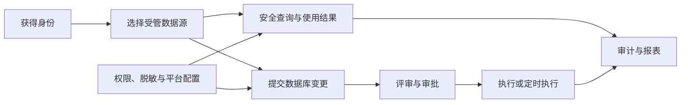

# SQLFlow User Stories

本目录把 [产品需求](../REQUIREMENTS.md) 转换为面向角色、场景和验收结果的用户故事。它不是页面清单：一个故事可以跨前端、API、Service、数据和审计多个层次。

## 故事地图

| 领域 | 文档 | 主要角色 | 关联需求 |
|---|---|---|---|
| 身份与访问 | [US-IAM](US-IAM.md) | Developer、DBA、Admin | FR-IAM-* |
| 数据源 | [US-DATASOURCE](US-DATASOURCE.md) | Admin、所有已认证用户 | FR-DS-* |
| 查询与结果 | [US-QUERY](US-QUERY.md) | Developer、DBA | FR-QRY-* |
| 工单与审批 | [US-TICKET](US-TICKET.md) | Developer、DBA、Admin | FR-TKT-* |
| 权限与数据保护 | [US-SECURITY](US-SECURITY.md) | Developer、DBA、Admin | FR-SEC-* |
| 审计与运维 | [US-OPERATIONS](US-OPERATIONS.md) | Admin、Operator | FR-OPS-* |

## 故事格式

- **故事**：作为 `<角色>`，我希望 `<能力>`，以便 `<价值>`。
- **前置条件**：进入场景前必须成立的状态。
- **验收标准**：使用 Given / When / Then 描述外部可观察行为，同时覆盖主要失败路径。
- **追踪**：关联稳定需求 ID 和代表性自动化测试，不绑定脆弱的代码行号。

## 完成定义

一个 User Story 只有同时满足以下条件才可标记完成：

1. 成功路径和关键失败路径均已实现。
2. 服务端完成认证、授权、输入校验和资源所有权检查。
3. 敏感数据、日志和审计处理符合安全要求。
4. API 错误对用户可解释且不泄露凭据或内部密钥。
5. 至少有一层自动化测试；关键跨层流程应有 Playwright 验证。
6. 需求、架构或 ADR 因该故事发生变化时已同步更新。
